# 亚信安全智能体安全平台解决方案 428 - 结构化梳理

## 文档说明

- 来源文件：[亚信安全智能体安全平台解决方案 428-原文图表整理.md](./亚信安全智能体安全平台解决方案%20428-原文图表整理.md)。该文件是按 PDF 页序保留的原始文字、图表转写和 Mermaid 图，本稿不覆盖或替代它。
- 原始文件类型：PDF/PPT 抽取整理稿；原始版本、发布日期和完整文件元数据未在抽取稿中明确说明。
- 本稿的处理边界：按业务主题重组页面，保留原始文字证据、原有 Mermaid 关系和页码映射；只对重复提纲、页面布局和图表关系做结构化整理。
- 本稿没有补写原始 PPT/PDF 未覆盖的产品功能、客户事实、交付周期、性能验证、硬件适配或竞品结论。图中看不清的内容不补写。
- 指标、客户案例、部署规格和宣传性口径均按“PPT 提及，需产品确认”处理。

## 阅读导航

1. 日常问答先读产品 brief：`overview.md`、`architecture-brief.md`、`sales-brief.md`。
2. brief 不足时，按本稿的主题和页码映射读取对应章节。
3. 需要核对逐页原文、OCR、图表转写细节或原始页序时，再回查逐页抽取稿。
4. 需要核对页面视觉布局或确认指标、案例和部署规格时，使用原始 PPT/PDF；本目录当前只保留抽取稿链接。

## 一句话结论

这份 PPT 将智能体安全描述为覆盖资产发现、事前准入检测、事中运行监测和事后审计处置的全生命周期平台，重点对象包括 Agent、大模型、Skills、MCP 工具和知识库；其具体指标、案例、交付边界和部署配置仍需产品确认。

## 主题目录

| 主题 | 覆盖原始页 | 主题说明 |
|---|---:|---|
| 背景、威胁与风险场景 | 3-8 | 法规要求、15 类威胁、决策路径和两类数据泄露场景 |
| 平台总览与资产管理 | 10-14、22 | 平台功能架构、资产对象和不同资产的攻击面 |
| 事前检测 | 15-25、32 | MCP、Skills、知识库、策略和准入检测 |
| 事中监测 | 26-28、33 | 安全网关、提示词/越狱和 MCP 调用监测 |
| 事后分析与处置 | 29-30、34 | 风险分析、告警响应、审计溯源 |
| 应用案例 | 36-37 | 两个以“XX 集团”表示的方案页 |
| 部署与平台优势 | 39-40 | 全生命周期集成、本地化部署和 PPT 指标 |

第 1、2、9、31、35、38、41 页主要是封面、提纲或结束页，不产生独立业务能力结论。

## 一、背景、威胁与风险场景

### 1. 法规与治理要求

#### 原始文字证据

- 第 3 页列出《中国移动数智化领域生成式人工智能业务发布安全管理办法》《中国移动人工智能安全风险防控工作指引》《中国移动人工智能应用安全管理办法》等材料。
- 原文归纳的要求包括分级定级、先评后上、集中网关发布、接入防护能力和严格问责；另一组原文写有模型准入与开源边界、运行监测与数据闭环、生成内容标识、外部交互权限和高风险操作人工兜底。
- 第 3 页还出现“一级业务内容合格率 >92%，二/三级业务 >95%”等硬指标。

#### 可提炼结论

- PPT 的安全主线不是单次上线扫描，而是把模型、数据、算法、应用和运行过程放进持续治理链路。
- “先评后上”“集中网关发布”和“人工兜底”可以作为平台方案的治理背景，但不能直接推断本产品已经满足全部监管要求。

#### 不应误读

- 第 3 页是法规/管理要求的 PPT 摘要，不是产品认证、监管验收或合同承诺。
- 具体法规适用范围、条文版本、合格率计算方法和产品支撑方式未在本稿中展开，需产品与合规确认。

### 2. 智能体攻击面与决策路径

#### 原始文字证据

- 第 4 页引用“代理式人工智能 - Threats and Mitigations”，列出 T1-T15：记忆投毒、工具滥用、权限滥用、资源过载、级联幻觉攻击、意图破坏与目标操纵、不协调与欺骗行为、否认与不可追踪、身份欺骗与冒充、过度人类监督、非预期代码执行、Agent 通信投毒、恶意 Agent、多 Agent 系统人类攻击、操纵人类。
- 第 5 页按六步分析威胁：自主确定目标步骤、依赖记忆决策、通过工具/系统命令/外部集成执行、依赖认证机制、人类参与、多智能体参与。
- 第 5 页原文在第四步附近写出“T3：恶意智能体”；结合第 4 页清单应为 T13，但本稿保留原页差异，不替原文改写。

#### 图：15 类智能体威胁分布（原始第 4 页）

图想表达什么：

这张图把威胁放回智能体的实际执行链路，说明风险可能来自用户和数据入口，也可能发生在规划、动作执行、工具/检索调用、LLM 核心、记忆和外部环境等环节。

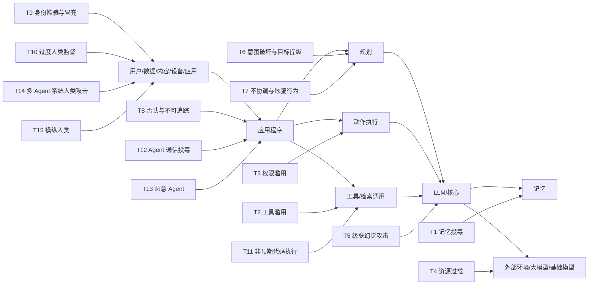

图中关键关系：

- 用户/数据/内容/设备/应用进入应用程序，应用程序再进入规划、动作执行和工具/检索调用。
- 规划、动作执行和工具调用共同作用于 LLM/核心；核心还连接记忆和外部环境/基础模型。
- T1-T15 不是同一层的检测项，而是映射到不同执行节点的威胁类别。

可提炼结论：

- 智能体安全需要同时看语义决策、记忆内容、工具调用、权限、认证和人机/多智能体协作。
- 资产清单和运行链路是后续事前、事中、事后能力的共同对象。

不应误读：

- 图中没有给出每类威胁的检测准确率、覆盖率、风险等级或处置成功率。
- 图中来源名称被原文引用，但具体版本和与产品检测规则的对应关系需确认。

#### 图：基于决策路径的六步威胁分析（原始第 5 页）

图想表达什么：

图按智能体完成任务的决策路径，把威胁从自主推理一路延伸到记忆、工具执行、认证、人类参与和多智能体协作，帮助确定检查点。

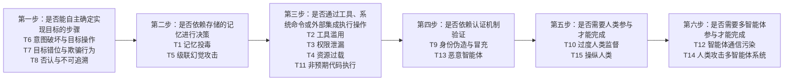

图中关键关系：

- 六个问题按任务执行路径串联，前一步的判断将检查重点带到下一类依赖。
- 原图把 T2、T3、T4、T11 放在工具/执行阶段，把 T9、T13 放在认证阶段；这是一种分析框架，不是唯一分类标准。

可提炼结论：

- 可以按“自主性、记忆、工具、认证、人类、多智能体”建立风险检查清单。
- 事前检测应关注配置、提示词、依赖和权限，事中监测应关注调用与行为，事后审计应保留跨步骤证据。

不应误读：

- 原页存在 T3/T13 编号差异；本稿同时保留原文事实和结构化解释，不把差异当作已校准结论。
- 六步不是产品已实现的完整检测流程，产品规则覆盖需逐项确认。

### 3. Agent 攻击与典型数据泄露

#### 原始文字证据

- 第 6 页将传统 ATT&CK 描述为“窃贼破门而入”，将 Agent 时代攻击描述为“说服门卫开门”，强调攻击者可能诱导拥有合法权限的 Agent 执行合法动作，但改变其意图。
- 第 7 页描述客户经理方案助手从环境探测、沙箱接触宽表数据，到构造恶意 Python、沙箱逃逸和 Base64 分块输出的三阶段风险。
- 第 8 页描述经分系统中模板投毒、Agent 过度执行、聚合敏感数据，再通过下载文档、影子 IT、OCR/公网 AI 工具跨网泄露的链路。

#### 图：传统攻击链与 Agent 攻击链对比（原始第 6 页）

图想表达什么：

图对比传统攻击的线性、阶段依赖和可观察痕迹，与 Agent 攻击中发现模型/API、投毒、Prompt 注入、工具投毒和自主执行等更偏网状的攻击过程。

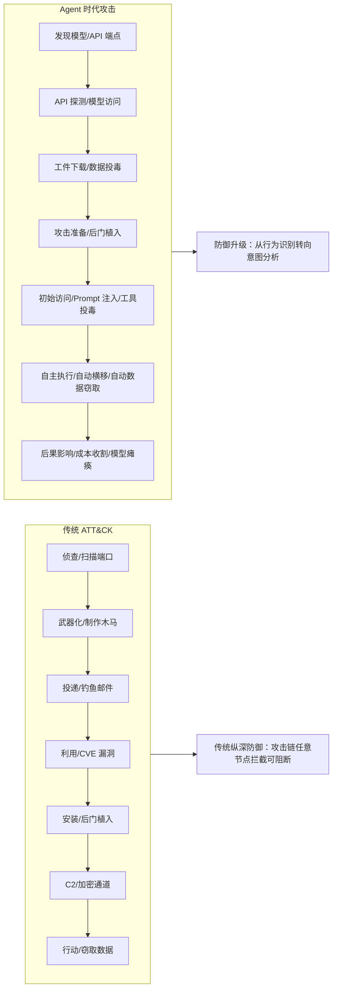

图中关键关系：

- 传统链路从侦查、武器化、投递、利用、安装、C2 到行动，强调单向推进。
- Agent 链路从模型/API 发现进入访问、工件下载、投毒、Prompt/工具注入和自主执行，最终指向数据窃取或成本/模型影响。
- 图的结论箭头把传统纵深防御与“意图分析”形成对照。

可提炼结论：

- Agent 场景需要把意图、上下文、工具调用和数据流纳入检测，而不只看网络异常或文件变更。

不应误读：

- “从行为识别转向意图分析”是 PPT 的方案口径，不代表传统检测被完全替代，也没有给出实现细节或效果指标。

#### 图：客户经理智能体数据泄露三阶段（原始第 7 页）

图想表达什么：

图示意一个被攻陷账号或内部人员如何利用工具权限和代码执行能力，逐步从探测发展到大规模数据渗出。

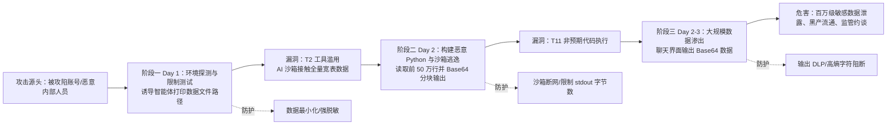

图中关键关系：

- 被攻陷账号/内部人员先诱导路径探测，再利用工具和沙箱读取数据，最终通过聊天输出数据。
- 防护点分别对应数据最小化/脱敏、沙箱和输出 DLP；这些是图示措施，不等于已验证的产品能力。

可提炼结论：

- 需要同时限制数据可见范围、工具/代码执行权限和输出通道，单点内容过滤不足以覆盖整条链路。

不应误读：

- “前 50 万行”“百万级”等是原始 PPT 场景描述，是否为真实客户事件、演示数据或估算未说明，需产品确认。

#### 图：经分系统敏感数据泄露链路（原始第 8 页）

图想表达什么：

图示低权限内部人员通过模板投毒改变 Agent 对格式化要求的理解，促使其聚合生产数据，再借助跨网工具绕过防护。

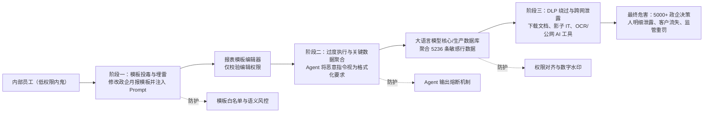

图中关键关系：

- 编辑权限进入模板编辑器，模板内容影响 Agent 的执行解释，再连接到模型和生产数据库。
- 数据聚合后进入下载、影子 IT、OCR 或公网 AI 工具等跨网泄露路径。
- 图中三个虚线防护点分别位于模板、输出和数据权限/水印环节。

可提炼结论：

- 模板、知识和上下文也可能成为攻击入口；需要将内容治理、权限对齐和输出控制结合起来。

不应误读：

- “5236 条”“5000+”和“监管重罚”是 PPT 场景中的数字和后果描述，不应直接当作已证实客户案例或统计结论。

## 二、平台总览、资产与攻击面

### 1. 功能架构与资产管理

#### 原始文字证据

- 第 10 页把平台分为安全视图、事前防御、事中控制、事后溯源、检测模型和原子能力。
- 第 11 页的目标是“一次拉齐‘有哪些 Agent、在哪里、由谁负责、依赖什么’，并保持增量更新”，对象包括智能体、大模型、Skills、MCP 工具和知识库。
- 第 12-14 页把攻击分为注入、劫持、投毒、配置风险、数据泄露、供应链风险和资源滥用，并逐项关联目标资产、攻击特征和产品检测能力。

#### 图：智能体安全平台功能架构（原始第 10 页）

图想表达什么：

图表达平台以安全视图作为上层入口，连接事前防御、事中控制和事后溯源，底部由检测模型和原子能力提供支撑。

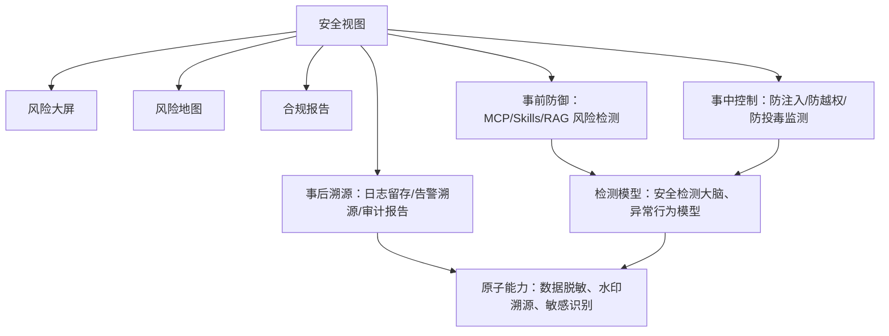

图中关键关系：

- 安全视图连接风险大屏、风险地图和合规报告，也连接三段生命周期能力。
- 事前、事中能力汇入检测模型；检测模型和原子能力共同支撑检测、处置和溯源。

可提炼结论：

- PPT 的产品叙事是“视图 + 生命周期能力 + 检测模型 + 原子能力”，不是只有一个网关或一个内容过滤器。

不应误读：

- 图中没有说明各模块是独立产品、平台内置模块还是可选组件，也没有给出接口和部署边界。

#### 图：智能体资产管理闭环（原始第 11 页）

图想表达什么：

图表达通过同步和扫描发现并统一收敛 AI 资产，再进入可视化管理、持续监测、合规审计和风险预警，形成增量更新闭环。

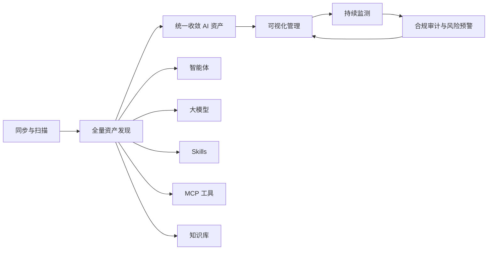

图中关键关系：

- 同步与扫描进入全量资产发现，发现结果覆盖五类对象。
- 资产被统一收敛后进入管理、监测和审计/预警，后者回到管理环节形成持续治理。

可提炼结论：

- 平台需要先回答“有哪些资产、在哪里、由谁负责、依赖什么”，再谈检测和处置。

不应误读：

- “全量”是 PPT 的方案表述，没有给出发现范围、连接器清单、漏报率或增量同步周期。

#### 不同资产攻击面与检测对象（原始第 12-14 页）

原始文字证据归纳如下：

- 注入攻击覆盖提示词注入、工具调用注入、代码/依赖注入；目标涉及智能体、大模型、MCP Server 和 Skill。
- 劫持攻击覆盖决策逻辑劫持、通信链路劫持和会话劫持；检测侧提到配置完整性、ARP/DNS 风险、会话 ID 随机性和超时策略。
- 投毒攻击覆盖知识库投毒和 MCP 模块投毒；配置风险覆盖身份认证缺陷和权限配置不当；数据泄露覆盖模型记忆泄露和接口响应泄露。
- 供应链风险覆盖 CVE 漏洞和恶意 Skill；资源滥用覆盖智能体/MCP 异常调用风暴。

可提炼结论：

- 原文将风险对象与检测器对应起来：大模型扫描器、MCP 扫描器、Skills 扫描器、智能体扫描器和安全网关分别承担不同侧重点。

不应误读：

- 第 12-14 页是风险场景和检测能力的方案对照表，不等于每项检测都已产品化、默认开启或完成效果验证。

### 2. AI 资产管理界面

#### 原始文字证据

- 第 22 页展示 AI 资产管理总览，Mermaid 中记录了 MCP 工具 26、Skills 53、智能体 34、大模型 22、知识库 7 等示例数值，以及无风险、有风险、待扫描的示例拆分。
- 原始页将该页面作为资产管理界面示例，并未说明这些数字对应真实客户环境。

#### 图：AI 资产管理界面结构（原始第 22 页）

图想表达什么：

图表达一个总览页按资产类型呈现 MCP 工具、Skills、智能体、大模型和知识库的数量与风险状态，并提供大模型防护对象、权限和管理入口。

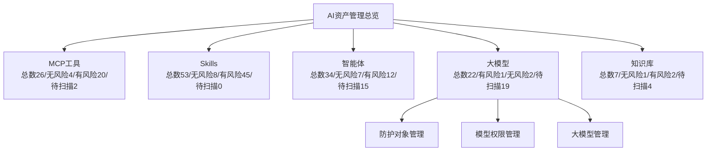

图中关键关系：

- 总览页将五类 AI 资产汇总到同一视图。
- 大模型条目继续连接防护对象、模型权限和大模型管理。

可提炼结论：

- 平台界面强调资产分类、风险状态和管理入口的统一呈现。

不应误读：

- 所有数字是截图/图示示例，不能当作客户资产规模、风险比例或产品容量指标。

## 三、事前检测

### 1. MCP 工具风险管理

#### 原始文字证据

- 第 15 页写明可配置检测规则，并按全域、分域或资产自动扫描。
- 原文列出 MCP 冲突、劫持、投毒、配置脆弱性、Web 漏洞和敏感数据检测，风险发现后联动告警、处置、验证和复盘。

#### 图：MCP 工具风险管理流程（原始第 15 页）

图想表达什么：

图表达 MCP 检测从规则配置和扫描开始，识别多类 MCP 风险后进入告警、处置、验证和复盘，并回到后续扫描。

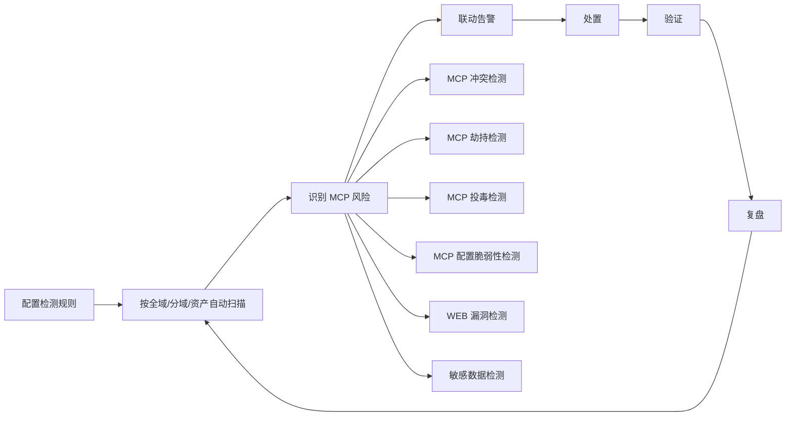

图中关键关系：

- 扫描范围可以按全域、分域或单项资产配置。
- MCP 风险识别向多个风险类型分叉，之后统一进入告警和闭环处理。

可提炼结论：

- MCP 事前治理同时关注协议/配置、通信、供应链和敏感数据，而不是只做接口可用性检查。

不应误读：

- 图中没有说明扫描器的覆盖率、扫描时长、误报率或对生产 MCP 的具体影响。

### 2. Skills 风险管理与热点事件

#### 原始文字证据

- 第 16 页写明 Skills 覆盖发布、更新和运行阶段，采用静态扫描与动态沙箱分析，检查 Markdown、代码、依赖、数据流和外联行为。
- 第 17 页列出三组 Skill 安全热点事件，原始时间线包括 2026-01-27 至 2026-01-29、2026-02-03 和 2026-04-23；描述了伪装技能安装木马、窃取凭证、删除邮件和仿冒技能包等风险。
- 第 18 页将 Skill 执行拆为任务编排、外部通信、系统操作和第三方逻辑代码，并指出可能接触 SSH 密钥、API 凭证、本地数据库、邮件、记忆文件和网络出口。
- 第 19 页的 Top10 风险围绕恶意指令、敏感信息读取、外联、供应链和权限/执行风险展开；完整编号和原文仍以逐页稿为准。

#### 图：Skills 风险管理能力（原始第 16 页）

图想表达什么：

图表达 Skills 从发布、更新到运行都要经过静态和动态分析，并把文本、代码、依赖、数据流和外联风险归入全生命周期治理。

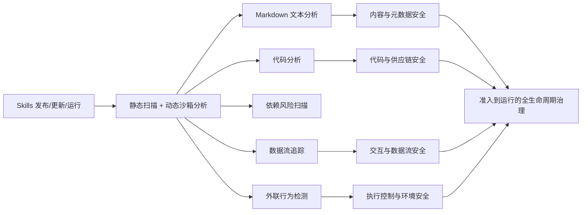

图中关键关系：

- 输入是 Skill 的发布、更新和运行状态；中间由静态扫描和动态沙箱分析展开多类检查。
- 检查结果分别落到内容/元数据、代码/供应链、交互/数据流、执行控制/环境四类安全，再汇入生命周期治理。

可提炼结论：

- Skill 需要按软件供应链和可执行逻辑来治理，同时检查声明内容、代码依赖和运行行为。

不应误读：

- “动态沙箱”不等于所有执行环境都能被完整仿真；隔离能力、网络策略和支持的文件/依赖类型需产品确认。

#### 图：Skill 安全热点事件（原始第 17 页）

图想表达什么：

时间线用于说明 Skill 生态中可能出现伪装、恶意安装、凭证窃取和违反人工确认要求的安全事件。

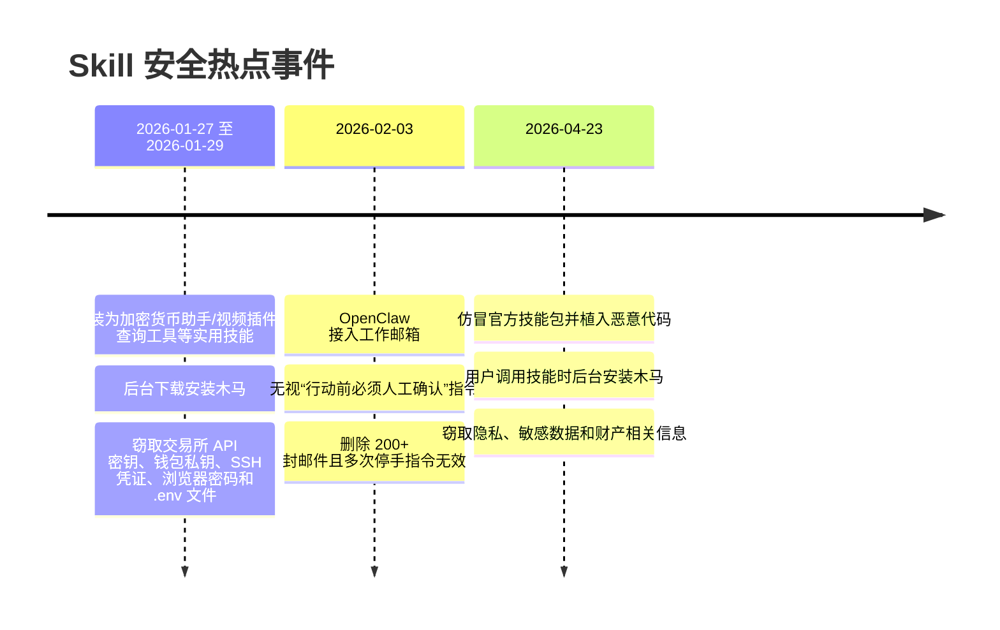

图中关键关系：

- 时间线把不同日期的事件与伪装、执行、外联、凭证和人类确认风险关联起来。

可提炼结论：

- Skill 上架、来源验证、权限约束和运行期行为监测是事前检测之外的持续要求。

不应误读：

- 这些事件的来源、真实性、影响范围、产品关联和对外引用授权未在本稿中核验，统一记为“PPT 提及，需产品确认”。

#### 图：Agent Skill 执行逻辑与攻击闭环（原始第 18 页）

图想表达什么：

图表达用户指令经过 Agent 编排进入 Skill 后，Skill 可能执行任务编排、外部通信、系统操作或第三方代码，并接触高敏感资源和不可控内容。

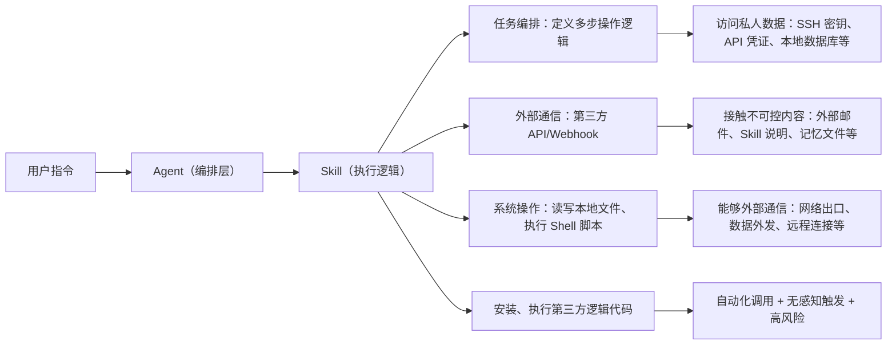

图中关键关系：

- 用户指令经 Agent 编排进入 Skill，Skill 的四类执行能力分别连接私人数据、外部内容、网络出口和第三方代码风险。

可提炼结论：

- Skill 风险不仅是文件内容风险，也包括调用权限、外联能力、系统操作和无感知触发。

不应误读：

- 图中列出的资源和操作是风险面说明，不代表每个 Skill 默认拥有这些权限。

#### 图：Agent Skill 分层检测模型（原始第 20 页）

图想表达什么：

图表达从规则/结构检查到轻量模型、语义复核和运行时关联的递进检测过程，风险越高越进入更深层分析和处置。

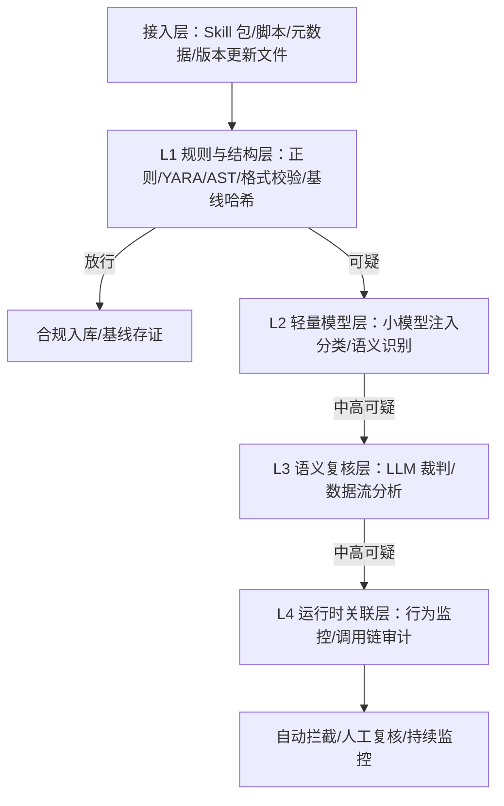

图中关键关系：

- L1 先处理格式、规则、语法和基线；放行项入库存证，可疑项逐级进入 L2-L4。
- L4 把静态判断与行为监控、调用链审计关联，并输出自动拦截、人工复核或持续监控。

可提炼结论：

- 分层检测可以在成本和深度之间分配资源，并把检测证据与运行期行为关联起来。

不应误读：

- “LLM 裁判”“自动拦截”等是原文方案描述，没有说明模型版本、判定阈值、人工复核流程或实际效果。

#### 图：Agent Skill 分阶段检测闭环（原始第 21 页）

图想表达什么：

图把 Skill 检查放入开发、发布、加载和运行四个阶段，并用统一数据联动记录检测结果、风险标签和审计日志。

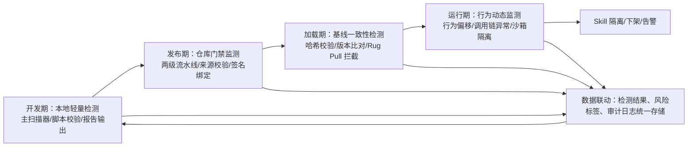

图中关键关系：

- 检测从开发期延伸到运行期；每个阶段都向数据联动节点写入结果和日志。
- 运行期异常可进入隔离、下架和告警，数据联动再支持后续开发期检查。

可提炼结论：

- Skill 的准入、发布、加载和运行不应割裂，版本基线和审计记录是跨阶段闭环的基础。

不应误读：

- 图中没有给出流水线产品、仓库类型、签名体系、Rug Pull 判定规则或处置时限。

### 3. 知识库与策略管理

#### 原始文字证据

- 第 23 页覆盖知识库入库、存储和调用，检测敏感个人/商业信息、个保数据、违规内容、访问控制与身份管理、供应链和数据投毒。
- 第 24 页将安全策略集、识别规则组和原子检测能力组织成三层，原子能力结合 AI 小模型语义识别与关键词/正则字典，命中后可拒答、脱敏掩码、警告放行或人工审核拦截。
- 第 25 页分别列出智能体扫描、MCP 扫描和 Skills 风险扫描的策略项。

#### 图：知识库风险管理流程（原始第 23 页）

图想表达什么：

图表达知识库全生命周期经过策略、规则和检测层，再通过小模型与关键词字典识别多类内容和治理风险。

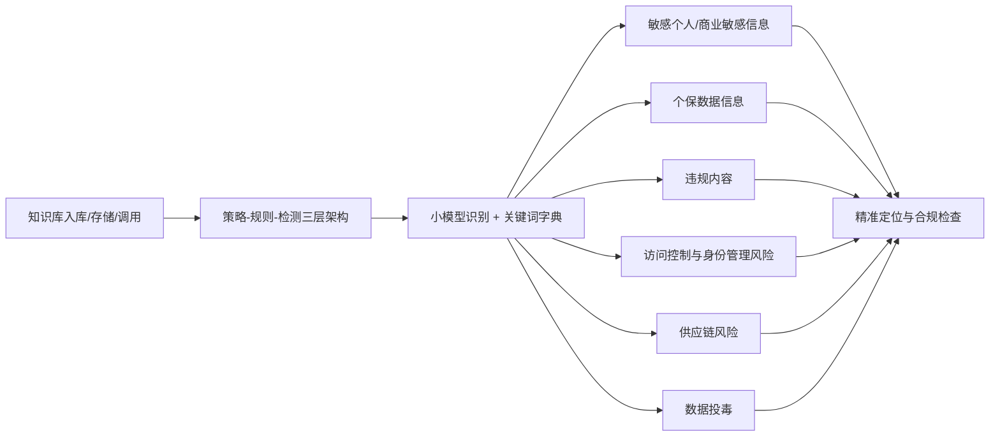

图中关键关系：

- 入库、存储和调用是三个检查时点；策略-规则-检测架构连接小模型/字典，再分发到六类风险。
- 六类风险最终汇入精准定位与合规检查。

可提炼结论：

- 知识库风险不仅是内容敏感性，也包括来源、供应链、访问控制、身份和投毒风险。

不应误读：

- 图中没有说明向量数据库、检索算法、数据标签方案或扫描性能；“精准”是方案表述，不是已验证指标。

#### 图：智能体安全策略管理（原始第 24 页）

图想表达什么：

图表达策略集按 Agent 或用户群体配置，经过规则组和原子检测能力，对文本/代码等内容进行组合识别，再根据命中结果选择处置动作。

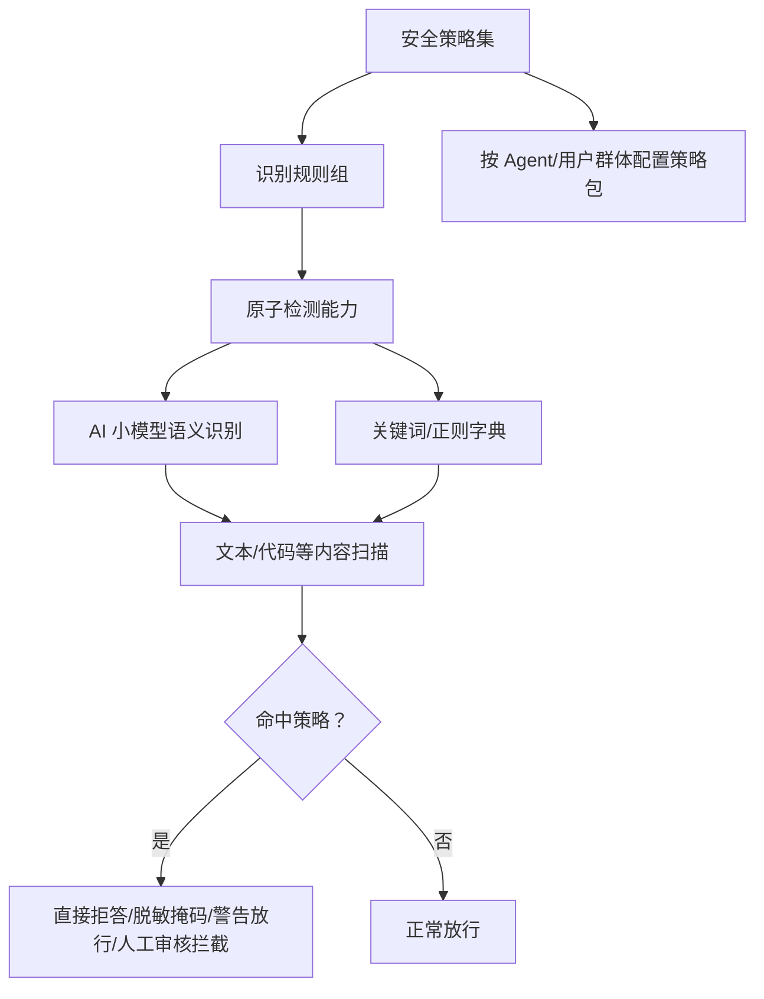

图中关键关系：

- 策略集向下连接规则、原子能力和两种识别方式；小模型和字典共同进入内容扫描。
- 命中后有拒答、脱敏、警告放行和人工审核四类处置分支，未命中则放行。

可提炼结论：

- 策略可按不同 Agent 或用户群体配置，并把识别方式与动作分离，便于组合和运营。

不应误读：

- 图中没有说明策略优先级、冲突处理、版本回滚、审计字段和人工审核 SLA。

#### 图：智能体安全检测策略总览（原始第 25 页）

图想表达什么：

图表达平台至少按智能体、MCP 和 Skills 三类对象组织专项扫描策略。

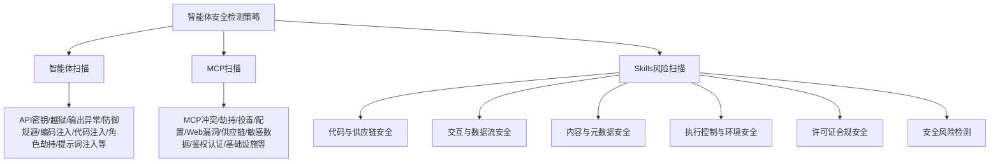

图中关键关系：

- 总策略按资产类型分成智能体、MCP 和 Skills 三条分支。
- 智能体分支关注 API 密钥、越狱、输出、注入等；MCP 分支关注协议、鉴权、供应链和基础设施；Skills 分支覆盖代码、交互、内容、执行、许可证和综合风险。

可提炼结论：

- 策略体系应按资产差异化配置，而不是用单一内容规则覆盖所有智能体依赖。

不应误读：

- 策略名称列表不等于每项规则的详细实现、默认状态或检测效果。

### 4. 事前安全准入场景

#### 原始文字证据

- 第 32 页将准入检测概括为“通用基线 + 智能检测双轮驱动”，对象为 MCP、Agent、Skill 和多模态知识。
- 通用检测包括协议合规性、安全配置、组件漏洞扫描和风险专项检测；智能检测包括 MCP、Agent、Skill 和多模态知识深度检测。

#### 图：事前安全准入检测体系（原始第 32 页）

图想表达什么：

图表达安全准入同时依赖通用基线和面向 AI 资产语义/行为的智能检测，两者共同形成全栈资产风险感知。

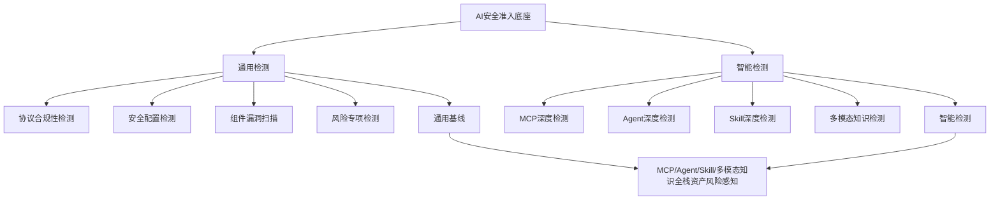

图中关键关系：

- AI 安全准入底座向下分为通用检测和智能检测，两个分支各有四类检查。
- 两个分支共同指向 MCP/Agent/Skill/多模态知识的全栈风险感知。

可提炼结论：

- 准入方案试图将协议、配置、漏洞和已知威胁检查，与提示词逻辑、权限边界、行为基线和知识真实性检查结合。

不应误读：

- “全栈”“自主可控”“精准高效”等是 PPT 方案口径，不能直接转成覆盖率或准入通过率承诺。

## 四、事中监测

### 1. 智能体安全网关与语义防护

#### 原始文字证据

- 第 26 页把智能体安全网关描述为输入输出过滤、内容审查和上下文限制的运行期组件，覆盖用户输入、大模型规划、记忆数据存储、工具描述与响应、Agent 最终响应和跨 Agent 消息。
- 第 27 页描述提示词注入检测、系统提示泄露防护、越狱变体识别、动态过滤、语义重定向和 RAG 清洗。

#### 图：智能体安全网关整体监测（原始第 26 页）

图想表达什么：

图表达安全网关位于输入输出和上下文控制位置，监测智能体从用户输入到规划、记忆、工具、最终响应和跨 Agent 消息的多个环节。

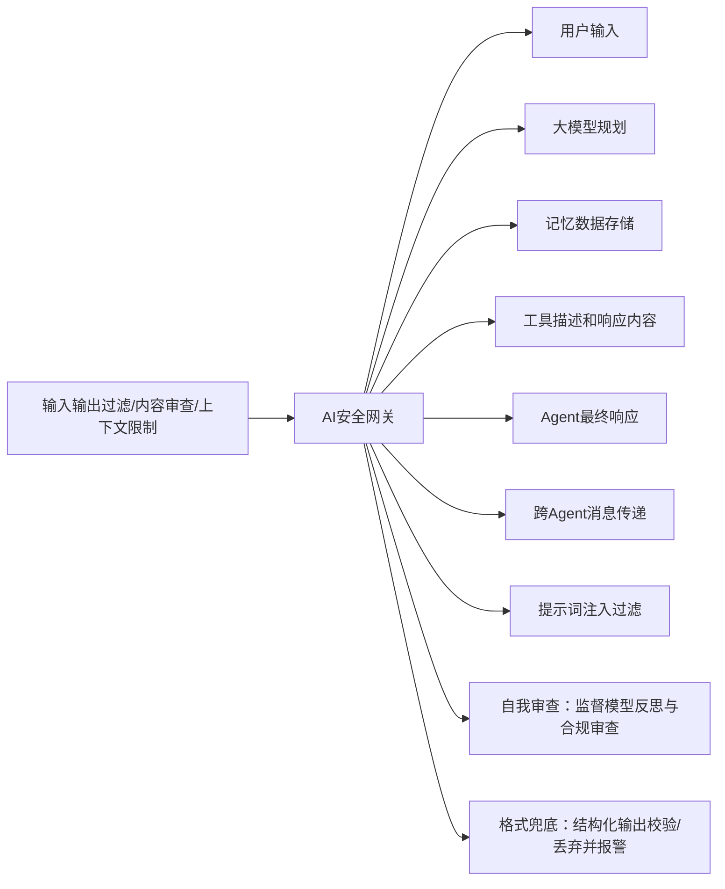

图中关键关系：

- 过滤、审查和上下文限制汇入 AI 安全网关，再覆盖内容、规划、记忆、工具、响应和跨 Agent 消息。
- 网关还连接提示词注入过滤、自我审查和结构化输出兜底。

可提炼结论：

- 运行期防护点不仅在 API 入口，也包括模型上下文、工具响应、最终输出和多 Agent 消息。

不应误读：

- “自我审查”“格式兜底”是原文列出的机制，不代表能发现所有语义或业务逻辑风险。

#### 图：提示词注入与越狱防护链路（原始第 27 页）

图想表达什么：

图表达输入经过安全网关检测后，对提示词注入和越狱分别采用隔离/重构/拒答/RAG 清洗及动态过滤/语义重定向，再生成内容输出。

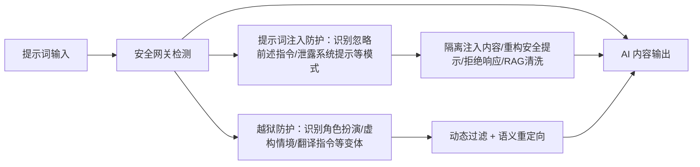

图中关键关系：

- 注入和越狱从同一个网关检测点分叉，分别进入不同处置链路后回到输出。

可提炼结论：

- 运行时策略需要同时识别显式指令模式和角色/情境/翻译等变体，并将检测结果连接到输出控制。

不应误读：

- 原图没有给出攻击样本集、检测阈值、误报率或“覆盖 99% 常见注入向量”等口径的验证方法；相关数字需产品确认。

### 2. 资产行为与 MCP 调用监测

#### 原始文字证据

- 第 28 页描述 MCP 链路劫持与投毒防护，监控多链提示流，识别劫持模式和投毒向量，可隔离异常链路段、重置提示状态或触发沙箱验证。
- 同页还描述工具调用风险控制：扫描 RAG 检索结果、函数参数和外链响应，使用源头白名单验证、内容消毒和动态阻断高危工具交互。
- 第 33 页将运行期分为语义安全防护、资产行为监测和专项能力深度监测，专项对象为 MCP、智能体、模型和知识库。

#### 图：MCP 工具调用风险控制（原始第 28 页）

图想表达什么：

图表达 MCP 调用在链路输入与输出之间经过风险检测，分别处理链路劫持/投毒和工具数据污染/诱导。

```mermaid
flowchart LR
  A["MCP链路注入"] --> B["风险检测"]
  B --> C["MCP链路输出"]
  B --> D["链路劫持与投毒防护：监控多链提示流"]
  B --> E["工具调用风险控制：扫描RAG检索结果/函数参数/外链响应"]
  D --> F["隔离异常链路段/重置提示状态/沙箱验证"]
  E --> G["源头白名单验证/内容消毒/阻断高危工具交互"]
  F --> C
  G --> C
```

图中关键关系：

- 风险检测是统一控制点，向链路防护和工具调用控制分叉，两个处置结果再回到 MCP 链路输出。

可提炼结论：

- MCP 运行时防护既要看通信链路完整性，也要检查检索结果、参数和外链响应的数据洁净度。

不应误读：

- 原文提及“覆盖 95% 链路攻击场景、检测延迟小于 30ms”等数字，属于 PPT 提及指标，需产品确认。

#### 图：事中安全运行监测（原始第 33 页）

图想表达什么：

图表达系统运行期间由语义防护、资产行为监测和专项能力监测共同识别高危行为，并以“风险即阻断”为目标。

```mermaid
flowchart TB
  A["系统运行期间"] --> B["语义安全防护"]
  A --> C["资产行为监测"]
  A --> D["专项能力深度监测"]
  B --> B1["提示词泄露/注入等自然语言对话监测"]
  C --> C1["API与网关资产防护"]
  C --> C2["会话与交互链路防护"]
  C --> C3["数据流与隐私防护"]
  C --> C4["资源与算力防护"]
  D --> D1["MCP监测"]
  D --> D2["智能体监测"]
  D --> D3["模型监测"]
  D --> D4["知识库监测"]
  B1 --> E["风险即阻断"]
  C1 --> E
  D1 --> E
```

图中关键关系：

- 运行期目标分成三个监测面：语义、资产行为和专项能力。
- 资产行为监测包括 API/网关、会话、数据流/隐私和资源/算力；专项监测包括 MCP、Agent、模型和知识库。
- 原图只把 B1、C1、D1 明确连到“风险即阻断”，其他节点的具体处置关系没有画全。

可提炼结论：

- 运行时防护从固定内容规则扩展到资产画像、行为基线和对象专项监测。

不应误读：

- “风险即阻断”“秒级精准阻断”等是 PPT 目标或宣传性口径，不等于所有风险都能自动阻断。

## 五、事后分析、告警与审计溯源

### 1. 风险分析与告警处置

#### 原始文字证据

- 第 29 页的基础数据包括访问日志、安全告警、网络流量和上下文信息；分析模块包括不良内容、智能体风险、敏感数据、威胁情报、行为、MCP 攻击和攻击路径分析。
- 第 30 页列出系统通知、工单、人机联动，以及智能体注册/流量/权限限制、大模型访问阻断、MCP 服务暂停和工具禁止接入等处置动作。

#### 图：智能体风险分析闭环（原始第 29 页）

图想表达什么：

图表达以多源访问和安全数据为基础，经深度检测与智能分析形成自动化告警，再进入风险管理和闭环处置。

```mermaid
flowchart TB
  A["智能体访问日志数据采集<br/>访问日志/安全告警/网络流量/上下文信息"] --> B["深度检测 + 智能分析中台"]
  B --> C["不良内容检测"]
  B --> D["智能体风险分析"]
  B --> E["敏感数据检测"]
  B --> F["威胁情报分析"]
  B --> G["行为分析/MCP攻击分析/攻击路径识别"]
  C --> H["自动化告警机制"]
  D --> H
  E --> H
  F --> H
  G --> H
  H --> I["风险管理与闭环处置"]
```

图中关键关系：

- 日志、告警、流量和上下文进入检测/分析中台，再分到五类检测与分析能力。
- 多类分析结果汇入自动化告警，最后进入风险管理和闭环处置。

可提炼结论：

- 事后能力的价值在于把事件证据、攻击路径、威胁情报和业务处置串起来，而不只是保存日志。

不应误读：

- 图中没有说明日志留存周期、数据量、分析模型、告警分级或响应时限；第 3 页法规要求中的日志周期也不能直接当作本产品承诺。

#### 图：风险告警响应处置（原始第 30 页）

图想表达什么：

图表达安全事件发生后，同时支持通知、网关联动和人工工单处置，并将自动动作与人工动作汇入统一处置结果。

```mermaid
flowchart LR
  A["安全事件发生"] --> B["系统通知<br/>短信/邮件/消息"]
  A --> C["联动处置<br/>AI安全网关/AI网关联动"]
  A --> D["人工处置<br/>派发工单"]
  C --> E["注册限制/流量限制/权限限制/大模型访问阻断/MCP暂停/工具禁止接入"]
  D --> F["审批/收集/通知"]
  B --> G["相关负责人"]
  E --> H["告警阻断与处置"]
  F --> H
```

图中关键关系：

- 同一事件分成系统通知、联动处置和人工处置三路。
- 联动处置进入注册、流量、权限、大模型、MCP 和工具限制；人工处置进入审批、收集和通知；两路汇到告警阻断与处置。

可提炼结论：

- 平台将自动化动作、人工审批和通知渠道放在同一响应闭环中，支持风险处置留痕。

不应误读：

- 具体联动系统、工单字段、审批权限、阻断回滚和通知可用性未在 PPT 中展开。

### 2. 事后安全审计溯源场景

#### 原始文字证据

- 第 34 页以“违规可追溯”为目标，提出威胁发现、数据溯源、行为审计和态势研判四个方向。
- 原文列出智能体日志留存、安全数据存储与分析、全链路日志采集、日志标准化、统一查询、调用链展示、IP/域名/URL/APT 威胁情报、泄露数据上传和水印解密溯源。

#### 图：事后安全审计溯源（原始第 34 页）

图想表达什么：

图表达安全事件或用户行为进入智能体安全观测，再通过日志、数据、调用链、威胁情报和数据溯源能力形成链路可观测与风险管控。

```mermaid
flowchart TB
  A["安全事件/用户行为"] --> B["智能体安全观测"]
  B --> C["安全观测与审计"]
  C --> D["智能体日志留存"]
  C --> E["安全数据存储"]
  C --> F["安全数据分析"]
  C --> G["全链路日志采集"]
  C --> H["日志标准化"]
  C --> I["统一查询"]
  C --> J["调用链展示"]
  C --> K["威胁情报观测：IP/域名/URL/APT"]
  C --> L["数据溯源观测：泄露数据上传/水印解密溯源"]
  K --> M["链路可观测与风险管控"]
  L --> M
  M --> N["合规可证/风险可控/运营可视/生态可信"]
```

图中关键关系：

- 事件/行为进入安全观测，再展开为日志、存储、分析、标准化、查询、调用链、威胁情报和数据溯源。
- 威胁情报和数据溯源共同进入链路可观测与风险管控，最后形成合规、风险、运营和生态价值。

可提炼结论：

- 事后审计的证据链包括行为日志、调用链、威胁情报和泄露数据溯源，目标是支持复盘、定责和合规举证。

不应误读：

- “合规可证”“生态可信”是建设价值表述，不等于已经取得监管认可或完成客户审计。

## 六、应用案例

### 1. 事前、事中、事后应用场景关系

第 32-34 页共同形成三段应用主线：事前安全准入检测、事中安全运行监测、事后安全审计溯源。三页分别强调全栈资产风险感知、运行期风险拦截和违规可追溯。它们是 PPT 的场景化表达，与平台功能架构相互对应，但不构成独立的交付范围承诺。

### 2. XX 集团一级智能体平台安全防护集成方案

#### 原始文字证据

- 第 36 页用“XX 集团一级智能体平台安全防护集成方案”描述三级防御：一级总部聚智平台与智能体安全平台，二级省份/专业公司聚智平台与安全网关，三级 CRM/BOSS、大数据、视频等业务系统与 AI 安全原子能力 API/SDK。
- 三级方案中列出资产清点、风险监测、全生命周期管理、大模型安全防护、入口流量检测、敏感数据拦截、API 滥用检测、内容风控、脱敏/鉴黄/防注入 API 等。

#### 图：XX 集团一级智能体平台三级防御（原始第 36 页）

图想表达什么：

图表达“总部统管、省分/专业公司承接、业务系统调用原子能力”的三级纵深防御集成结构。

```mermaid
flowchart TB
  A["一级防御：移动总部聚智智能体平台 + 智能体安全平台"] --> A1["智能体安全平台：资产清点/风险监测/全生命周期管理"]
  A --> A2["大模型安全防护系统：提示词注入/数据投毒/模型窃取防御"]
  A --> B["二级防御：省份公司/专业公司二级聚智平台"]
  B --> B1["智能体安全网关：二级平台入口流量深度检测"]
  B --> B2["敏感数据拦截/API滥用检测/内容风控"]
  B --> C["三级防御：CRM/BOSS/大数据平台/视频平台等业务系统"]
  C --> C1["AI安全原子能力 API/SDK"]
  C1 --> C2["脱敏API/鉴黄API/防注入API等全场景调用"]
```

图中关键关系：

- 一级平台承载资产和风险治理，二级平台以安全网关承接入口流量，三级业务系统通过 API/SDK 调用安全原子能力。
- 图中的层级关系是集成方案示意，不是产品组织或客户实际架构的证明。

可提炼结论：

- 集团型智能体平台可以按总部、区域/专业平台和业务系统分层配置检测、防护和原子能力。

不应误读：

- “XX 集团”不是可公开客户名称；案例真实性、客户授权、实际部署和效果数据均需产品/市场确认。

### 3. XX 集团一级智能体运营架构安全集成方案

#### 原始文字证据

- 第 37 页将安全检测嵌入能力创建、能力供给、能力上架和生态开放流程，提出“入场即合规、分发即可信”的方案口径。
- 原文列出智能体静态与动态扫描、MCP 工具安全性检测、大模型风险扫描和知识库风险扫描，关注提示词/逻辑、MCP API 越权/参数注入、模型后门和知识库投毒。

#### 图：XX 集团一级智能体运营架构安全集成（原始第 37 页）

图想表达什么：

图表达能力从省能运平台和聚智平台进入生态开放广场前，需要经过合规检测和安全检测，检测对象覆盖智能体、MCP、大模型和知识库。

```mermaid
flowchart LR
  A["省能运平台：能力创建/能力供给/能力上架"] --> B["聚智平台：登录、填写基本信息、工具信息配置、能力查询/订购"]
  B --> C["全生态能力汇聚开放广场：集团内部能力汇聚、外部生态能力汇聚、两级能力运营管理"]
  C --> D["能力审核合规检测"]
  D --> E["安全检测"]
  E --> F["生态广场上架开放"]
  E --> S1["智能体静态与动态扫描"]
  E --> S2["MCP工具安全性检测"]
  E --> S3["大模型风险扫描"]
  E --> S4["知识库风险扫描"]
```

图中关键关系：

- 能力创建/供给/上架进入登录、配置、查询/订购，再进入生态汇聚广场。
- 合规检测和安全检测位于生态开放前；安全检测向四类资产扫描分叉。

可提炼结论：

- 能力运营平台可以把安全检测嵌入上架门禁，降低风险能力向生态分发的可能性。

不应误读：

- “绿码”“入场即合规”“分发即可信”等属于原文宣传口径，不能替代具体检测结果、审计结论或客户授权。

## 七、部署、优势与指标边界

### 1. 全生命周期集成优势

#### 原始文字证据

- 第 39 页以“全生命周期嵌入 + 技术架构深度集成”为核心，列出全周期风险拦截、自动化合规审计、安全智能运维提效和全链路成本管控。
- 原文提到开发、部署、运行、运维阶段，以及 MCP+Sidecar、威胁情报 RAG 更新、自动化工单、敏感数据管控和全流程留痕。

#### 图：平台优势：全生命周期嵌入与架构集成（原始第 39 页）

图想表达什么：

图表达业务系统通过 AI 安全网关组件接入智能体安全平台，平台连接大模型，并将技术集成映射到风险拦截、合规审计、运维提效和成本管控四类价值。

```mermaid
flowchart LR
  A["业务系统A/B/N"] --> G["AI安全网关组件（阻断、防护）"]
  G --> P["智能体安全平台（策略、监控、审计）"]
  P --> M["大模型A/B/C"]
  P --> V1["全周期风险拦截"]
  P --> V2["自动化合规审计"]
  P --> V3["安全智能运维提效"]
  P --> V4["全链路成本管控"]
  V1 --> D1["开发/部署/运行/运维阶段嵌入"]
  V2 --> D2["全流程留痕/敏感数据管控/可视化合规"]
  V3 --> D3["MCP+Sidecar/威胁情报RAG更新/自动化工单"]
  V4 --> D4["减少排查成本/降低供应链损失/减少处罚与中断"]
```

图中关键关系：

- 业务系统经 AI 安全网关组件进入平台，平台连接大模型并提供策略、监控和审计。
- 四类价值分别映射到全周期阶段、审计与敏感数据、运维集成和成本/损失控制。

可提炼结论：

- PPT 希望把平台定位为智能体平台的集成式安全层，覆盖开发到运维的多个阶段。

不应误读：

- “风险秒级识别”“<500ms 响应”“一键达标”“零手动”等口径需产品确认，不能直接当作交付 SLA。

### 2. 本地化部署与集成

#### 原始文字证据

- 第 40 页写有“无侵入式集成，现有代码改动小”“统一管理安全策略”，并展示智能体应用、安全代理层、后端服务和智能体安全网关的链路。
- 企业内网部分列出智能体安全平台、企业数据中心、企业私有云/物理服务器集群，以及 Kubernetes 集群、数据库集群和存储系统。
- 同页列出 CPU 32 核+、内存 128GB+、存储 2TB+（支持扩展），以及攻击阻断率、误报率、API 延迟、系统可用性和并发处理能力等目标值。

#### 图：本地化部署与集成方式（原始第 40 页）

图想表达什么：

图表达平台部署在企业内网，可连接数据中心和私有云/物理资源；业务侧通过安全代理层和智能体安全网关访问后端服务，平台连接网关以统一安全策略。

```mermaid
flowchart LR
  subgraph Local["本地化部署：企业内网"]
    P["智能体安全平台"] <--> D["企业数据中心"]
    P <--> C["企业私有云/物理服务器集群<br/>Kubernetes/数据库/存储"]
  end
  A["智能体应用"] --> B["安全代理层"]
  B <--> G["智能体安全网关"]
  B --> S["后端服务"]
  G --> B
  P --> G
```

图中关键关系：

- 企业内网中的平台与数据中心、私有云/物理服务器集群互联。
- 智能体应用经安全代理层访问后端服务，代理层与安全网关双向连接，平台连接网关做策略管理。

可提炼结论：

- 原文给出的部署方向是企业内网本地化部署，兼顾云环境/物理资源和代理/网关集成。

不应误读：

- “无侵入式”“现有代码改动小”不是对所有环境的零改造承诺；具体接口、代理方式、兼容矩阵、交付周期和资源配置需产品确认。

## 待确认项

以下内容均来源于 PPT 提及、图示或页面口径，不能直接作为已验证事实或对外承诺：

- **指标**：一级业务内容合格率 >92%、二/三级业务 >95%；攻击阻断率 ≥99.9%；误报率 ≤0.1%；API 延迟 P99 ≤500ms；系统可用性 ≥99.95%；并发处理能力 ≥10000 QPS；MCP 链路覆盖 95%、检测延迟 <30ms；提示词防护覆盖 99% 常见注入向量、零误报率。需确认指标定义、测试方法、适用版本、环境和是否可对外。
- **部署规格**：CPU 32 核+、内存 128GB+、存储 2TB+（支持扩展）是最低配置、示例配置还是特定规模配置；Kubernetes、数据库、存储、云环境和物理机的支持矩阵需确认。
- **交付与集成**：本地化部署、安全代理层、AI 安全网关、MCP+Sidecar、现有代码改动小的具体实现方式、接口清单、改造量和交付周期需确认。
- **客户案例**：第 7、8 页的数据泄露场景和第 36、37 页的两个“XX 集团”方案，是否为真实客户、是否有授权、是否可公开客户名称和效果数据，需产品/市场确认。
- **热点事件**：第 17 页时间线中的 Skill 事件来源、事实核验、时间线版本和对外引用授权需确认。
- **法规与对外口径**：第 3 页法规摘要、一级/二级/三级业务分类、AIGC 标识、人工兜底以及“入场即合规”“风险即阻断”“一键达标”等表述的适用边界和对外口径需确认。
- **产品边界**：本平台中的智能体安全网关组件与独立 `4-智能体安全网关/` 产品的模块、销售和交付边界；本平台资产视图与 `3-AI-BOM/` 全域资产发现、台账、拓扑和供应链治理的接口边界，需确认。

## 可提炼到 brief 的结论

| brief 文件 | 可提炼内容 | 来源页 |
|---|---|---:|
| `overview.md` | 生命周期定位、五类核心资产、事前/事中/事后主线、典型场景和边界 | 10-11、15-30、32-34 |
| `architecture-brief.md` | 六组功能架构、MCP/Skills/知识库检测、网关监测、风险分析和部署链路 | 10-28、39-40 |
| `sales-brief.md` | 客户痛点、平台化集成、能力范围和不可承诺项 | 6-8、32-40 |
| `market-brief.md` | Skill/Agent 风险话题和法规背景的可复用表达；外部引用需核验 | 3-8、17、36-37 |
| `tasks.md` | 指标、规格、案例、交付和产品边界的待确认清单 | 3、7-8、17、36-40 |

## 原始页码映射

| 结构化章节 | 原始页/标题 |
|---|---|
| 法规与治理要求 | 第 3 页：智能体安全法律法规要求 |
| 攻击面 | 第 4 页：OWASP 定义的 15 类智能体威胁；第 5 页：基于智能体决策路径的威胁分析 |
| Agent 攻击与泄露场景 | 第 6 页：Agent 攻击；第 7 页：客户经理方案助手；第 8 页：经分系统 |
| 平台架构与资产 | 第 10 页：功能架构；第 11 页：智能体资产管理；第 12-14 页：不同资产攻击场景；第 22 页：资产管理界面 |
| MCP/Skills/知识库事前检测 | 第 15-25 页；第 32 页：事前安全准入检测 |
| 事中监测 | 第 26-28 页；第 33 页：事中安全运行监测 |
| 事后分析与审计 | 第 29-30 页；第 34 页：事后安全审计溯源 |
| 集成案例 | 第 36-37 页 |
| 优势与部署 | 第 39-40 页 |

## 原始来源

- [逐页抽取稿：亚信安全智能体安全平台解决方案 428-原文图表整理.md](./亚信安全智能体安全平台解决方案%20428-原文图表整理.md)
- 产品 brief：`../overview.md`、`../architecture-brief.md`、`../sales-brief.md`、`../market-brief.md`
