# 亚信安全AI-BOM资产管理解决方案

来源文件：`D:\yaxin\文档\亚信安全AI-BOM资产管理解决方案@20260521.pptx`

转换说明：本文按 PPT/PDF 页码逐页转换。正文文字以 PPTX 内部文本框和分组图形抽取结果为准，并结合导出的页面图片核对。装饰性背景、品牌 Logo、渐变色块等不作为内容图转换；业务流程图、架构图、场景图、产品界面示例等均同时给出 Mermaid 图和纯文字说明。对于产品截图中无法清晰辨认的细小字段，不进行扩写或猜测。

## 第1页 / PDF第1页：封面

亚信安全AI-BOM资产管理解决方案

图像转换：本页除背景与品牌标识外，无需要转换的非装饰性内容图。

## 第2页 / PDF第2页：目录

1. 方案建设背景
2. 方案建设方案
3. 方案核心场景
4. 方案建设价值

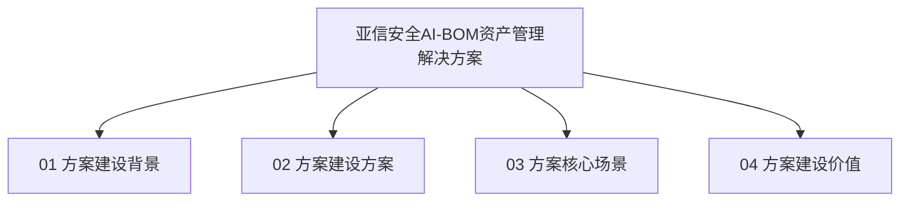

图解文字：目录将方案分为四部分，依次说明建设背景、建设方案、核心场景与建设价值。

图像复原说明：画面左侧为“目录 / CONTENTS”标题，右侧纵向排列四个圆角条目。每个条目前方有蓝色圆形编号，依次为 01、02、03、04；编号右侧是对应章节名称。四个条目从上到下排列，整体呈居中偏右的目录列表结构。

## 第3页 / PDF第3页：政策监管刚性要求

页面列出与软件供应链、关键信息基础设施、开源代码安全评价和产业链供应链安全相关的监管要求。

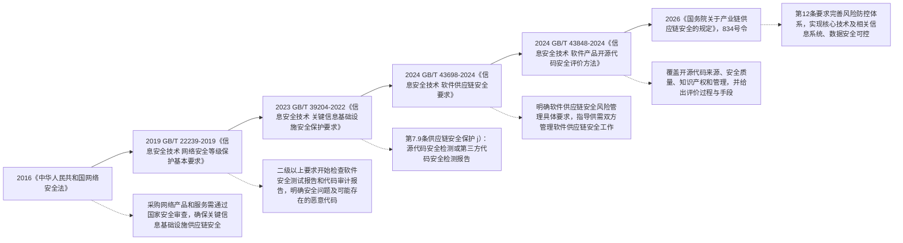

图解文字：本页使用时间线表达监管要求逐步增强。监管关注点从关键信息基础设施采购安全审查，扩展到等级保护中的软件安全测试和代码审计，再到关键信息基础设施的软件源代码安全检测、软件供应链安全风险管理、开源代码安全评价，以及产业链供应链安全中的核心技术和信息系统数据安全可控。

图像复原说明：本页主体是一条从左下向右上倾斜的浅蓝色时间轴，像上升的阶梯路径。左下起点为 2016 年《中华人民共和国网络安全法》，随后沿斜线上升依次放置 2019 年 GB/T22239-2019、2023 年 GB/T39204-2022、2024 年 GB/T43698-2024、2024 年 GB/T43848-2024，最右上为 2026《国务院关于产业链供应链安全的规定》，834号令。每个年份节点上方或附近放置政策名称，节点下方或侧边放置对应要求说明。整体阅读顺序为左下到右上，表达监管要求逐年增强。

## 第4页 / PDF第4页：行业发展现状

自主智能体、大模型、MCP工具链在企业内网快速普及，AI资产从单一模型文件演进为智能体、模型、API、MCP工具、应用、IT基础设施的多元异构形态。传统IT资产管理仅覆盖硬件与通用软件，无法识别AI特有资产；影子AI、僵尸资产、未备案智能体静默部署，成为安全与合规的核心盲区。

图中列出的 AI 资产与风险要素包括：

- 智能体应用：个人助手、智慧工厂、智慧农业、智慧交通、智慧校园。
- 智能体相关要素：智能体、MCP、知识库、意图、skills、大模型API网关。
- IT基础设施与基础大模型相关要素：大模型、主机、DS、TDA、AE、算力、算网网络安全设备。
- 类 OpenClaw 智能体示例：Clawdbot、Moltbot、OpenClaw。
- 便利能力：可远程控制、帮您访问网站、帮您装“软件”、默默跑任务、跨模型调用更智能、访问硬盘和智能家居。
- 实证威胁：被他人远程控制、自动泄露密钥、被部署木马、堵不完的漏洞、链式转发泄露、上传隐私，删除数据。
- 右侧示意含“流量采集”与“资产管理服务器”。

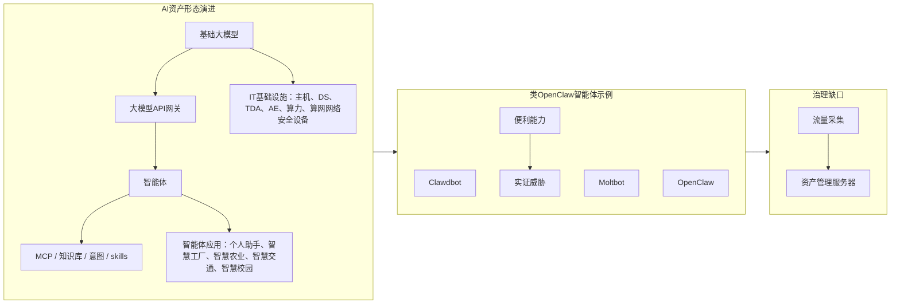

图解文字：本页将行业现状拆成三部分。左侧说明 AI 资产从基础大模型、API 网关、智能体、MCP、知识库、skills 等组件扩展到多类业务应用和 IT 基础设施。中部用类 OpenClaw 智能体说明影子智能体可能带来的能力与威胁。右侧强调当前缺少技术手段发现 AI 资产全貌、影子智能体及其依赖关系，需要通过流量采集和资产管理服务器支撑识别与管控。

图像复原说明：页面中部横向分成三个图块。左侧图块是 AI 资产结构示意，底部是“基础大模型”和“IT基础设施”一类基础层，标出“大模型、主机、DS、TDA、AE、算力、算网网络安全设备”等；其上是“大模型API网关”和“智能体”，智能体周围连接 MCP、知识库、意图、skills；最上层是智能体应用，散布“个人助手、智慧工厂、智慧农业、智慧交通、智慧校园”等业务场景。中间图块围绕类 OpenClaw 智能体展开，左侧列“便利能力”，包括可远程控制、访问网站、安装软件、默默跑任务、跨模型调用、访问硬盘和智能家居；下方列 Clawdbot、Moltbot、OpenClaw；右侧列“实证威胁”，包括被远程控制、泄露密钥、被部署木马、漏洞、链式转发泄露、上传隐私和删除数据。右侧图块是一个简化的采集与管理架构，左侧标“流量采集”，右侧标“资产管理服务器”，中间用线条连接，表示通过流量发现并汇入资产管理。

页面底部结论：

- 从大模型演进到智能体，AI资产数量和类型急剧增加，智能体资产相互依赖路径复杂。
- 类openclaw智能体的未授权部署，给企业带来了数量庞大、身份模糊、权限失控的影子智能体。
- 目前缺少技术手段发现AI资产全貌、影子智能体和AI资产的依赖关系，对企业安全防护带来不便。

## 第5页 / PDF第5页：企业现存核心痛点

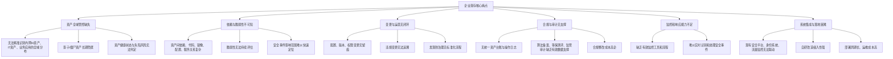

图解文字：本页将企业 AI 资产治理痛点归纳为六类：看不全资产、看不清依赖和脆弱性、变更运营不能闭环、合规审计缺少支撑、监控响应能力不足、系统集成落地困难。

图像复原说明：本页是两行三列的痛点卡片矩阵。第一行从左到右为“资产全域管控缺失”“依赖与脆弱性不可知”“变更与运营无闭环”；第二行从左到右为“合规与审计无支撑”“监控和响应能力不足”“系统集成与落地困难”。每张卡片上方是蓝色标题，下方是黑色正文，正文以项目符号形式说明具体问题。卡片之间留有明显间距，左侧还有一条弧形箭头装饰贯穿上下两行，表达这些痛点互相关联但不形成严格流程。

## 第6页 / PDF第6页：目录

本页为目录页，当前突出“02 方案建设方案”。目录项同第2页：

1. 方案建设背景
2. 方案建设方案
3. 方案核心场景
4. 方案建设价值

图像转换：本页除目录结构外，无其他非装饰性内容图。

## 第7页 / PDF第7页：建设理念

亚信安全AI-BOM（人工智能物料清单）是基于微服务架构的AI全生命周期资产可信治理平台，全面兼容SPDX3.0国际标准采集规范，实现AI资产主动发现、统一身份、闭环管理、可信合规，是运营商、政企、金融行业构建AI可信基础设施的核心底座。

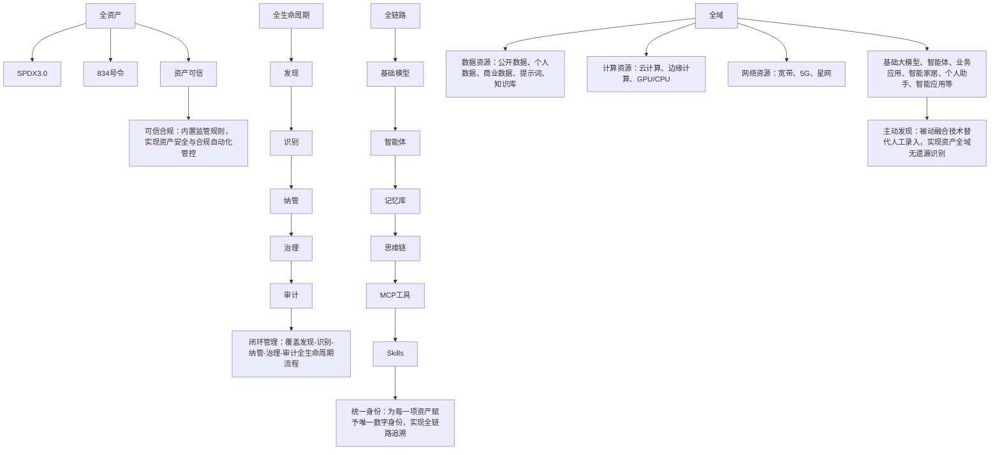

图解文字：建设理念围绕四个维度展开。全资产维度强调兼容 SPDX3.0、834号令与资产可信；全生命周期维度覆盖发现、识别、纳管、治理、审计；全链路维度覆盖基础模型、智能体、记忆库、思维链、MCP 工具和 Skills，并通过统一身份实现追溯；全域维度覆盖数据资源、计算资源、网络资源、基础大模型、智能体和业务应用等，并以主动发现减少人工录入遗漏。

图像复原说明：本页主体是四条横向分层带，从上到下分别是“全资产”“全生命周期”“全链路”“全域”。第一条“全资产”带中部放 SPDX3.0、834号令、资产可信等标签，右侧有说明框“可信合规”。第二条“全生命周期”带按从左到右流程排列“发现、识别、纳管、治理、审计”，右侧说明框为“闭环管理”。第三条“全链路”带按从左到右排列基础模型、智能体、记忆库、思维链、MCP工具、Skills，右侧说明框为“统一身份”。第四条“全域”带展示底层资源和应用，左侧包括数据资源、计算资源、网络资源，右侧包括基础大模型、智能体、业务应用以及智能家居、个人助手、智能应用等，最右说明框为“主动发现”。整个图的视觉逻辑是自上而下从合规资产、生命周期、链路组件到全域资源逐层展开。

## 第8页 / PDF第8页：功能架构

```mermaid
flowchart TB
  L1["应用交互层"] --> L1a["AI资产运营驾驶舱"]
  L1 --> L1b["影子AI治理"]
  L1 --> L1c["风险监控与告警中心"]
  L1 --> L1d["合规审计...."]

  L2["业务服务层"] --> S1["AI资产发现"]
  S1 --> S1a["主动扫描探测"]
  S1 --> S1b["被动流量解析"]
  S1 --> S1c["AI指纹特征库匹配"]
  S1 --> S1d["多源数据接入"]
  S1 --> S1e["资产标注..."]

  L2 --> S2["AI资产管理"]
  S2 --> S2a["大模型管理"]
  S2 --> S2b["智能体管理"]
  S2 --> S2c["MCP工具管理"]
  S2 --> S2d["API工具管理"]
  S2 --> S2e["应用管理/IT资产管理..."]

  L2 --> S3["资产数字身份与拓扑关系"]
  S3 --> S3a["全局唯一资产ID"]
  S3 --> S3b["可视化拓扑"]
  S3 --> S3c["依赖关系自动测绘"]
  S3 --> S3d["影响范围分析"]
  S3 --> S3e["全链路追溯..."]

  L2 --> S4["影子AI智能治理"]
  S4 --> S4a["影子/僵尸资产管理"]
  S4 --> S4b["智能风险分级"]
  S4 --> S4c["闭环处置"]
  S4 --> S4d["告警关联"]
  S4 --> S4e["日志留痕..."]

  L2 --> S5["资产全生命周期闭环管理"]
  S5 --> S5a["资产发现-纳管-变更-治理-下线管理"]
  S5 --> S5b["配置变更留痕"]
  S5 --> S5c["流程自动化"]
  S5 --> S5d["资产审批"]
  S5 --> S5e["操作日志审计..."]

  L3["能力引擎层"] --> E1["AI资产发现引擎"]
  L3 --> E2["合规检测引擎"]
  L3 --> E3["报表与可视化引擎"]
  L3 --> E4["流程引擎与任务编排..."]

  L4["数据与接口层"] --> D1["统一资产数据模型（AI-BOM标准模型）"]
  L4 --> D2["数据采集接口"]
  L4 --> D3["第三方系统集成接口（EDR/SIEM/流量/身份管理）..."]

  L1 --> L2 --> L3 --> L4
```

图解文字：功能架构自上而下分为应用交互层、业务服务层、能力引擎层、数据与接口层。业务服务层是核心，覆盖资产发现、资产管理、资产数字身份与拓扑关系、影子 AI 智能治理、资产全生命周期闭环管理；底层通过 AI 资产发现、合规检测、报表可视化、流程任务编排等引擎支撑，并接入统一资产数据模型、数据采集接口和第三方系统集成接口。

图像复原说明：架构图是横向宽表形式，左侧竖排标出层级名称，右侧为每一层的能力模块。最上层“应用交互层”是一行浅色长条，横向包含 AI资产运营驾驶舱、影子AI治理、风险监控与告警中心、合规审计等入口。中间最大区域是“业务服务层”，横向分成五列，每列顶部是一个业务域标题，下方纵向排列该业务域能力：AI资产发现列包含主动扫描探测、被动流量解析、AI指纹特征库匹配、多源数据接入、资产标注；AI资产管理列包含大模型管理、智能体管理、MCP工具管理、API工具管理、应用管理/IT资产管理；资产数字身份与拓扑关系列包含全局唯一资产ID、可视化拓扑、依赖关系自动测绘、影响范围分析、全链路追溯；影子AI智能治理列包含影子/僵尸资产管理、智能风险分级、闭环处置、告警关联、日志留痕；资产全生命周期闭环管理列包含资产发现-纳管-变更-治理-下线管理、配置变更留痕、流程自动化、资产审批、操作日志审计。下方“能力引擎层”是一行四个引擎模块，底部“数据与接口层”是一行三个数据/接口模块。层级关系是上层应用调用业务服务，业务服务由能力引擎支撑，能力引擎依赖数据模型和接口。

## 第9页 / PDF第9页：资产发现

资产发现：亚信安全 AI-BOM支持主动和被动资产发现能力，以主动探测扫描、被动流量监听、AI 指纹精准识别三位一体技术，全域无死角识别企业内网 AI 与 IT 全量资产，解决传统工具无法识别 AI 特有资产、资产底数不清、影子 / 僵尸资产隐匿的核心管理盲区问题。

1. 业务痛点：传统资产发现无法识别 AI 异构资产、依赖人工录入易遗漏，资产长期隐匿导致资产底数不清、治理数据不可信。
2. 解决方案与优势：
   - 方案：采用主动探测、被动监听、AI 指纹识别方式，结合多源采集与智能去重规则，实现 AI 与 IT 全域资产自动化、无死角精准发现。
   - 优势：全域覆盖无盲区、识别精准高效、适配复杂内网、为资产治理提供唯一可信数据源。
3. 建设价值：彻底摸清资产家底、消除管理盲区，降本增效并夯实治理根基，满足监管合规要求，支撑企业 AI 业务数字化转型。

右侧示例截图可见内容：AI-BOM 管理平台中的资产扫描页面，包含“资产扫描”“扫描配置”等区域，以及网关配置、网络发现、连接器、手工导入批次、连接器同步记录、失败记录等统计卡片；下方展示扫描配置列表，右侧展示发现规则。截图有“示例”水印。

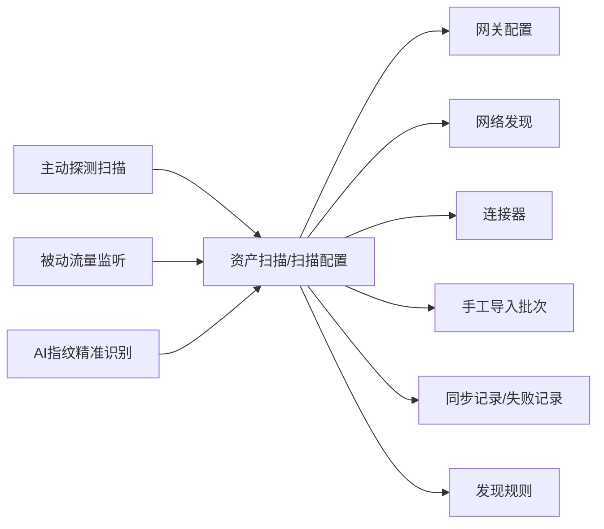

图解文字：资产发现能力由主动探测、被动监听和 AI 指纹识别共同构成，产品界面示例展示了资产扫描任务配置、不同发现方式的统计卡片、配置列表和发现规则入口。

图像复原说明：本页左半部分是三个纵向卡片，分别编号 1、2、3，对应“业务痛点”“解决方案与优势”“建设价值”。右半部分是一张产品界面截图，左侧有垂直导航栏，当前导航定位在“AI资产发现”下的“资产扫描”。主内容顶部为面包屑和搜索栏，页面标题为“资产扫描”。标题下方有页签或操作区，可见“扫描任务”“扫描配置”等字样。中上部横向排布多个统计卡片，依次展示网关配置、网络发现、连接器、手工导入批次、连接器同步记录、失败记录等，卡片内有数字。中部有二级标签或筛选入口，当前突出“网络发现”。下方是扫描配置表格，表格列出配置名称、资产类型、接入/扫描方式、地址或范围、操作等信息。右侧有一个窄侧栏，标题为“发现规则”，其中包含去重、自动入队、审批策略、拒绝策略等规则说明。截图中央有斜放的“示例”水印。

## 第10页 / PDF第10页：资产管理

资产管理：AI-BOM 六大类资产标准化台账，以统一数据模型与国际标准字段，覆盖智能体、业务应用、IT基础设施、MCP工具链、API接口、AI模型六大核心资产做全域标准化纳管，解决资产口径不一、台账混乱、无统一视图、合规无依据的问题。

1. 业务痛点：企业 AI 与 IT 异构资产无统一标准、台账混乱、口径不一，无法支撑全生命周期管理与合规审计。
2. 解决方案与优势：
   - 方案：基于统一数据模型与国际 AI-BOM 标准，构建覆盖六大类资产的标准化台账，实现统一纳管与全生命周期管理。
   - 优势：全域覆盖、标准统一、视图唯一，可直接对接监管合规与资产运营场景。
3. 建设价值：提升资产管理效率、消除安全盲区、支撑合规举证，为 AI 资产治理与数字化转型提供可信数据底座。

右侧示例截图展示六类资产管理页面：智能体管理、大模型管理、MCP 工具管理、API 工具管理、应用管理、IT资产。截图有“示例”水印。

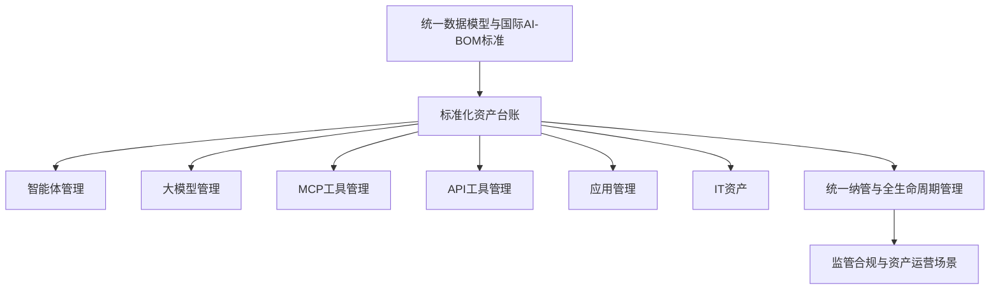

图解文字：本页将资产管理能力落到统一台账。统一数据模型和 AI-BOM 标准支撑六类资产的标准化管理，再面向生命周期管理、合规和运营使用。

图像复原说明：本页左侧仍是编号 1、2、3 的三段说明卡片。右侧区域由六张产品界面缩略图组成，呈两列三行网格排列。第一行左图标题为“智能体管理”，右图为“大模型管理”；第二行左图为“MCP 工具管理”，右图为“API 工具管理”；第三行左图为“应用管理”，右图为“IT资产”。每张缩略图都表现为同一套 AI-BOM 平台界面：左侧有导航栏，上方有统计卡片或筛选区，中间为资产列表表格，右侧或表格操作列有操作按钮。每张缩略图上都有斜向“示例”水印。六张图共同表达六大类资产使用统一台账样式管理。

## 第11页 / PDF第11页：资产数字身份与拓扑关系

资产数字身份与拓扑关系：为每一项 AI 与 IT 资产分配全局唯一数字身份，自动构建资产与代码、镜像、配置、服务间的依赖拓扑，实现资产关系可视化、变更可追溯、风险可快速定位，解决依赖黑盒、管理孤岛、风险无法溯源的核心问题。

1. 业务痛点：企业内网资产调用关系复杂混乱，依赖链路完全黑盒，跨平台资产无统一标识形成管理孤岛，安全风险无法上下溯源、影响范围难以精准界定。
2. 解决方案与优势：
   - 方案：为每项资产分配全局唯一数字身份，自动关联并可视化呈现依赖关系，实现组件变更全链路上下溯源。
   - 优势：身份唯一可信、依赖自动可视、溯源高效精准，大幅提升风险定位与变更管控效率。
3. 建设价值：打通资产关联关系，强化风险管控与应急响应能力，为安全运营、故障定位、合规审计提供可追溯、可举证的数据支撑。

右侧示例截图可见资产详情页和“调用关系”拓扑视图；拓扑中存在不同类型节点，顶部图例包含本智能体、关联智能体、MCP工具、API工具、大模型、IT资产、模型资源等。截图有“示例”水印。

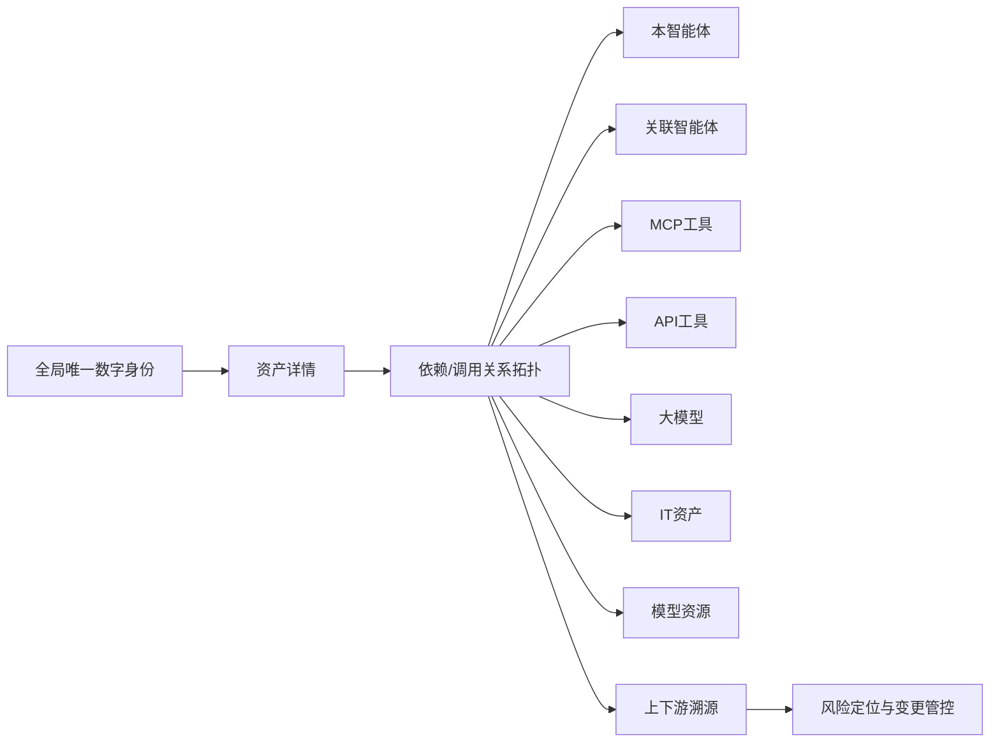

图解文字：数字身份是资产拓扑的基础。平台先为资产赋予唯一身份，再在详情页中呈现调用关系，将智能体、MCP 工具、API 工具、大模型、IT 资产等关联起来，用于风险定位、影响范围分析和变更追溯。

图像复原说明：本页右侧截图是一个资产详情抽屉或详情页。左边覆盖着灰色半透明背景，表示主页面被详情面板遮罩；右侧白色详情面板标题为“详情”。面板左栏是“基础信息”，可见字段包括智能体名称 Ax01、身份码 10002、版本 1.0.1、所属域 Operations Domain、所属网关 Agent Gateway-Cloud Domain-001、责任人 admin、服务地址等。面板右侧上方有时间范围选择框，下面有两个页签“画像”和“调用关系”，其中“调用关系”被选中。调用关系区域顶部是图例，标明本智能体、关联智能体、MCP工具、API工具、大模型、IT资产、模型资源等节点类型。中心是网状拓扑图，红色节点 Ax01 位于中间，周围以不同颜色连线连接多个资产节点；部分可见节点包括知识库、应用服务、Agent Gateway、CMDB/Nacos、salary-search 等。右上角有缩放控件，截图中央有斜向“示例”水印。

## 第12页 / PDF第12页：影子AI智能治理

影子AI智能治理：通过静默探测、自动识别、风险分级与闭环处置，实现对私自部署、无备案、无人运维的影子 / 僵尸 AI 资产全流程治理，解决影子 AI 隐蔽难查、风险高、合规难举证的问题。

1. 业务痛点：企业内网私自部署的影子 / 僵尸 AI 资产隐蔽性强、排查难度大，存在大量安全漏洞与合规隐患，缺乏标准化处置流程，整改与追溯困难。
2. 解决方案与优势：
   - 方案：对影子资产实现自动识别、风险分级、清单展示与闭环处置，支持转纳管 / 忽略并关联安全告警，形成完整治理闭环。
   - 优势：全自动发现、智能风险分级、处置流程闭环、日志全程留痕，可快速落地并满足监管合规要求。
3. 建设价值：全面消除影子 AI 安全盲区，降低合规扣分与漏洞风险，实现资产全域可控可管，提升整体安全与合规治理水平。

右侧示例截图展示“影子资产处理”页面，包含待处置、审批中、已转纳管、已忽略等统计卡片，并按智能体、MCP工具、API工具、模型等类型展示清单。截图有“示例”水印。

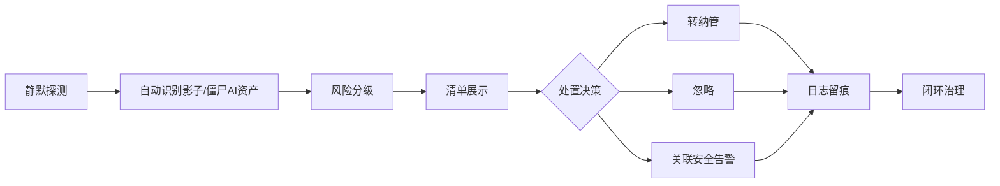

图解文字：影子 AI 治理的核心链路是从静默探测和自动识别开始，经风险分级进入处置清单，再通过转纳管、忽略、关联安全告警等动作形成闭环，并保留日志用于追溯和合规举证。

图像复原说明：右侧产品截图为“影子资产处理”列表页。左侧垂直导航栏中“影子资产处理”处于选中状态。主区域顶部是面包屑与搜索栏，下面是一排状态统计卡片，从左到右为“待处置”“审批中”“已转纳管”“已忽略”，卡片中可见待处置数量为 11，其余多为 0。统计卡片下方有类型页签，包括“智能体”“MCP工具”“API工具”“模型”，其中“MCP工具”处于选中状态。列表区上方有搜索框，表格列包括名称、标识、来源、首次发现、最近发现、操作等。表格中多行记录名称呈 IP:端口/sse 形式，来源可见 NETWORK_SCAN，右侧操作列有“处置”。截图中央同样有斜向“示例”水印。

## 第13页 / PDF第13页：可视化Dashboard运营中心

可视化Dashboard运营中心：通过核心指标概览、资产分布可视化、风险管控面板与流程漏斗监控，一站式呈现 AI 资产全域态势与治理全过程，解决资产管理数据分散、态势不透明、管控无抓手、决策与汇报缺乏直观支撑的问题。

1. 业务痛点：资产数据分散、无统一可视界面，核心指标、分布情况、治理进度无法直观掌握，运营决策与监管汇报缺少直观高效的抓手。
2. 解决方案与优势：
   - 方案：搭建一站式可视化运营中心，实现资产指标、分布、风险、治理流程的集中展示与实时监控。
   - 优势：全域数据集中呈现、多维度可视化展示、进度实时可追踪，支撑高效运营与快速决策。
3. 建设价值：提升资产管理透明度与运营效率，便于全局掌控与汇报展示，为运维管理、合规检查、应急指挥提供直观有力支撑。

右侧示例截图标题为“AI资产治理平台 Dashboard 大屏”。截图可见核心指标卡片：AI资产总量 12,486，待纳管 1,276，影子风险资产 684，资产健康率 76.8%，处置完成率 61.4%。可见图表包括六大类资产分类占比环形图、各部门/业务线资产分布柱状图、六大类资产合规状态多柱状图、近7天资产发现与纳管趋势折线图。截图有“示例”水印。

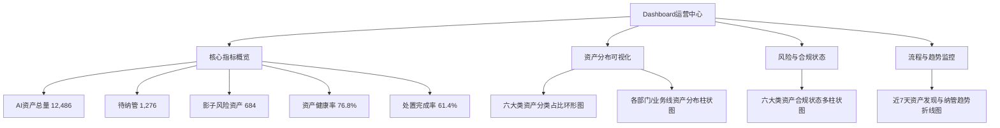

图解文字：Dashboard 将资产治理状态压缩到一个运营视图中。顶部用于快速查看总量、待纳管、风险资产、健康率和处置完成率；中部和底部通过分类、部门分布、合规状态和趋势图支撑运营监控、汇报展示和快速决策。

图像复原说明：右侧截图是 Dashboard 大屏页面，左侧保留 AI-BOM 平台导航栏，当前选中“资产看板”。主内容顶部标题为“AI资产治理平台 Dashboard 大屏”，标题下有说明文字，表示统一发现、识别、纳管与处置企业内智能体、应用、IT资产、MCP工具、API与大模型资产。标题下方横向排列五个核心指标卡片：AI资产总量 12,486，待纳管 1,276，影子风险资产 684，资产健康率 76.8%，处置完成率 61.4%。中间区域左侧是“六大类资产分类占比环形图”，右侧是“各部门/业务线资产分布柱状图”。底部左侧是“六大类资产合规状态多柱状图”，底部右侧是“近7天资产发现与纳管趋势折线图”。画面中部偏右有斜向“示例”水印，最右侧可见页面滚动条。

## 第14页 / PDF第14页：资产全生命周期闭环管理

全生命周期闭环管理系：构建覆盖资产自动化发现、同步纳管、台账管理、配置变更留痕、合规审计取证的全流程能力，将资产管理与风险管控、合规检查、变更管理、应急联动深度融合，解决资产从上线到退役全程不可控、不可管、不可查、不可审，管理无标准、无量化、无追溯的问题。

1. 业务痛点：资产从发现、纳管、变更到下线缺乏标准化流程，配置与权限变更无留痕、违规操作无法追溯，资产管理与风险治理，难以形成闭环。
2. 解决方案与优势：
   - 方案：打造资产从发现、识别、纳管、治理到审计的全生命周期一体化能力，实现全程可控、可管、可查、可审。
   - 优势：全流程自动化、管理标准化、操作可留痕、合规可举证，真正实现 AI 资产闭环运营。
3. 建设价值：保障 AI 资产安全、合规、稳定、高效运行，降低运营风险与合规成本，为企业 AI 业务规模化落地提供坚实管理支撑。

右侧图文字包括“资产全生命周期管理”“亚信安全 AI-BOM资产管理平台”“企业业务系统”“资产管理平台”“其它业务系统....”“同步共享”，流程节点为发现、纳管、变更、治理、下线。

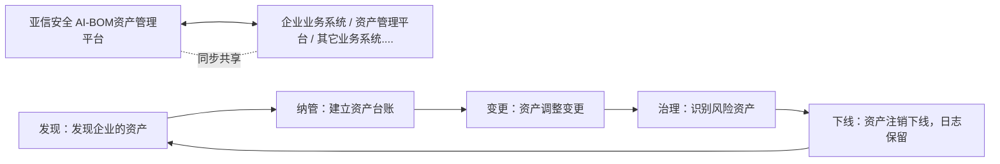

图解文字：生命周期闭环从发现企业资产开始，进入纳管建立台账，随后对资产调整变更进行留痕，再识别风险资产并治理，最终资产注销下线并保留日志。AI-BOM资产管理平台与企业业务系统、资产管理平台和其它业务系统同步共享数据。

图像复原说明：右侧图是一条类似闭环跑道的流程图。左侧中部有绿色方块“亚信安全 AI-BOM资产管理平台”，其下方有一个蓝色业务系统容器，内部从上到下写“企业业务系统”“资产管理平台”“其它业务系统....”。平台和业务系统之间用上下双向箭头连接，箭头旁写“同步共享”。跑道从左上开始向右延伸，第一段标“发现 / 发现企业的资产”，右上段标“纳管 / 建立资产台账”，中部向左回折的段落标“变更 / 资产调整变更”，左下回折处标“治理 / 识别风险资产”，最底部横向段落末端标“下线 / 资产注销下线，日志保留”。跑道上分布多个白色圆点和较大的圆形节点，表示流程节点或里程碑。整体表达资产在平台与业务系统同步共享的基础上，围绕发现、纳管、变更、治理、下线形成闭环。

## 第15页 / PDF第15页：目录

本页为目录页，当前突出“03 方案核心场景”。目录项同第2页：

1. 方案建设背景
2. 方案建设方案
3. 方案核心场景
4. 方案建设价值

图像转换：本页除目录结构外，无其他非装饰性内容图。

## 第16页 / PDF第16页：AI资产全域可视管控场景

治理痛点：企业存在AI资产识别能力弱、资产孤岛严重、依赖链路不透明、人工盘点成本高昂的治理痛点。

解决方案：平台依托主被动融合探测、标准化台账、资产数字身份及可视化大屏能力，实现全域AI资产可视、可查、可管。

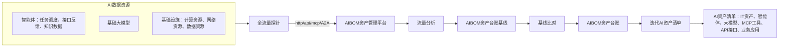

图解文字：场景图从 AI 数据资源开始，覆盖智能体、基础大模型和基础设施。全流量探针通过 http/api/mcp/A2A 获取流量后进入 AIBOM 资产管理平台，平台进行流量分析，生成资产台账基线并进行基线比对，形成 AIBOM 资产台账和迭代 AI 资产清单。资产清单包括 IT资产、智能体、大模型、MCP工具、API接口、业务应用。

图像复原说明：场景图左侧上方是一个浅蓝色框“AI数据资源”，框内分三层：上层是“智能体”，包含任务调度、接口反馈、知识数据等交互字样和多个智能体/数据图标；中层是“基础大模型”，排列多个模型或厂商图标；下层是“基础设施”，包含计算资源、网络资源、数据资源。左侧下方另有一个浅蓝色框“AI资产清单”，横向放置六个图标和标签：IT资产、智能体、大模型、MCP工具、API接口、业务应用。中间偏左是“全流量探针”图标，左侧 AI数据资源通过虚线箭头指向探针；探针右侧通过标注“http/api/mcp/A2A”的箭头连接到“AIBOM资产管理平台”。平台下方有向下箭头，旁边写“流量分析”，指向“AIBOM资产台账基线”；再向下经过“基线比对”到“AIBOM资产台账”。底部从 AIBOM资产台账向左有一条长箭头，标注“迭代AI资产清单”，回到左下角 AI资产清单。右侧是蓝色标题栏“价值效果”的说明面板，列出全域智能体纳管、统一身份可信、可视化大屏展示三项。

价值效果：

- 全域智能体纳管：实现对全域智能体资产的纳管，并根据企业内部风险判断标准对智能体资产进行类别和级别的标识。
- 统一身份可信：为所有的AI资产设置全域唯一可信的数字身份标识，方便对AI资产进行统一管理和跟踪溯源，方便风险发现和处置。
- 可视化大屏展示：通过大屏可视化展示智能体、大模型、MCP工具、API接口、IT资产和应用等六大维度的资产信息。

## 第17页 / PDF第17页：影子AI智能发现与闭环治理场景

治理痛点：影子AI排查难度大、安全漏洞多、合规扣分严重，且缺少标准化处置流程，整改追溯困难。

解决方案：平台通过静默探测识别、智能风险分级、全量日志留痕能力，实现影子AI合规化闭环治理。

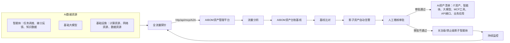

图解文字：影子 AI 治理场景同样从 AI 数据资源与全流量探针开始，经 AIBOM 资产管理平台做流量分析和基线比对，发现异常后形成影子资产自动告警。告警进入人工稽核审批；审批通过则进入 AI 资产清单，审批不通过则标记为关注级或禁止级影子智能体并持续监控。

图像复原说明：本页图的左侧“AI数据资源”和左下“AI资产清单”与第16页相同。中间流程也从 AI数据资源经虚线箭头进入“全流量探针”，再通过“http/api/mcp/A2A”连接到“AIBOM资产管理平台”，平台向下做“流量分析”，进入“AIBOM资产台账基线”，再通过“基线比对”生成“影子资产自动告警”。与第16页不同的是，告警后向左进入“人工稽核审批”。人工稽核审批有两条结果路径：一条标“审批通过”，向左进入 AI资产清单；另一条标“审批不通过”，向上进入“关注级/禁止级影子智能体”，再向上连接“持续监控”，持续监控箭头回到全流量探针，形成循环监控。右侧“价值效果”面板列出全域影子智能体纳管、全链路闭环管理、供应链风险阻断三项。

价值效果：

- 全域影子智能体纳管：实现对全域影子智能的安全管控，防止企业内部智能体使用失控与级联故障，防止渗透扩散。
- 全链路闭环管理：在智能体全链路进行流量数据采集，并通过资产管理中心的基线比对，实时对影子智能体进行风险级别的判断。
- 供应链风险阻断：深度检测影子智能体安全漏洞、开源框架后门及第三方服务权限，阻断预埋攻击通道，降低供应链攻击损失，保障多智能体协同安全。

## 第18页 / PDF第18页：目录

本页为目录页，当前突出“04 方案建设价值”。目录项同第2页：

1. 方案建设背景
2. 方案建设方案
3. 方案核心场景
4. 方案建设价值

图像转换：本页除目录结构外，无其他非装饰性内容图。

## 第19页 / PDF第19页：核心优势

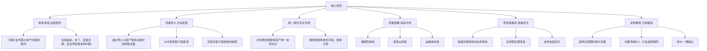

图解文字：核心优势围绕资产可见、主动发现、身份可信、轻量部署、快速集成和合规报送展开。中心是“核心优势”，外围六个能力点分别对应资产掌控、流量发现、统一身份、微服务轻量部署、零改造集成和审计报表输出。

图像复原说明：本页主体是一张围绕中心的优势环形图。中心是一个圆形或盾牌状区域，文字为“核心优势”。围绕中心分布六个方向的能力说明：左上为“摸清家底 全面掌控”，说明了解企业内部 AI 资产使用情况，包括版本、补丁、安装日期、安全风险等；左中为“流量导入 主动发现”，说明通过导入 AI 资产使用过程中的网络流量发现影子智能体并纳管；左下为“统一身份 安全可控”，说明对纳管智能体资产统一身份标识；右上为“轻量部署 成本可控”，说明微服务架构、资源占用低、运维成本低；右中为“零改造集成 快速交付”，说明快速对接现有业务系统、应用侧无需改造；右下为“定制报表 合规报送”，说明提供全周期审计、内置等保2.0和行业监管规则、审计一键输出。图中蓝色箭头或弧线连接六个方向，形成围绕中心的闭合优势组合。

## 第20页 / PDF第20页：建设价值

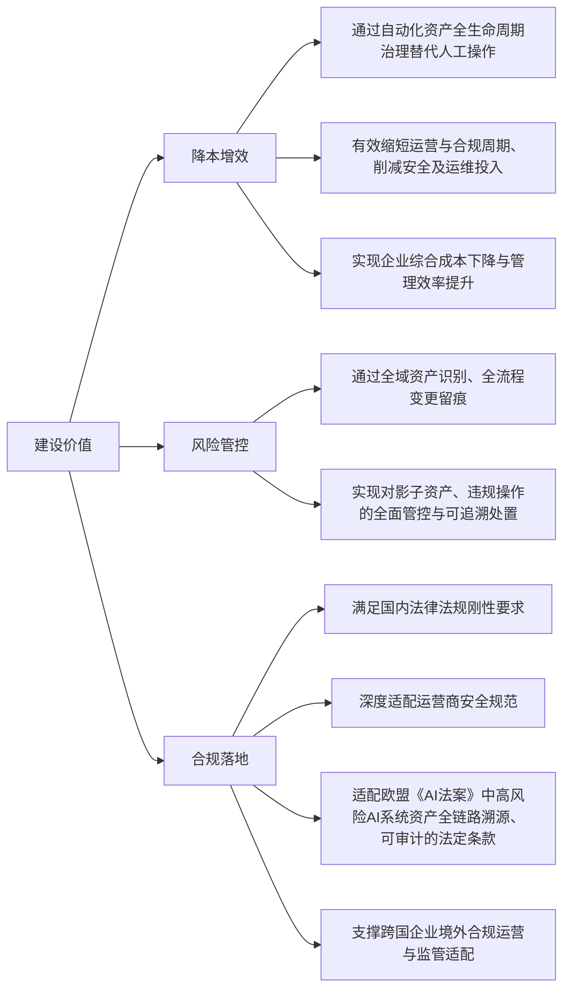

图解文字：建设价值分为三类。降本增效强调用自动化资产全生命周期治理替代人工操作，缩短周期并减少安全和运维投入。风险管控强调全域识别和全流程变更留痕，对影子资产与违规操作进行可追溯处置。合规落地强调满足国内法律法规、运营商安全规范，并适配欧盟《AI法案》中高风险 AI 系统资产全链路溯源和可审计要求。

图像复原说明：本页主体横向排列三个大型圆形价值模块。左侧蓝色圆为“降本增效”，圆下方正文说明通过自动化资产全生命周期治理替代人工操作，缩短运营与合规周期，削减安全及运维投入，实现综合成本下降与管理效率提升。中间紫色圆为“风险管控”，圆下方正文说明通过全域资产识别、全流程变更留痕，实现对影子资产、违规操作的全面管控与可追溯处置。右侧粉色圆为“合规落地”，圆下方正文说明满足国内法律法规刚性要求，深度适配运营商安全规范，适配欧盟《AI法案》中高风险 AI 系统资产全链路溯源、可审计的法定条款，并支撑跨国企业境外合规运营与监管适配。三个圆都有浅色外环和轨道状装饰，表示三个价值维度并列。

## 第21页 / PDF第21页：封底

安全数字世界

SECURE THE DIGITAL WORLD

护航产业互联

商务咨询热线：400-820-8876

技术售后热线：400-820-8839

图像转换：本页包含二维码和品牌标识。二维码未在本文中解析为链接；除联系方式和标语外，无流程或架构类内容图。
