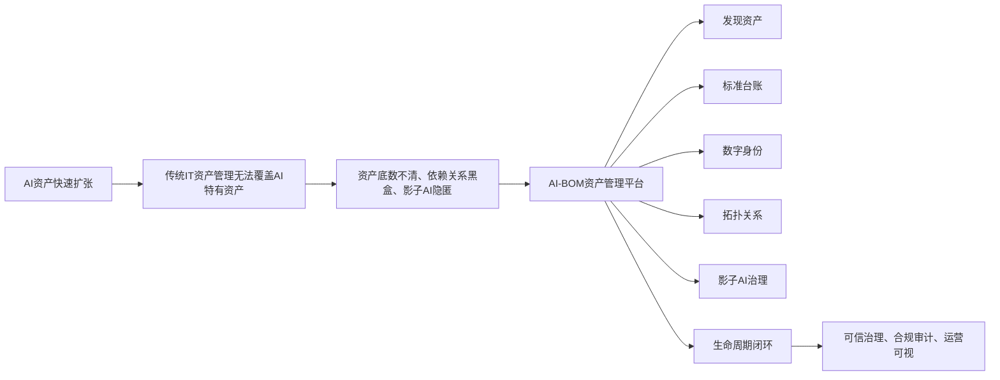
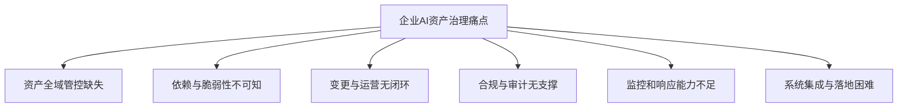
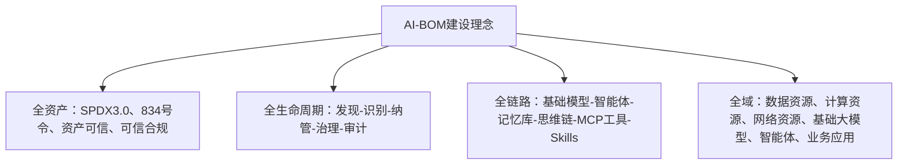
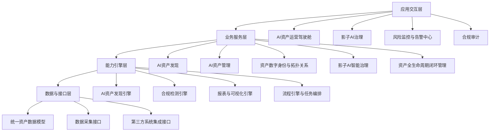
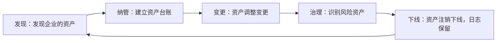
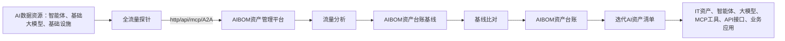
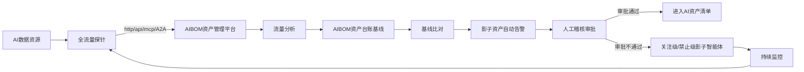
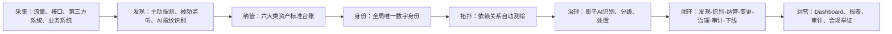

# 亚信安全 AI-BOM 资产管理解决方案完整梳理

来源文件：`D:\yaxin\文档\亚信安全AI-BOM资产管理解决方案@20260521.pptx`

本文用途：把 PPT 中的内容重新组织成一份独立可读的方案说明。只看这一份文件，应当能够理解该方案为什么要建设、要解决哪些问题、平台是什么、有哪些能力、如何工作、适用于哪些场景、最终产生什么价值。本文不引入 PPT 以外的外部事实，不扩写看不清或原文未出现的内容。

## 一句话结论

亚信安全 AI-BOM 是一个面向企业 AI 资产的全生命周期可信治理平台。它围绕 AI 资产发现、标准化台账、数字身份、依赖拓扑、影子 AI 治理、生命周期闭环、可视化运营与合规审计，帮助企业把内网中的智能体、大模型、MCP 工具、API 接口、业务应用和 IT 资产统一识别、统一纳管、统一追溯、统一治理。

## 这份方案要解决什么

企业内部 AI 资产正在从单一模型文件，快速演进为智能体、模型、API、MCP 工具、应用和 IT 基础设施共同组成的复杂体系。传统 IT 资产管理主要覆盖硬件与通用软件，难以识别 AI 特有资产，也难以看清智能体、模型、工具、接口、配置、服务之间的依赖关系。

PPT 中反复强调的核心问题有三类：

1. 资产看不全：AI 资产、IT 资产、业务应用、影子 AI、僵尸资产长期隐匿，企业不知道资产家底。
2. 关系看不清：代码、镜像、配置、服务、智能体、模型、MCP 工具、API 接口之间依赖复杂，风险难以溯源，影响范围难以界定。
3. 治理闭不了环：资产发现、纳管、变更、治理、下线缺少标准流程，操作无留痕，合规审计缺少数据支撑。

这套方案的目标，就是用 AI-BOM 平台形成企业 AI 资产可信底座：先发现资产，再统一建账，再赋予身份，再测绘关系，再治理影子资产，最后把发现、纳管、变更、治理、审计和下线串成闭环。

图示介绍：这是一张从建设背景到方案价值的总览图。左侧说明企业 AI 资产快速扩张，而传统 IT 资产管理无法覆盖智能体、模型、工具和接口等 AI 特有资产，最终造成资产底数不清、依赖关系不透明、影子 AI 隐匿等问题。中间的 AI-BOM 资产管理平台通过资产发现、标准台账、数字身份、拓扑关系、影子 AI 治理和生命周期闭环六项能力承接这些问题，右侧落到可信治理、合规审计和运营可视三个结果。

图示想要表达的内容：企业 AI 资产治理不能停留在传统 IT 资产盘点，而需要以 AI-BOM 平台为中心，把资产发现、建账、身份、关系、影子资产治理和生命周期管理连接起来，最终形成可见、可管、可追溯、可审计的治理体系。

## 监管与行业背景

PPT 的背景部分先说明政策监管的刚性要求，再说明行业发展带来的资产复杂性。

### 政策监管要求

页面列出以下政策或标准，并把它们组织成监管要求逐步增强的时间线：

| 年份 | 政策或标准 | PPT 中强调的要求 |
|---|---|---|
| 2016 | 《中华人民共和国网络安全法》 | 关键信息基础设施运营者采购网络产品和服务需通过国家安全审查，确保关键信息基础设施供应链安全。 |
| 2019 | GB/T 22239-2019《信息安全技术 网络安全等级保护基本要求》 | 二级以上要求开始就对自行开发软件在上线前检查是否具有软件安全测试报告和代码审计报告，明确软件存在的安全问题及可能存在的恶意代码。 |
| 2023 | GB/T 39204-2022《信息安全技术 关键信息基础设施安全保护要求》 | 第7.9条供应链安全保护 j）要求自行或委托第三方网络安全服务机构对定制开发的软件进行源代码安全检测，或由供应方提供第三方网络安全服务机构出具的代码安全检测报告。 |
| 2024 | GB/T 43698-2024《信息安全技术 软件供应链安全要求》 | 明确软件供应链安全风险管理的具体要求，指导供需双方管理软件供应链安全工作。 |
| 2024 | GB/T 43848-2024《信息安全技术 软件产品开源代码安全评价方法》 | 覆盖开源代码来源、开源代码安全质量、开源代码知识产权和开源代码管理，评价流程依据评价要素给出评价过程与手段。 |
| 2026 | 《国务院关于产业链供应链安全的规定》，834号令 | 第12条要求企业、科研机构等完善风险防控体系，实现核心技术及相关信息系统、数据的安全可控。 |

这些要求共同指向一个结论：企业需要对软件、AI 资产、供应链、开源代码、核心技术、信息系统和数据形成可识别、可追溯、可审计、可管控的能力。

### 行业发展现状

PPT 描述的行业现状是：自主智能体、大模型、MCP 工具链在企业内网快速普及，AI 资产形态从单一模型文件演进为多元异构资产。

这些资产包括：

- 智能体应用：个人助手、智慧工厂、智慧农业、智慧交通、智慧校园。
- 智能体相关要素：智能体、MCP、知识库、意图、skills、大模型 API 网关。
- IT 基础设施与基础大模型相关要素：大模型、主机、DS、TDA、AE、算力、算网网络安全设备。
- 类 OpenClaw 智能体示例：Clawdbot、Moltbot、OpenClaw。
- 便利能力：可远程控制、帮您访问网站、帮您装“软件”、默默跑任务、跨模型调用更智能、访问硬盘和智能家居。
- 实证威胁：被他人远程控制、自动泄露密钥、被部署木马、堵不完的漏洞、链式转发泄露、上传隐私，删除数据。

PPT 的判断是：

- 从大模型演进到智能体，AI 资产数量和类型急剧增加，智能体资产相互依赖路径复杂。
- 类 OpenClaw 智能体的未授权部署，给企业带来了数量庞大、身份模糊、权限失控的影子智能体。
- 当前缺少技术手段发现 AI 资产全貌、影子智能体和 AI 资产依赖关系，对企业安全防护带来不便。

## 企业现存六大核心痛点

PPT 将企业现存痛点总结为六类。

### 资产全域管控缺失

企业无法精准识别内网 AI 资产、IT 资产、业务应用的全域分布。影子资产和僵尸资产长期隐匿，资产健康状态与失陷风险无法判定。

### 依赖与脆弱性不可知

资产间依赖、代码、镜像、配置、服务关系复杂。脆弱性无法持续评估，安全事件影响范围难以快速定位。

### 变更与运营无闭环

资产配置、版本、权限变更全程无留痕，违规变更无法追溯，资产从发现到治理缺少标准化流程。

### 合规与审计无支撑

企业缺少统一资产台账与操作日志，算法备案、等保测评、监管审计缺乏有效数据支撑，合规整改成本高。

### 监控和响应能力不足

企业缺乏有效监控工具和流程，难以及时识别和处理安全事件。

### 系统集成与落地困难

现有安全平台、身份系统、流量监控无法联动。自研改造侵入性强，部署周期长，运维成本高。

图示介绍：这是一张 AI 资产治理问题分解图。顶部的总体痛点向下展开为六个相互独立但彼此关联的治理缺口：看不全资产、看不懂依赖与脆弱性、变更和运营没有闭环、缺少合规审计依据、监控响应不足，以及现有系统难以集成落地。图中没有设置先后顺序，重点是说明 AI-BOM 需要同时覆盖资产、关系、流程、合规、运营和集成六个方面，而不是只解决资产盘点问题。

图示想要表达的内容：企业 AI 治理是一个系统性问题，资产发现只是起点，平台还必须补齐依赖分析、变更运营、审计合规、监控响应和系统集成等能力，才能真正落地。

## AI-BOM 平台是什么

PPT 对平台的定义是：

亚信安全 AI-BOM（人工智能物料清单）是基于微服务架构的 AI 全生命周期资产可信治理平台，全面兼容 SPDX3.0 国际标准采集规范，实现 AI 资产主动发现、统一身份、闭环管理、可信合规，是运营商、政企、金融行业构建 AI 可信基础设施的核心底座。

这个定义里有几个关键词：

- 微服务架构：强调轻量部署、资源占用低、运维成本低。
- AI 全生命周期：覆盖发现、识别、纳管、治理、审计和下线。
- 资产可信治理：为 AI 与 IT 资产建立统一身份、台账、关系和审计证据。
- 兼容 SPDX3.0：强调与国际标准采集规范的兼容。
- 主动发现：用主动探测、被动流量解析、指纹识别、多源数据接入等方式替代单纯人工录入。
- 可信合规：内置监管规则，实现资产安全与合规自动化管控。

## 建设理念：四个维度

PPT 的建设理念图按四个维度展开：全资产、全生命周期、全链路、全域。

### 全资产

全资产维度强调兼容 SPDX3.0、834号令，并围绕资产可信构建可信合规能力。平台内置监管规则，实现资产安全与合规自动化管控。

### 全生命周期

全生命周期维度按照“发现、识别、纳管、治理、审计”展开，形成覆盖资产全流程的闭环管理。

### 全链路

全链路维度覆盖基础模型、智能体、记忆库、思维链、MCP 工具、Skills。平台为每一项资产赋予唯一数字身份，实现全链路追溯。

### 全域

全域维度覆盖数据资源、计算资源、网络资源、基础大模型、智能体、业务应用等。平台通过主动发现和主被动融合技术替代人工录入，实现资产全域无遗漏识别。

图示介绍：这张图用“四个全”概括 AI-BOM 的建设边界。全资产强调按照标准和监管要求统一管理各类资产；全生命周期强调从发现、识别、纳管到治理、审计的持续管理；全链路强调沿基础模型、智能体、记忆库、思维链、MCP 工具和 Skills 追踪资产关系；全域强调把数据、计算、网络、模型、智能体和业务应用纳入同一视野。四个维度共同说明平台既要覆盖资产类型，也要覆盖时间过程、依赖链路和企业资源范围。

图示想要表达的内容：AI-BOM 的建设不能只覆盖某一种 AI 资产或某一个管理环节，而要同时做到资产范围全面、管理过程完整、依赖链路可追踪、企业资源全域可见。

## 功能架构

PPT 的功能架构分为四层：应用交互层、业务服务层、能力引擎层、数据与接口层。

### 应用交互层

应用交互层提供面向用户使用的入口，包括：

- AI 资产运营驾驶舱
- 影子 AI 治理
- 风险监控与告警中心
- 合规审计

这些入口让用户从运营、治理、风险、审计等角度使用平台。

### 业务服务层

业务服务层是平台的核心，包含五大业务服务域。

#### AI 资产发现

能力包括：

- 主动扫描探测
- 被动流量解析
- AI 指纹特征库匹配
- 多源数据接入
- 资产标注

这一层解决资产看不见、发现不准、依赖人工录入的问题。

#### AI 资产管理

能力包括：

- 大模型管理
- 智能体管理
- MCP 工具管理
- API 工具管理
- 应用管理 / IT 资产管理

这一层解决资产口径不一、台账混乱、缺少统一视图的问题。

#### 资产数字身份与拓扑关系

能力包括：

- 全局唯一资产 ID
- 可视化拓扑
- 依赖关系自动测绘
- 影响范围分析
- 全链路追溯

这一层解决依赖黑盒、风险无法上下溯源、影响范围难以界定的问题。

#### 影子 AI 智能治理

能力包括：

- 影子 / 僵尸资产管理
- 智能风险分级
- 闭环处置
- 告警关联
- 日志留痕

这一层解决私自部署、无备案、无人运维的影子 / 僵尸 AI 隐蔽难查、风险高、合规难举证的问题。

#### 资产全生命周期闭环管理

能力包括：

- 资产发现-纳管-变更-治理-下线管理
- 配置变更留痕
- 流程自动化
- 资产审批
- 操作日志审计

这一层解决资产从上线到退役全过程不可控、不可管、不可查、不可审的问题。

### 能力引擎层

能力引擎层提供底层能力支撑，包括：

- AI 资产发现引擎
- 合规检测引擎
- 报表与可视化引擎
- 流程引擎与任务编排

这些引擎支撑上层业务服务运行。

### 数据与接口层

数据与接口层提供：

- 统一资产数据模型（AI-BOM 标准模型）
- 数据采集接口
- 第三方系统集成接口（EDR / SIEM / 流量 / 身份管理等）

这说明平台不是孤立系统，而是需要与现有安全、流量、身份和第三方系统对接。

图示介绍：这是一张自上而下的四层功能架构图。应用交互层面向使用者，提供运营驾驶舱、影子 AI 治理、风险告警和合规审计入口；业务服务层承载资产发现、资产管理、数字身份与拓扑、影子 AI 治理及生命周期闭环等核心业务；能力引擎层提供发现、合规检测、报表可视化和流程编排等通用支撑；数据与接口层沉淀统一 AI-BOM 数据模型，并负责数据采集和第三方系统集成。纵向箭头表示下层为上层提供支撑，体现平台从数据接入到业务呈现的依赖关系。

图示想要表达的内容：AI-BOM 是一个分层的平台型系统，而不是单一的扫描工具。底层负责数据接入和统一建模，中间层负责引擎和业务处理，上层面向运营、风险和合规场景提供可用功能。

## 五个核心功能模块

PPT 中方案建设部分重点展开了五个模块：资产发现、资产管理、资产数字身份与拓扑关系、影子 AI 智能治理、可视化 Dashboard 运营中心、资产全生命周期闭环管理。严格说这里是六个能力主题，其中前五个偏能力和界面，第六个是贯穿闭环。

### 资产发现

资产发现模块支持主动和被动资产发现能力。它以主动探测扫描、被动流量监听、AI 指纹精准识别三位一体技术，全域无死角识别企业内网 AI 与 IT 全量资产。

业务痛点：

- 传统资产发现无法识别 AI 异构资产。
- 依赖人工录入容易遗漏。
- 资产长期隐匿导致资产底数不清、治理数据不可信。

解决方案：

- 采用主动探测、被动监听、AI 指纹识别方式。
- 结合多源采集与智能去重规则。
- 实现 AI 与 IT 全域资产自动化、无死角精准发现。

优势：

- 全域覆盖无盲区。
- 识别精准高效。
- 适配复杂内网。
- 为资产治理提供唯一可信数据源。

建设价值：

- 彻底摸清资产家底。
- 消除管理盲区。
- 降本增效并夯实治理根基。
- 满足监管合规要求。
- 支撑企业 AI 业务数字化转型。

产品界面示例中展示的是 AI-BOM 管理平台的资产扫描页面，可见“资产扫描”“扫描配置”等区域，以及网关配置、网络发现、连接器、手工导入批次、连接器同步记录、失败记录等统计卡片。下方有扫描配置列表，右侧有发现规则侧栏。截图带有“示例”水印。

### 资产管理

资产管理模块构建 AI-BOM 六大类资产标准化台账，以统一数据模型与国际标准字段，覆盖智能体、业务应用、IT 基础设施、MCP 工具链、API 接口、AI 模型六大核心资产。

业务痛点：

- 企业 AI 与 IT 异构资产无统一标准。
- 台账混乱、口径不一。
- 无法支撑全生命周期管理与合规审计。

解决方案：

- 基于统一数据模型与国际 AI-BOM 标准。
- 构建覆盖六大类资产的标准化台账。
- 实现统一纳管与全生命周期管理。

优势：

- 全域覆盖。
- 标准统一。
- 视图唯一。
- 可直接对接监管合规与资产运营场景。

建设价值：

- 提升资产管理效率。
- 消除安全盲区。
- 支撑合规举证。
- 为 AI 资产治理与数字化转型提供可信数据底座。

产品界面示例中展示六类资产管理页面：智能体管理、大模型管理、MCP 工具管理、API 工具管理、应用管理、IT 资产。六类页面使用统一平台样式，说明平台以统一台账方式管理不同类型资产。

### 资产数字身份与拓扑关系

该模块为每一项 AI 与 IT 资产分配全局唯一数字身份，自动构建资产与代码、镜像、配置、服务之间的依赖拓扑，实现资产关系可视化、变更可追溯、风险可快速定位。

业务痛点：

- 企业内网资产调用关系复杂混乱。
- 依赖链路完全黑盒。
- 跨平台资产无统一标识，形成管理孤岛。
- 安全风险无法上下溯源，影响范围难以精准界定。

解决方案：

- 为每项资产分配全局唯一数字身份。
- 自动关联并可视化呈现依赖关系。
- 实现组件变更全链路上下溯源。

优势：

- 身份唯一可信。
- 依赖自动可视。
- 溯源高效精准。
- 大幅提升风险定位与变更管控效率。

建设价值：

- 打通资产关联关系。
- 强化风险管控与应急响应能力。
- 为安全运营、故障定位、合规审计提供可追溯、可举证的数据支撑。

产品界面示例中展示资产详情页和“调用关系”拓扑视图。拓扑图中包含本智能体、关联智能体、MCP 工具、API 工具、大模型、IT 资产、模型资源等节点类型。示例资产信息中可见智能体名称 Ax01、身份码 10002、版本 1.0.1、所属域 Operations Domain、所属网关 Agent Gateway-Cloud Domain-001、责任人 admin 等字段。截图带有“示例”水印。

### 影子 AI 智能治理

影子 AI 智能治理模块通过静默探测、自动识别、风险分级与闭环处置，实现对私自部署、无备案、无人运维的影子 / 僵尸 AI 资产全流程治理。

业务痛点：

- 企业内网私自部署的影子 / 僵尸 AI 资产隐蔽性强。
- 排查难度大。
- 存在大量安全漏洞与合规隐患。
- 缺乏标准化处置流程。
- 整改与追溯困难。

解决方案：

- 对影子资产实现自动识别。
- 进行风险分级。
- 通过清单展示和闭环处置管理。
- 支持转纳管 / 忽略并关联安全告警。
- 形成完整治理闭环。

优势：

- 全自动发现。
- 智能风险分级。
- 处置流程闭环。
- 日志全程留痕。
- 可快速落地并满足监管合规要求。

建设价值：

- 全面消除影子 AI 安全盲区。
- 降低合规扣分与漏洞风险。
- 实现资产全域可控可管。
- 提升整体安全与合规治理水平。

产品界面示例展示“影子资产处理”页面。页面包含待处置、审批中、已转纳管、已忽略等状态统计卡片，并按智能体、MCP 工具、API 工具、模型等类型展示清单。示例中待处置数量为 11，其它状态多为 0。表格中可见来源 NETWORK_SCAN，右侧操作列有“处置”。截图带有“示例”水印。

### 可视化 Dashboard 运营中心

可视化 Dashboard 运营中心通过核心指标概览、资产分布可视化、风险管控面板与流程漏斗监控，一站式呈现 AI 资产全域态势与治理全过程。

业务痛点：

- 资产数据分散。
- 无统一可视界面。
- 核心指标、分布情况、治理进度无法直观掌握。
- 运营决策与监管汇报缺少直观高效的抓手。

解决方案：

- 搭建一站式可视化运营中心。
- 实现资产指标、分布、风险、治理流程的集中展示与实时监控。

优势：

- 全域数据集中呈现。
- 多维度可视化展示。
- 进度实时可追踪。
- 支撑高效运营与快速决策。

建设价值：

- 提升资产管理透明度与运营效率。
- 便于全局掌控与汇报展示。
- 为运维管理、合规检查、应急指挥提供直观有力支撑。

Dashboard 示例截图可见标题“AI资产治理平台 Dashboard 大屏”，并展示以下指标：

| 指标 | 截图可见数值 |
|---|---:|
| AI资产总量 | 12,486 |
| 待纳管 | 1,276 |
| 影子风险资产 | 684 |
| 资产健康率 | 76.8% |
| 处置完成率 | 61.4% |

截图还包含六大类资产分类占比环形图、各部门 / 业务线资产分布柱状图、六大类资产合规状态多柱状图、近7天资产发现与纳管趋势折线图。截图带有“示例”水印。

### 资产全生命周期闭环管理

资产全生命周期闭环管理构建覆盖资产自动化发现、同步纳管、台账管理、配置变更留痕、合规审计取证的全流程能力，将资产管理与风险管控、合规检查、变更管理、应急联动深度融合。

业务痛点：

- 资产从发现、纳管、变更到下线缺乏标准化流程。
- 配置与权限变更无留痕。
- 违规操作无法追溯。
- 资产管理与风险治理难以形成闭环。

解决方案：

- 打造资产从发现、识别、纳管、治理到审计的全生命周期一体化能力。
- 实现全程可控、可管、可查、可审。

优势：

- 全流程自动化。
- 管理标准化。
- 操作可留痕。
- 合规可举证。
- 真正实现 AI 资产闭环运营。

建设价值：

- 保障 AI 资产安全、合规、稳定、高效运行。
- 降低运营风险与合规成本。
- 为企业 AI 业务规模化落地提供坚实管理支撑。

生命周期图的流程是：

图示介绍：这是一张 AI 资产全生命周期循环图。资产首先被发现，再建立标准台账并纳入管理；后续发生版本、配置、权限或关系调整时进入变更环节；平台识别风险资产并执行治理；资产注销下线后保留操作日志和审计记录。下线并不代表管理结束，闭环箭头回到发现，表示平台需要持续重新发现新增或重新出现的资产。PPT 同时表达了 AI-BOM 平台与企业业务系统、资产管理平台及其它业务系统之间通过“同步共享”进行数据联动。

图示想要表达的内容：AI 资产管理是持续循环的运营过程，必须把发现、纳管、变更、治理和下线串成一条有记录、可追溯的闭环，避免资产上线后失去管理。

## 两个核心场景

PPT 后半部分用两个场景说明平台如何发挥作用。

### 场景一：AI 资产全域可视管控

治理痛点：

企业存在 AI 资产识别能力弱、资产孤岛严重、依赖链路不透明、人工盘点成本高昂的治理痛点。

解决方案：

平台依托主被动融合探测、标准化台账、资产数字身份及可视化大屏能力，实现全域 AI 资产可视、可查、可管。

场景流程：

1. 左侧是 AI 数据资源，包括智能体、基础大模型、基础设施。
2. AI 数据资源通过全流量探针进行采集。
3. 全流量探针通过 http/api/mcp/A2A 等方式把数据送入 AIBOM 资产管理平台。
4. 平台进行流量分析。
5. 生成 AIBOM 资产台账基线。
6. 进行基线比对。
7. 形成 AIBOM 资产台账。
8. 迭代形成 AI 资产清单。
9. AI 资产清单包括 IT 资产、智能体、大模型、MCP 工具、API 接口、业务应用。

图示介绍：这张图描述“AI 资产全域可视管控”场景的数据处理链路。平台从智能体、基础大模型和基础设施等 AI 数据资源开始，通过全流量探针采集运行通信，再经 HTTP、API、MCP、A2A 等链路送入 AIBOM 平台。平台对流量进行分析，生成并比对资产台账基线，形成标准化台账，再持续迭代 AI 资产清单。最右侧列出了最终纳管的六类对象：IT 资产、智能体、大模型、MCP 工具、API 接口和业务应用，体现从运行数据到统一资产视图的转换过程。

图示想要表达的内容：平台可以通过业务运行流量主动获得资产信息，经过分析和基线比对，把分散、动态的 AI 使用活动转化为统一、持续更新的资产清单，实现 AI 资产全域可视和统一纳管。

价值效果：

- 全域智能体纳管：实现对全域智能体资产的纳管，并根据企业内部风险判断标准对智能体资产进行类别和级别的标识。
- 统一身份可信：为所有 AI 资产设置全域唯一可信的数字身份标识，方便统一管理和跟踪溯源，方便风险发现和处置。
- 可视化大屏展示：通过大屏可视化展示智能体、大模型、MCP 工具、API 接口、IT 资产和应用等六大维度的资产信息。

### 场景二：影子 AI 智能发现与闭环治理

治理痛点：

影子 AI 排查难度大、安全漏洞多、合规扣分严重，且缺少标准化处置流程，整改追溯困难。

解决方案：

平台通过静默探测识别、智能风险分级、全量日志留痕能力，实现影子 AI 合规化闭环治理。

场景流程：

1. AI 数据资源进入全流量探针。
2. 探针通过 http/api/mcp/A2A 与 AIBOM 资产管理平台联动。
3. 平台进行流量分析。
4. 分析结果进入 AIBOM 资产台账基线。
5. 平台进行基线比对。
6. 发现异常后形成影子资产自动告警。
7. 告警进入人工稽核审批。
8. 审批通过后进入 AI 资产清单。
9. 审批不通过则进入关注级 / 禁止级影子智能体，并持续监控。

图示介绍：这张图描述“影子 AI 智能发现与闭环治理”场景。流量探针采集 AI 数据资源的通信信息，平台通过流量分析和基线比对发现未登记或不符合基线的资产，并自动生成影子资产告警。告警进入人工稽核审批：审批通过的资产进入正式 AI 资产清单；审批不通过的资产被标记为关注级或禁止级影子智能体，并进入持续监控。持续监控结果再次回到探针采集环节，形成“发现、判断、审批、处置、复核”的循环。

图示想要表达的内容：影子 AI 不应只被发现和告警，还要经过风险判断、人工审批、转纳管或限制使用，并持续验证处置结果，从而形成可追责、可复核的治理闭环。

价值效果：

- 全域影子智能体纳管：实现对全域影子智能的安全管控，防止企业内部智能体使用失控与级联故障，防止渗透扩散。
- 全链路闭环管理：在智能体全链路进行流量数据采集，并通过资产管理中心的基线比对，实时对影子智能体进行风险级别判断。
- 供应链风险阻断：深度检测影子智能体安全漏洞、开源框架后门及第三方服务权限，阻断预埋攻击通道，降低供应链攻击损失，保障多智能体协同安全。

## 核心优势

PPT 将核心优势总结为六项。

### 摸清家底，全面掌控

平台帮助企业了解内部 AI 资产使用情况，包括版本、补丁、安装日期、安全风险等多种问题。

### 流量导入，主动发现

平台通过导入 AI 资产使用过程中的网络流量，从中发现影子智能体，实现对影子智能体的纳管。

### 统一身份，安全可控

平台对纳管的智能体资产统一身份标识，做到智能体身份可信，使用可控。

### 轻量部署，成本可控

平台采用微服务架构，资源占用低，运维成本低。

### 零改造集成，快速交付

平台可以快速对接现有业务系统，应用侧无需改造，支持快速交付。

### 定制报表，合规报送

平台提供全周期审计功能，内置等保 2.0、行业监管规则，支持审计一键输出。

## 建设价值

PPT 将建设价值分为三类：降本增效、风险管控、合规落地。

### 降本增效

通过自动化资产全生命周期治理替代人工操作，有效缩短运营与合规周期，削减安全及运维投入，实现企业综合成本下降与管理效率提升。

### 风险管控

通过全域资产识别、全流程变更留痕，实现对影子资产、违规操作的全面管控与可追溯处置。

### 合规落地

满足国内法律法规刚性要求，深度适配运营商安全规范，适配欧盟《AI法案》中高风险 AI 系统资产全链路溯源、可审计的法定条款，支撑跨国企业境外合规运营与监管适配。

## 方案整体运行逻辑

把所有内容串起来，AI-BOM 的运行逻辑可以理解为一条完整链路：

1. 从 AI 数据资源、网络流量、第三方系统、业务系统中采集信息。
2. 通过主动探测、被动监听、AI 指纹识别、多源接入发现资产。
3. 将发现的智能体、大模型、MCP 工具、API 接口、业务应用、IT 资产纳入统一资产台账。
4. 为每项资产分配全局唯一数字身份。
5. 自动测绘资产之间的调用关系、依赖关系和拓扑关系。
6. 对影子 / 僵尸资产进行识别、风险分级、告警、审批、转纳管或持续监控。
7. 将资产从发现、识别、纳管、变更、治理、审计、下线纳入闭环流程。
8. 通过 Dashboard 大屏、报表、审计日志支撑运营、合规、应急和汇报。

图示介绍：这是一张方案整体运行逻辑图，用一条主链路串起平台的核心能力。平台先从流量、接口、第三方系统和业务系统采集数据，再通过主动探测、被动监听和 AI 指纹识别发现资产；发现结果进入六大类资产标准台账，并获得全局唯一数字身份；随后平台测绘调用和依赖拓扑，识别、分级和处置影子 AI；最后通过生命周期闭环管理资产，并用 Dashboard、报表、审计日志和合规举证支撑持续运营。它可以作为全篇方案的流程摘要。

图示想要表达的内容：AI-BOM 的核心价值在于把“采集数据”转化为“发现资产”，再转化为“可信身份、可见关系、风险治理和持续运营”，形成从数据进入到合规举证的完整价值链。

## 关键对象与术语

### AI-BOM

人工智能物料清单。PPT 中将其定位为 AI 全生命周期资产可信治理平台的核心数据与能力基础。

### 六大类资产

PPT 中明确覆盖的六大类资产包括：

- 智能体
- 业务应用
- IT 基础设施
- MCP 工具链
- API 接口
- AI 模型 / 大模型

在部分页面中也以“IT资产、智能体、大模型、MCP工具、API接口、业务应用”的资产清单形式出现。

### 影子 AI / 僵尸 AI 资产

指企业内网私自部署、无备案、无人运维或长期隐匿的 AI 资产。PPT 认为这类资产隐蔽性强、风险高、合规难举证，是平台重点治理对象。

### 数字身份

平台为每项 AI 与 IT 资产分配的全局唯一身份标识。它用于统一管理、跟踪溯源、拓扑关联、风险定位和变更管控。

### 拓扑关系

资产与代码、镜像、配置、服务，以及智能体、MCP 工具、API 工具、大模型、IT 资产、模型资源之间的依赖或调用关系。

### 基线比对

在场景图中，平台将流量分析结果与 AIBOM 资产台账基线进行比对，用于生成台账、迭代资产清单或触发影子资产自动告警。

## 适用对象

PPT 明确提到 AI-BOM 是运营商、政企、金融行业构建 AI 可信基础设施的核心底座。因此可以确定方案面向至少以下组织类型：

- 运营商
- 政企
- 金融行业

PPT 也提到跨国企业境外合规运营与监管适配，但未展开具体行业或部署模式。

## 不应误读的边界

为保证内容真实可靠，以下边界需要明确：

- PPT 中产品截图均带有“示例”水印，因此截图中的界面和数值应理解为示例展示，不应直接当作某客户真实运行数据。
- Dashboard 中出现的 12,486、1,276、684、76.8%、61.4% 是截图可见指标，本文仅按截图记录。
- PPT 没有展开具体部署拓扑、硬件规格、接口协议细节、模型算法细节或商业报价，因此本文不推断这些内容。
- PPT 提到兼容 SPDX3.0、834号令、等保2.0、行业监管规则、欧盟《AI法案》等，但未提供具体规则库条目或实现细节，因此本文只按 PPT 原文整理其作用。

## 最终理解

这份 PPT 讲的是一个 AI 资产治理平台方案，而不是单点安全工具。它的核心思想是：企业 AI 资产已经从“模型”变成“智能体、模型、工具、接口、应用、基础设施”混合系统，传统资产管理看不全、管不住、审不了。因此需要一个以 AI-BOM 为核心的数据底座和治理平台，将资产发现、标准台账、数字身份、依赖拓扑、影子 AI 治理、生命周期闭环、可视化运营、合规审计连接起来。

如果用一句更业务化的话总结：亚信安全 AI-BOM 要帮助企业把所有 AI 相关资产从“隐形、分散、不可追溯”变成“可见、可管、可查、可审、可持续运营”。

## 联系方式

PPT 封底信息：

- 安全数字世界
- SECURE THE DIGITAL WORLD
- 护航产业互联
- 商务咨询热线：400-820-8876
- 技术售后热线：400-820-8839
