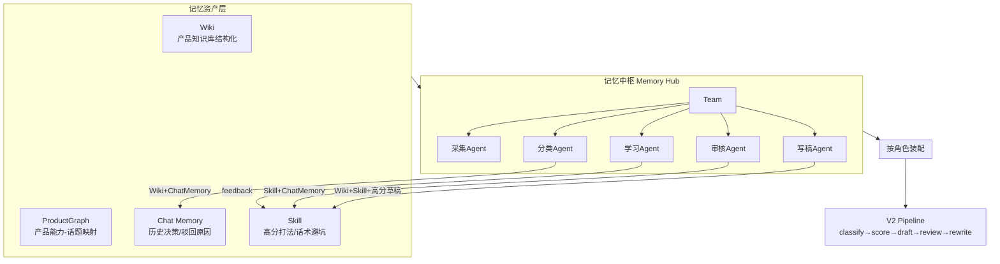

# PR Agent Demo V2 → Team Memory 化改造方案

> 依据腾讯云《Team Memory 2.0.0》推文（2026-08）+ 项目现状 `pr-agent-demo-v2` 产出
> 目标：把当前「多租户 PR 生成工具」升级为「团队共享长期记忆 + 按角色装配」的 PR 情报协作平台

---

## 一、推文内容总结（腾讯云 Team Memory 2.0.0）

**一句话**：腾讯云把 Agent 长期记忆从「个人」扩展到「团队」，统一管理**对话 / 文档 / 代码库 / Skill 四类资产**，可按 Agent 角色按需装配，且支持直接导入已有 GitHub 仓库、文档、历史 Session 自动生成记忆。

**核心要点**

1. **背景**：TencentDB Agent Memory 开源 80 天 GitHub Star 破 15,000，多次登 Trending 日榜第一；本次 2.0.0 大版本上线 Team Memory。
2. **四类记忆资产（统一治理）**
   - **Chat Memory**：历史 Agent Session 整理，记住聊过什么、定过什么。
   - **Wiki**：项目文档（设计文档 / 运维手册）变成可查的结构化页面。
   - **CodeGraph**：代码仓库自动生成，让 Agent 看懂结构与调用关系（改一处牵连哪儿）。
   - **Skill**：一次干成的排障 / 代码评审沉淀为可复用技能，下次同类任务直接调用。
3. **按角色装配**：修 Bug 的 Agent 优先用 CodeGraph + 排障经验 + Skill；需求分析 Agent 加载 Wiki + 业务背景 + 历史讨论。不用每次重读整个项目。
4. **Memory Hub 控制台**：创建 Team / Agent / Task，记忆的生成、审核、授权、分享、装配集中管理；每条记忆有 **Owner + 版本 + 使用记录**。
5. **导入即上手**：GitHub 仓库、项目文档、历史 Session 可直接导入，自动生成对应四类记忆，新 Agent 从现有经验起步。
6. **解耦**：记忆资产与具体模型 / Agent 框架独立，换模型或工具后知识仍可复用。
7. **OPC 场景**：一个人 + 多个 Agent（调研 / 写码 / 找 Bug）也能用同一套机制分别装配，各取所需。
8. **权限**：新建 Chat Memory / Skill 默认创建者可见，由 Owner 主动按用户 / 角色 / Agent 分享。

---

## 二、现状盘点：已具备能力 vs 差距

| Team Memory 概念 | 本项目现状（真实模块） | 差距 |
|---|---|---|
| **Wiki（项目文档）** | `agent-security-briefs/` 产品知识库 + `knowledge.py` 加载器 + 配置→产品知识库管理页 | ✅ 基础具备，但为扁平 Markdown，无结构化检索 / 自动生成 |
| **Chat Memory（历史对话）** | `chat_sessions`（对话改稿）、`pipeline_logs`（trace 链路） | ⚠️ 仅存于「对话改稿」场景，未沉淀为跨 Agent 可复用决策记忆 |
| **CodeGraph（代码结构）** | 无 | ❌ 缺失；PR Agent 对「产品能力→新闻话题」的映射靠人工知识库 |
| **Skill（排障/评审沉淀）** | `style_profiler.py`（风格画像）、`template_repository.py`（模板）、`draft_reviewer.py`（话术检查） | ⚠️ 雏形有，但未形成可复用「playbook / runbook」资产 |
| **Team / Agent / Task 装配** | 多租户 `users` + `is_admin`；无角色化 Agent 装配 | ❌ 缺失角色化装配层 |
| **Memory Hub 控制台** | 配置→产品知识库（admin 维护）；开发者日志页 | ⚠️ 部分控制台具备，无统一记忆中枢 |
| **版本 + 权限 + Owner** | `user_pr_template_versions`（模板版本）、`user_pr_templates`（用户覆盖） | ✅ 版本模式可复用，需扩展至全部记忆资产 |
| **导入已有资产** | 文件上传（.txt/.md/.pdf/.docx）+ 网页搜索导入 | ⚠️ 文档可入，但无「仓库 / Session → 自动生成记忆」管线 |
| **模型 / 框架解耦** | `.env` 配置 DeepSeek + `llm_wrapper.py` 抽象 | ✅ 已具备，作为改造前提保留 |

**结论**：本项目在「Wiki / 版本 / 模型解耦」上已有地基；真正的缺口是 **CodeGraph、Skill 资产化、角色化装配层、统一记忆中枢、导入自动化** 五块。

---

## 三、改造目标与原则

**目标**：让团队（及 OPC 单人多 Agent）在 PR 情报生产中的 **产品知识、历史决策、代码/能力映射、已验证话术打法** 沉淀为共享长期记忆，并被不同角色 Agent 在流水线各节点**按需注入**，从而减少重复交代背景、提升一致性与复用率。

**原则**
- 复用现有资产（`agent-security-briefs`、模板版本机制、用户隔离模型），不推倒重来。
- 记忆与模型 / 框架解耦（保持 `llm_wrapper` 抽象）。
- 权限默认最小可见，Owner 主动分享（沿用多租户隔离心智）。
- 记忆持久化进 MongoDB，服务重启可恢复（与现有 `pipeline_state` / `checkpointer` 一致）。

---

## 四、改造蓝图（四层）

### 4.1 记忆资产层（升级四类资产）

| 资产 | 落地方式 | 复用/新增 |
|---|---|---|
| **Wiki** | 将 `agent-security-briefs/` 从扁平 MD 升级为带元数据的结构化页面（标题/用途标签已有），新增「上传文档→自动生成 Wiki 条目」（复用现有 .pdf/.docx 解析） | 升级 `knowledge.py` |
| **ProductGraph** | 从知识库 + 可选仓库抽取「安全产品模块 ↔ 能力点 ↔ 相关新闻话题」图谱，存 MongoDB `product_graph`；写稿/打分时用于相关性判断与牵连分析 | 新增模块 `agent/product_graph.py` |
| **Chat Memory** | 把 `chat_sessions` 的「改稿决策 / 审核驳回原因 / 采纳意见」抽取为团队共享决策记忆（默认创建者可见，Owner 共享） | 升级 `draft_chat.py` + 新增抽取任务 |
| **Skill** | 从 `feedbacks`（高分草稿）+ `style_profiler`（偏好）+ 话术检查命中项，沉淀为可复用 playbook（如「爆点事件4步回应」「监管类避坑清单」） | 新增 `agent/skill_repo.py`，复用 `template_repository` 版本模式 |

### 4.2 角色装配层（Agent 配置 + 按需注入）

在 `pipeline_v2.py` 增加 `agent_profile` 参数，决定注入哪类记忆子集：

| 角色 Agent | 注入记忆 | 收益 |
|---|---|---|
| 采集 Agent | Chat Memory（关键词/来源偏好） | 精准抓取 |
| 分类 Agent | Wiki + Chat Memory（历史归类决策） | 归类更稳定 |
| 打分 Agent | Wiki + ProductGraph + 历史打分反馈 | 相关度判断更准 |
| 写稿 Agent | Wiki + Skill（高分模板/话术避坑）+ 历史高分草稿 | 一次成稿率↑ |
| 审核 Agent | Skill（话术检查）+ Chat Memory（历史驳回） | 风险遗漏↓ |
| 学习 Agent | feedbacks / user_profiles → 生成 Skill / 画像 | 持续进化 |

### 4.3 记忆中枢（Memory Hub 控制台）

前端新增「记忆中枢」菜单（复用 `is_admin` 权限）：
- 创建 Team，挂载 Agent 角色（开发/评审/需求分析 → 映射为上述 PR 角色）。
- 为每个 Agent 勾选可用 Wiki / ProductGraph / Chat Memory / Skill。
- 查看每条记忆的 Owner、版本、被哪些 Agent/Task 使用（复用 `pipeline_logs` 的 trace）。
- 生成 / 审核 / 授权 / 分享 / 装配集中操作。

### 4.4 导入与共享

- **导入即上手**：新增「导入」入口，支持把历史 Session（本系统 `chat_sessions` / `pipeline_logs`）、外部文档批量转成四类记忆；预留 GitHub 仓库导入（调用现有爬虫/解析能力生成 ProductGraph+Wiki）。
- **权限模型**：新建 Chat Memory / Skill 默认创建者可见；Owner 按 用户 / 角色 / Agent 分享（复用 `user_pr_templates` 的乐观锁+版本思路）。

---

## 五、模块级改造点（对应真实代码）

| 改动 | 涉及文件 | 说明 |
|---|---|---|
| 知识库结构化 | `services/backend/agent/knowledge.py`、`agent-security-briefs/` | 增加元数据索引，支持结构化检索 |
| 新增 ProductGraph | `services/backend/agent/product_graph.py` + `db` 集合 `product_graph` | 能力-话题映射与牵连分析 |
| Chat Memory 抽取 | `services/backend/agent/draft_chat.py` + 定时/事件任务 | 从对话改稿抽取共享决策 |
| Skill 资产化 | 新增 `services/backend/agent/skill_repo.py`，复用 `template_repository.py` | 高分打法/话术避坑沉淀 |
| 角色装配 | `services/backend/agent/pipeline_v2.py`、`schemas.py` | 增加 `agent_profile` 注入逻辑 |
| 记忆中枢 API | 新增 `services/backend/api/memory_hub.py` + 前端页面 | Team/Agent/Task/权限/版本 |
| 导入管线 | `services/backend/api/`（复用上传/搜索导入）+ `mcp_crawl` | Session/文档/仓库→记忆 |
| MongoDB 集合 | `product_graph`、`team_memory_*`、`skills` | 持久化 + 版本 |

---

## 六、实施路径（建议分四期）

- **P0（2 周）记忆资产地基**：`product_graph` 模块 + `skill_repo` 雏形；把现有知识库/模板版本机制标准化为资产接口。
- **P1（2 周）角色装配**：`pipeline_v2` 接入 `agent_profile`，写稿/审核 Agent 先吃 Skill + Chat Memory；验证成稿率与风险遗漏指标。
- **P2（2 周）记忆中枢**：Memory Hub 控制台（Team/Agent/Task/权限/版本）+ 前端页面。
- **P3（1–2 周）导入与共享**：历史 Session/文档导入自动化；GitHub 仓库导入预留；默认权限与 Owner 分享闭环。

---

## 七、风险与对策

| 风险 | 对策 |
|---|---|
| 记忆注入导致上下文膨胀、Token 成本上升 | 按角色**子集注入** + 检索式召回（仅取相关片段） |
| Chat Memory 抽取噪声污染团队记忆 | Owner 审核机制 + 低置信度记忆进草稿态、不自动装配 |
| 多租户隔离与团队共享冲突 | 明确「个人草稿隔离」与「团队共享记忆」边界；共享需显式授权 |
| 与现有 V2 流水线回归 | 沿用 `checkpointer` / `pipeline_state` 持久化，新增装配层做 A/B 开关 |

---

## 八、收益衡量指标

- 单次成稿率（无需改稿即采纳）↑
- 话术高风险问题遗漏率 ↓
- 新成员/Agent 接手项目的「背景交代」轮次 ↓
- 高分 Skill / Wiki 复用次数（Memory Hub 使用记录）
- 流水线平均 LLM Token 消耗（角色化注入后应持平或下降）
