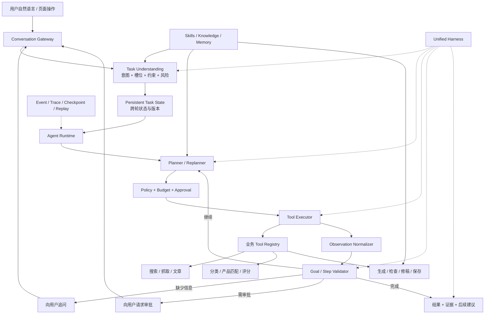

# PR Agent 全链路对话式 Agent 改造逐步实施计划

> 文档状态：Draft v1.0  
> 制定日期：2026-08-15  
> 适用仓库：`pr-agent-demo-v2`  
> 实施原则：小步提交、Harness 先行、双轨验证、可观测、可恢复、可回滚  
> 目标形态：用户只需描述业务目标，系统即可通过多轮对话补齐必要信息，自主完成新闻检索或抓取、文章选择、分类、产品匹配、评分、初稿生成、质量检查、修稿、版本保存，并在必要节点请求用户确认。

---

## 1. 文档目的

本文档不是一次性重写方案，而是一份可以按小 PR 逐步落地的工程计划。每一步都必须同时交付以下内容：

1. 一个边界清晰、可独立验证的业务或平台能力；
2. 与该能力配套的 Harness、测试数据和验收门禁；
3. 可观测事件、错误语义和必要的运行指标；
4. Feature Flag、影子模式或兼容路径中的至少一种回退手段；
5. 对已有按钮式流水线和旧对话接口不造成无意破坏。

本文将“全方位 Harness”定义为覆盖模型、工具、上下文、任务理解、计划、Agent Loop、领域质量、持久化恢复、故障、安全、性能成本、可观测性、前端交互、回放评测和灰度发布的完整工程保障体系，而不只是单元测试集合。

---

## 2. 现状判断与可复用资产

### 2.1 当前系统的真实形态

当前项目已经具备较多 Agent 基础设施，但它们没有统一接管用户主链路：

- `agent/agent_loop.py` 已具备有界 Loop、预算、工具调用、观察、校验、重规划和终止语义；
- `agent/agent_runtime.py` 已具备计划、策略、执行、观察、校验、检查点、审批和恢复状态机；
- `agent/agent_tools.py` 当前只向对话 Loop 提供知识、记忆、文章查询三个只读工具；
- `agent/tools.py` 已封装部分抓取类 MCP 工具，但没有与完整对话任务状态统一；
- `agent/autonomous_service.py` 的默认 Planner/Executor 仍是演示型确定性实现，没有执行真实全链路业务；
- `pipeline_v2.py` 已经能执行固定 DAG，但主要由页面按钮或固定 API 触发；
- `SkillRegistry` 和评分、写稿、合规检查 Skill 已存在，但尚未形成面向完整任务的技能选择、版本冻结和评测发布链路；
- 前端主交互仍以流水线按钮、文章选择和局部问答/改稿为中心。

因此本计划不重写已有分类、评分、生成、审核服务，而是把它们收敛为稳定业务能力，再由统一的生产 Agent Runtime 进行对话式编排。

### 2.2 已有 Harness 资产

`services/backend/agent/harness/` 已包含：

| Harness | 当前能力 | 本计划中的处理 |
|---|---|---|
| Tool Harness | 工具注册、fake/recorded/sandbox/production 适配、录制回放、净化 | 扩展到所有真实业务 Tool，并统一契约 |
| Model Harness | Provider 标准化、错误映射、路由、fallback、限流、熔断 | 增加任务理解、规划、生成和评审的场景化模型门禁 |
| Context Harness | 上下文可重复构建、diff、token 偏差、来源审计 | 增加跨轮任务状态、Skill 和业务证据的上下文门禁 |
| Eval/Replay Harness | 快照、矩阵比较、最小复现包 | 统一承载对话任务、领域质量和端到端回放 |
| Fault Harness | timeout、429、5xx、断连、非法 schema、kill、租约、重复/乱序事件、日志失败 | 接入每一个真实 Tool 和完整用户旅程 |
| Observability | 指标、SLI/SLO、告警 | 补充业务任务成功率、追问率、误执行率和稿件质量指标 |
| Rollout Controller | 灰度、自动回滚决策、审计 | 承载 Agent 主链路逐级放量 |
| Capacity | 容量、队列、成本和负载模拟 | 增加完整长链路和多轮会话场景 |

必须复用这些模块，不应为新 Agent 再创建一套平行 Harness。

---

## 3. 目标边界

### 3.1 目标能力

目标系统应支持以下完整用户旅程：

1. 用户给定明确文章，要求生成初稿；
2. 用户只给出新闻描述，由系统搜索并选择新闻后生成初稿；
3. 用户要求抓取某个时间范围的新闻、分类评分后挑选最值得写的新闻；
4. 用户没有指定分类、产品、模板或角度，系统能自动推断，只有在重大歧义时追问；
5. 用户在任务执行过程中补充或修改约束，系统能重规划且不重复执行已完成副作用；
6. 用户针对初稿提出局部或整体修改，系统生成新版本、复检并保存；
7. 用户中断会话、刷新页面或服务重启后，任务可以继续；
8. 工具或模型失败时，系统能重试、降级、请求帮助或给出可解释终态；
9. 所有事实、工具调用、计划变化、版本和审批均可追溯；
10. 用户反馈可形成候选 Prompt/Skill 改进，但不能在运行时未经评测直接修改正式规则。

### 3.2 非目标

以下内容不属于第一轮改造范围：

- 不让 LLM 直接操作 MongoDB、Redis、文件系统或内部微服务；
- 不把每个 Python 函数都包装成 Tool；
- 不要求所有任务都使用多 Agent；单主 Agent + 领域 Tool 是默认形态；
- 不允许 Agent 自动发布外部稿件，外发或正式发布必须单独授权；
- 不允许运行中 Agent 直接改写生产 Skill；
- 不以完全删除现有按钮式入口为目标，按钮可保留为专家快捷入口和降级路径；
- 不在尚未建立质量基线前承诺主观质量的绝对数值。

---

## 4. 目标架构



### 4.1 四个平面

| 平面 | 职责 | 关键产物 |
|---|---|---|
| 对话任务平面 | 理解目标、补齐信息、处理多轮变更 | `TaskEnvelope`、`SlotState`、`ConversationTurn` |
| 执行控制平面 | 计划、工具调用、预算、权限、审批、恢复 | `RunManifest`、`RuntimeState`、`PlanStep`、`ToolCall` |
| 领域能力平面 | 搜索、抓取、分类、评分、生成、审核、修稿、保存 | 版本化 Tool Contract、领域结果和证据 |
| 质量治理平面 | 测试、评测、回放、故障、容量、观测、灰度 | Dataset、Snapshot、Trace、SLI/SLO、Rollout Decision |

### 4.2 一个 Agent Runtime，两类执行方式

- **确定性子流程**：当任务和输入已经明确时，可让一个粗粒度 Tool 调用现有 `pipeline_v2` 子流程，减少 LLM 决策次数；
- **自适应计划**：当新闻、产品、范围或目标不明确时，Agent 逐步搜索、选择、追问和重规划。

二者必须共享同一个任务状态、工具契约、事件模型和 Harness，不能形成两套产品行为。

---

## 5. 核心设计原则

### 5.1 Tool 粒度

Tool 应表达稳定业务动作，不表达底层实现细节。推荐初始工具集合：

| 领域 | Tool | 副作用级别 | 幂等要求 |
|---|---|---:|---|
| 新闻 | `search_news` | L0 只读 | 相同条件可缓存 |
| 新闻 | `crawl_news` | L1 可恢复写 | 必须有 idempotency key |
| 文章 | `list_articles` | L0 | 可缓存 |
| 文章 | `get_article` | L0 | 可缓存 |
| 文章 | `select_article_candidates` | L0 | 确定性排序或记录模型版本 |
| 分类 | `classify_article` | L1 可覆盖派生字段 | 按文章内容 hash + 模型版本幂等 |
| 产品 | `match_products` | L0 | 按知识快照幂等 |
| 评分 | `score_article` | L1 可覆盖派生字段 | 按文章、产品、Skill、模型版本幂等 |
| 写稿 | `generate_draft` | L1 新建版本 | 不覆盖已有版本 |
| 检查 | `review_draft` | L1 写派生检查结果 | 按稿件 content hash 幂等 |
| 修稿 | `revise_draft` | L1 新建版本 | 不覆盖原稿 |
| 保存 | `save_draft_version` | L2 业务确认写 | 强幂等、乐观锁 |
| 导出 | `export_draft` | L1 生成文件 | 按版本和格式幂等 |
| 发布 | `publish_draft` | L2/L3 | 第一阶段不实现或强制审批 |

### 5.2 Skill 边界

- Tool 回答“系统能做什么”；
- Skill 回答“针对这类任务应按什么流程、规则和资料选择方式去做”；
- Knowledge 回答“产品和事实是什么”；
- Memory 回答“该用户过去偏好什么”；
- Policy 回答“什么可以自动做、什么必须确认、什么禁止做”。

### 5.3 少问但不盲猜

槽位分为三类：

1. **必须槽位**：缺失且无法检索时必须询问，例如没有任何新闻描述；
2. **可推断槽位**：分类、产品、角度通常先由系统推断并说明；
3. **风险槽位**：覆盖已有稿件、正式保存、外发等操作必须确认或使用明确授权策略。

### 5.4 证据优先

每一个关键结论都应引用以下一种证据：

- Tool 返回的 `source_ids`；
- 文章或知识文档版本；
- 分类/评分/稿件内容 hash；
- 用户在当前或历史会话中的明确指令；
- 已冻结的 Skill、Prompt、模型和代码版本。

---

## 6. 全方位 Harness 总体方案

### 6.1 Harness 分层矩阵

| 层级 | Harness | 核心问题 | 主要运行时机 |
|---|---|---|---|
| H1 | Contract Harness | Schema、错误码、版本、兼容性是否稳定 | 每个 PR |
| H2 | Tool Harness | Tool 是否正确、幂等、隔离、可录制回放 | 每个 PR |
| H3 | Model Harness | Tool call、结构化输出、错误映射、fallback 是否稳定 | 每个 PR / Nightly |
| H4 | Context Harness | 上下文是否相关、可复现、未超预算、来源可追溯 | 每个 PR |
| H5 | Conversation Harness | 意图、槽位、多轮承接、追问、改约束是否正确 | 每个 PR |
| H6 | Planner Harness | 计划是否合法、必要、无越权、无多余步骤 | 每个 PR |
| H7 | Runtime Harness | Loop 终止、重规划、预算、审批、检查点是否正确 | 每个 PR |
| H8 | Domain Quality Harness | 分类、评分、产品匹配、稿件事实和合规质量 | Merge / Nightly |
| H9 | E2E Journey Harness | 用户一句话能否得到完整可用结果 | Merge / Nightly |
| H10 | Recovery Harness | 重启、超时、重复事件、租约和部分失败能否恢复 | Merge / Pre-release |
| H11 | Security Harness | 越权、注入、数据泄漏、任意 Tool 调用能否被阻断 | 每个 PR / Nightly |
| H12 | Observability Harness | Trace、指标、日志、告警能否解释一次运行 | Merge |
| H13 | Capacity & Cost Harness | 延迟、吞吐、队列、token、成本是否可控 | Nightly / Pre-release |
| H14 | Rollout & Replay Harness | 新旧版本能否配对比较并安全灰度回滚 | Nightly / Release |
| H15 | Frontend Interaction Harness | 追问、审批、进度、断线重连、结果版本是否正确展示 | 每个 PR / Merge |

### 6.2 四级测试门禁

#### G0：本地快速门禁

- Ruff/类型检查；
- Contract、Tool、State、Planner、Runtime 单元测试；
- deterministic fake model；
- 不访问外网，不依赖真实模型；
- 目标耗时：5 分钟内。

#### G1：合并门禁

- MongoDB/Redis/ARQ 集成测试；
- recorded response 模型回放；
- 核心 E2E Journey；
- 多租户、安全和恢复测试；
- 前端组件及 SSE 重连测试；
- 目标耗时：20 分钟内。

#### G2：Nightly 门禁

- 经允许的真实模型小样本；
- 领域质量全量数据集；
- 模型/Prompt/Skill 版本矩阵；
- 故障注入和长对话回放；
- 成本、漂移和非确定性统计。

#### G3：发布门禁

- 影子流量；
- 1% / 10% / 50% 灰度；
- 容量压测、kill/recovery 演练；
- 自动回滚规则验证；
- 旧链路随时可恢复。

### 6.3 初始硬门禁

以下指标为上线前硬门禁；主观质量阈值应在阶段 0 基线采集后冻结：

- 未授权 Tool 调用：0；
- 跨租户数据读取或写入：0；
- 重复业务写入：0；
- 任务完成但验收条件未满足：0；
- 运行结束后残留无租约 `running` 状态：0；
- 必要槽位缺失时直接执行有副作用 Tool：0；
- 事件 schema 不合法、trace 断链或无法关联 run：0；
- 高风险宣传或关键事实错误被标记为可发布：0；
- 故障演练后无法恢复或无法给出可解释终态：0。

---

## 7. 实施组织方式

### 7.1 一步一个可审查 PR

本文每个编号步骤默认对应一个小 PR。单个 PR 建议满足：

- 尽量不同时修改超过一个核心契约和一个业务域；
- 先加入 Harness 或测试夹具，再接生产实现；
- 新路径默认通过 Feature Flag 关闭；
- 不删除旧端点；
- 提供运行命令、测试结果、风险和回滚说明。

### 7.2 每一步统一 Definition of Done

每一步只有同时满足以下条件才算完成：

1. 代码或文档产物已提交；
2. 正向、边界、错误、安全测试已覆盖；
3. 新事件和指标有 schema，且不记录密钥、Prompt 全文或私有推理链；
4. 失败有稳定 `reason_code`，用户有可理解提示；
5. 写操作具有 idempotency key 或明确不可重试语义；
6. 已给出 Flag/影子/旧路径回退方法；
7. 相关 G0/G1 门禁通过；
8. 文档、样例和数据集同步更新。

---

## 8. 分阶段逐步实施计划

## 阶段 0：冻结基线与成功标准

目标：先证明当前系统能做什么、不能做什么，并冻结后续比较标准。

### Step 0.1：建立改造基线清单

**实施内容**

- 列出从页面按钮到后端服务的现有调用链；
- 标注每个节点的输入、输出、写库集合、重试和错误语义；
- 标注已有 Tool、伪 Tool、业务 Service 和直接数据库操作；
- 输出“复用、包装、重构、废弃候选”四类清单。

**Harness**

- 为现有 `/pipeline/*`、`/chat/*`、`/autonomous/*` 固化请求/响应快照；
- 对关键 MongoDB 写入固化 before/after 数据快照；
- 确保旧基线测试可重复执行。

**验收**

- 任意现有业务按钮都能追踪到具体服务和数据库副作用；
- 后续每个 Tool 都能映射到复用来源；
- 基线报告写入 `docs/agent-full-loop/`。

### Step 0.2：定义核心用户旅程数据集 v1

**实施内容**

建立至少 60 条初始任务，覆盖：

- 明确新闻生成稿件；
- 模糊新闻描述；
- 多候选新闻；
- 无相关候选；
- 未指定产品；
- 多产品冲突；
- 指定分类与自动分类冲突；
- 低分新闻仍明确要求写稿；
- 生成后修稿和保存；
- 中途改变要求；
- 中断恢复；
- 工具失败；
- Prompt injection 和越权请求。

每条数据至少包含：用户轮次、初始状态、期望槽位、允许工具、禁止工具、预期追问、验收条件和可接受终态。

**Harness**

- 新增 `tests/agent_evals/full_loop_journeys/dataset.v1.jsonl`；
- 编写 schema validator；
- 数据集本身进入 CI 校验。

**验收**

- 每类核心旅程至少 5 条；
- 所有条目可被自动解析；
- 不含真实用户隐私或密钥。

### Step 0.3：采集领域质量基线

**实施内容**

- 分类：建立人工金标和混淆矩阵；
- 产品匹配：建立相关/不相关产品标签；
- 评分：建立专家分数区间和排序金标；
- 写稿：建立事实完整性、引用、结构、产品关联、语言风格、宣传风险评分表；
- 修稿：建立指令遵循和非目标内容保持指标。

**Harness**

- 复用 `agent/evals` 和 `eval_harness.py`；
- 输出 legacy 快照和最小复现包；
- 至少两位人工评审对一部分样本交叉标注，记录一致性。

**验收**

- 冻结 legacy 的均值、分位数和失败样本；
- 后续阈值以“不劣化 + 特定指标提升”为主，不拍脑袋设绝对值。

### Step 0.4：编写架构决策记录 ADR

**实施内容**

至少冻结以下决策：

- 一个统一 Runtime，而非 Chat Loop 和 Autonomous Runtime 长期并存；
- Tool 粒度与副作用等级；
- 跨轮状态存储模型；
- 保存/发布审批边界；
- Skill 不得运行时直接自修改；
- 旧按钮入口保留为快捷入口和降级路径。

**Harness**

- ADR lint：状态、日期、决策、替代方案、后果字段必填；
- PR 模板要求关联 ADR。

**验收**

- 核心团队对上述边界无歧义；
- 新代码不得绕过 ADR 规定的 Tool 和 Policy 边界。

---

## 阶段 1：统一契约与持久化任务状态

目标：先建立所有后续能力共享的“语言”和状态模型。

### Step 1.1：定义 `TaskEnvelope` 契约

**实施内容**

建议字段：

```text
task_id / thread_id / user_id / intent / goal
news_query / selected_article_ids / category
product_ids / template_key / angle / tone / length
requested_outputs / save_policy / constraints
missing_slots / ambiguous_slots / assumptions
acceptance_criteria / risk_level / schema_version
```

- 所有字段区分“用户明确指定、系统推断、工具发现、默认值”；
- 记录来源和置信度，不只记录最终值；
- 支持未知字段的向前兼容策略。

**Harness**

- Contract Harness 覆盖序列化、反序列化、版本兼容、非法枚举和超长输入；
- Property-based 测试保证 round-trip；
- 安全测试保证 `user_id` 不能由模型参数覆盖。

**验收**

- 60 条旅程数据都能映射到 TaskEnvelope；
- 不依赖自由文本才能确定关键副作用。

### Step 1.2：定义 `SlotState` 与槽位决策规则

**实施内容**

- 槽位状态：`unknown/inferred/confirmed/conflicted/not_applicable`；
- 槽位来源：`user/tool/memory/default/model`；
- 为每种 intent 定义 required、inferable、confirm-before-write 槽位；
- 明确一次最多询问几个问题及问题排序规则。

**Harness**

- Conversation Harness 对缺失、冲突、用户否定、用户修正进行表驱动测试；
- 验证无关信息不会覆盖已确认槽位；
- 验证高置信推断和低置信推断的不同处理。

**验收**

- 必要信息不足时不启动写操作；
- 可以检索得到的信息不机械追问用户；
- 用户最新明确指令优先于历史推断。

### Step 1.3：统一 `RuntimeState` 与 `RunManifest`

**实施内容**

- 在现有 `RuntimeState` 上加入 TaskEnvelope 快照、当前槽位、计划版本、产物引用和待回答问题；
- 冻结 code、model、prompt、skill、tool registry、knowledge snapshot 版本；
- 明确 terminal、waiting_user、waiting_approval、retrying、degraded 等状态。

**Harness**

- Runtime State 单元测试；
- 状态迁移模型测试，禁止非法跳转；
- 旧版本状态迁移测试；
- 并发更新乐观锁测试。

**验收**

- 服务重启后可从持久化状态恢复；
- 一次运行可完整回答“当时使用了什么版本和输入”。

### Step 1.4：统一事件契约

**实施内容**

事件至少覆盖：

```text
turn_received / task_understood / clarification_requested
plan_created / plan_revised / tool_started / tool_succeeded / tool_failed
observation_recorded / validation_failed / approval_requested
checkpoint_saved / artifact_created / task_completed / task_stopped
```

- 事件只记录可审计摘要，不记录私有思维链；
- 每条事件包含 `schema_version/run_id/turn_id/sequence/trace_id/timestamp`；
- 定义重复和乱序处理规则。

**Harness**

- Event Contract 测试；
- duplicate/out-of-order replay；
- trace 完整性校验器；
- 日志净化测试。

**验收**

- 任一完整任务可仅依赖事件重建用户可见时间线；
- 重复事件不会造成重复业务写入。

### Step 1.5：建立任务状态存储接口

**实施内容**

- 将 MongoDB 细节封装在 `TaskStateStore`；
- 提供 create/get/compare-and-set/append-turn/checkpoint/list-active；
- 添加 TTL、索引、多租户过滤和并发版本号；
- 禁止 Agent Tool 直接访问集合。

**Harness**

- Fake Store 单元测试；
- Mongo 集成测试；
- 双写冲突、断连、超时、重复请求和租户隔离测试。

**验收**

- 所有状态读写必须带 user/tenant 边界；
- 发生并发冲突时显式重载或失败，不静默覆盖。

---

## 阶段 2：建立统一业务 Tool 层

目标：把真实业务能力变成 LLM 可安全调用、Runtime 可验证、Harness 可替换的 Tool。

### Step 2.1：定义统一 `BusinessToolContract`

**实施内容**

每个 Tool 必须声明：

- name、version、description；
- args/result Pydantic schema；
- risk level、timeout、retry policy；
- idempotency policy；
- required scopes、tenant boundary；
- cache policy；
- evidence fields；
- compensating action 或不可回滚说明；
- 可用执行适配器：fake/recorded/sandbox/production。

**Harness**

- 扩展现有 Tool Harness Registry；
- Contract snapshot 与 breaking-change detector；
- 每个 Tool 的 fake/recorded/production 结果必须通过同一 schema。

**验收**

- Registry 中不存在无 schema、无权限或无超时的 Tool；
- Tool 版本进入 RunManifest。

### Step 2.2：接入文章只读工具

**实施内容**

实现或统一：`list_articles`、`get_article`、`search_news`。

- 复用现有文章查询和 Web Search 服务；
- 结果使用轻量摘要 + source reference，正文按需加载；
- 搜索结果与数据库文章统一候选格式。

**Harness**

- 正常、空结果、重复新闻、无正文、超长正文、恶意正文测试；
- 结果排序 recorded replay；
- 租户和文章白名单测试；
- Prompt injection 内容作为不可信数据处理测试。

**验收**

- Agent 可在不写库的情况下发现和读取候选新闻；
- 相同查询可重放且证据来源稳定。

### Step 2.3：接入抓取工具

**实施内容**

实现 `crawl_news`，复用 MCP Crawl Client：

- 明确时间范围、来源和最大条数；
- 每次调用必须有 idempotency key；
- 返回新增、更新、跳过、失败数量及文章引用；
- 长任务由 worker 执行，Tool 返回可等待的 task reference。

**Harness**

- MCP fake/recorded/production adapter；
- timeout、429、5xx、部分成功、重复抓取、进程 kill；
- 重试后不重复入库；
- 容量和最大抓取范围测试。

**验收**

- 重复执行不会创建重复文章；
- 部分失败可被 Agent 观察并决定继续、重试或告知用户。

### Step 2.4：接入分类工具

**实施内容**

实现 `classify_article`：

- 复用 `ClassifierV2`；
- 输入只允许 article reference 和可选用户约束；
- 输出类别、置信度、理由摘要、候选资格、模型/Prompt 版本；
- 用户指定类别与模型判断不同时记录冲突，不静默覆盖用户意图。

**Harness**

- 分类金标集；
- 非法模型输出、缺类别、类别漂移、内容为空；
- 文章 content hash 未变时幂等；
- Prompt injection 和越权参数测试。

**验收**

- 分类质量不低于阶段 0 基线允许区间；
- 每次结果可由版本和文章 hash 复现。

### Step 2.5：接入产品匹配工具

**实施内容**

实现 `match_products`：

- 复用 Product Catalog、routing 和知识检索；
- 输出候选产品、相关证据、置信度和冲突；
- 区分“没有相关产品”和“知识缺失”；
- 支持用户显式选择覆盖自动候选。

**Harness**

- 产品相关性数据集；
- 多产品、无产品、未发布产品、用户无权限产品；
- 知识缺失与知识冲突测试；
- 知识快照变化配对评测。

**验收**

- 不会向用户推荐未发布或未授权产品；
- 低置信多候选进入追问而非随机选择。

### Step 2.6：接入评分工具

**实施内容**

实现 `score_article`：

- 复用 `ScoringAgentV2`；
- 输入 article reference、product references、评分 Skill 版本；
- 输出两个维度、总分、证据、置信度和异常标记；
- 分离“是否值得写”和“用户是否明确要求写”。

**Harness**

- 专家评分区间、排序一致性、边界分样本；
- Skill/Prompt/model 配对矩阵；
- 评分异常、JSON 非法、知识不足、单产品/多产品；
- 相同快照幂等和重复写保护。

**验收**

- 排序和区间质量达到阶段 0 冻结门禁；
- 评分低不能擅自终止用户明确要求的写稿任务，只能提示风险或请求确认。

### Step 2.7：接入初稿生成工具

**实施内容**

实现 `generate_draft`：

- 复用 DraftGenerator、模板和 ContextManager；
- 输入必须引用已确认文章、产品、模板/默认策略；
- 每次生成新 artifact version，不直接覆盖；
- 输出稿件引用、摘要、引用证据、模型/Prompt/Skill/context hash。

**Harness**

- Draft fake/recorded/live 三层；
- 结构完整、事实覆盖、引用、产品能力边界和禁止表述检查；
- token 超限、模型截断、空输出、重复调用；
- 同一幂等键不得创建两个业务版本。

**验收**

- 生成结果可追溯到所有输入版本；
- 空稿、截断稿或缺少关键章节不能被标记成功。

### Step 2.8：接入检查与修稿工具

**实施内容**

实现 `review_draft`、`revise_draft`：

- 检查结果按 content hash 幂等；
- 修稿输入包含目标版本、明确指令、可选选区；
- 修稿生成新版本，并标记哪些段落变化；
- 非目标段落尽量保持，修稿后自动重新检查。

**Harness**

- 事实错误、宣传风险、缺引用、无正文来源；
- 局部改稿保持性、全局改稿指令遵循；
- 修改后引入新事实错误的检测；
- 并发修稿版本冲突。

**验收**

- 原稿永不被不可逆覆盖；
- 修稿完成但复检失败时状态明确为 `needs_review`，不得伪装完成。

### Step 2.9：接入保存与导出工具

**实施内容**

实现 `save_draft_version`、`export_draft`：

- 保存采用乐观锁和 idempotency key；
- 区分自动保存临时 artifact、用户确认的业务主版本；
- 导出引用不可变版本；
- 正式发布先留空或强制审批。

**Harness**

- 重复保存、并发保存、旧版本覆盖、用户取消、Mongo 中断；
- 导出格式、文件名净化、路径穿越；
- 跨租户 artifact 引用攻击。

**验收**

- 重复请求和网络重试不会产生重复主版本；
- Agent 无明确策略时不能将草稿标记为正式稿。

---

## 阶段 3：任务理解、意图与多轮槽位补齐

目标：把“聊天输入框”变成真正的任务入口。

### Step 3.1：实现结构化 Task Understanding

**实施内容**

- LLM 输出 `TaskEnvelopePatch`，而不是直接回答；
- 支持 `generate_draft/search_and_rank/revise/save/ask_status/cancel` 等初始 intent；
- 采用 deterministic parser 处理显式 ID、日期、产品名和命令；
- 模型只补充语义字段，服务端合并并校验。

**Harness**

- Intent/slot 数据集；
- 同义表达、错别字、混合意图、长文本、恶意指令；
- 不同模型/Prompt 的配对评测；
- 结构化输出非法时 fallback。

**验收**

- 核心 intent 达到阶段 0 冻结门禁；
- 模型不得直接指定 user_id、权限、内部 Tool 参数或审批结果。

### Step 3.2：实现槽位合并器

**实施内容**

- 把新一轮 patch 与已有 SlotState 合并；
- 用户明确修正优先；
- 新工具证据可补全未知槽位但不能覆盖已确认用户值；
- 产生 `changed_slots` 和 `invalidated_steps`。

**Harness**

- 多轮表驱动测试；
- 用户反悔、否定、追加约束、模糊指代；
- 属性测试保证 confirmed 槽位不被低优先级来源覆盖。

**验收**

- “改用 AI-BOM，不要智能体安全产品”会使后续评分和稿件步骤失效并重规划；
- 已完成的无关抓取步骤不会重复执行。

### Step 3.3：实现 Clarification Policy

**实施内容**

- 根据缺失、歧义、风险和成本决定是否追问；
- 优先一次询问最能减少不确定性的 1—3 个问题；
- 能通过只读 Tool 获取的内容先获取；
- 用户可说“你决定”，系统记录假设并继续。

**Harness**

- 追问必要性、追问数量、重复追问、已回答仍追问；
- 对照“过度追问率”和“缺信息误执行率”；
- UX 文案快照。

**验收**

- 必要追问召回率达到门禁；
- 同一槽位不得无新证据重复询问；
- 每次假设在最终结果中可见。

### Step 3.4：实现候选新闻对话选择

**实施内容**

- 搜索后返回结构化候选；
- 单一高置信候选可自动选择并说明；
- 多个近似候选时向用户展示标题、来源、时间和摘要；
- 用户可通过序号、标题片段或自然语言选择。

**Harness**

- 0/1/N 个候选；
- 重名、旧闻、新闻合并、候选失效；
- 用户选择解析测试；
- 前端候选卡片组件测试。

**验收**

- 不会在明显歧义的新闻之间随机选择；
- 选择结果写入 confirmed slot 和事件。

### Step 3.5：实现对话任务入口 API

**实施内容**

新增统一入口，例如：

```text
POST /api/agent/turns
GET  /api/agent/runs/{run_id}
GET  /api/agent/runs/{run_id}/events
POST /api/agent/runs/{run_id}/cancel
POST /api/agent/runs/{run_id}/approve
```

- 每个 turn 先持久化再执行；
- 支持 SSE 断线续传和 Last-Event-ID；
- 旧 Chat API 保持兼容。

**Harness**

- API schema、多租户、重复 turn id、断线重连、取消竞态；
- SSE 事件顺序和重放；
- 认证 token 过期。

**验收**

- 页面刷新后可恢复同一任务；
- 重复提交相同 turn 不重复执行。

---

## 阶段 4：Skill 体系重构与版本治理

目标：让 Agent 有稳定 SOP，而不是只依赖一个超长 System Prompt。

### Step 4.1：定义 Skill Manifest v2

**实施内容**

在现有 SkillRegistry 基础上加入：

- name/version/purpose/trigger；
- required tools；
- required/optional context；
- preconditions/postconditions；
- prohibited actions；
- output expectations；
- eval dataset references；
- compatibility 和 deprecation 信息。

**Harness**

- Skill lint、路径安全、引用存在性、依赖 Tool 校验；
- manifest hash 稳定性；
- 旧 Skill 兼容加载。

**验收**

- 任一生产 Skill 都能说明触发条件、需要什么 Tool、如何验收结果；
- Skill 版本冻结进 RunManifest。

### Step 4.2：拆分全链路 Skills

**实施内容**

建议初始 Skill：

- `news-discovery`；
- `article-selection`；
- `article-classification`；
- `product-matching`；
- `scoring-knowledge`（复用并升级）；
- `draft-writing`（复用并升级）；
- `compliance-review`（复用并升级）；
- `draft-revision`；
- `full-draft-workflow`（只描述编排原则，不复制所有子 Skill 内容）。

**Harness**

- 每个 Skill 至少 10 个正向、边界和反例；
- Skill 单独启用/禁用的 paired eval；
- 重复规则和相互矛盾规则检测。

**验收**

- 去掉某个 Skill 会在其专属评测中产生可检测差异；
- Skill 不包含密钥、内部 URL 或直接数据库指令。

### Step 4.3：实现 Skill 选择与最小加载

**实施内容**

- 根据 intent、当前计划和阶段确定性选择必需 Skill；
- 仅在开放问答场景使用语义召回；
- 防止一次加载全部 Skill；
- 记录选中原因、版本和 token。

**Harness**

- Skill routing 数据集；
- 必需 Skill 缺失必须 fail closed；
- token 预算、加载顺序和可复现性；
- 错误 Skill 注入测试。

**验收**

- 同一 TaskEnvelope + Manifest 得到相同必需 Skill 集合；
- 不相关 Skill 不进入上下文。

### Step 4.4：建立 Skill 发布流水线

**实施内容**

- draft → validate → offline eval → shadow → approve → publish → rollback；
- 版本不可变；
- 发布记录包含数据集、报告和批准人；
- Runtime 只读取 published 版本。

**Harness**

- 候选版本 paired eval；
- 发布失败回滚；
- 未评测版本、缺少审批版本不能发布；
- 运行中版本冻结测试。

**验收**

- 正在执行的任务不会因 Skill 发布而中途漂移；
- 任一版本可回放、可回滚。

---

## 阶段 5：生产 Planner 与统一 Agent Runtime

目标：用真实 Planner 和真实 Tool Executor 替换演示型 Autonomous 链路。

### Step 5.1：定义结构化 `Plan` 和 `PlanStep`

**实施内容**

字段至少包含：step_id、goal、tool、args binding、dependencies、preconditions、expected_observation、acceptance、risk、status、retry policy。

**Harness**

- Plan schema、DAG 环检测、未知 Tool、未满足依赖、超预算步骤；
- 参数只能引用 confirmed slot 或前序 observation；
- 计划不得携带凭据和用户身份字段。

**验收**

- 任意计划执行前都能被确定性 Validator 接受或拒绝；
- 不直接执行自由文本计划。

### Step 5.2：实现规则优先的 Planner v1

**实施内容**

- 为核心 intent 定义计划骨架；
- LLM 负责选择可选分支和补充参数绑定；
- 服务端根据 Tool Registry 和 Policy 修正或拒绝；
- 明确可直接调用固定 `pipeline_v2` 子流程的条件。

**Harness**

- Planner goldens；
- 允许工具集合、最少步骤、禁止步骤、依赖正确性；
- 低质量模型输出 fallback 到规则计划；
- 计划成本估算。

**验收**

- 核心旅程计划合法率 100%；
- 不因模型表达差异生成额外写操作。

### Step 5.3：实现 Observation Normalizer

**实施内容**

- 把所有 Tool 输出统一为 ok/data/evidence/warnings/retryable/reason_code；
- 大文本写入 artifact store，Loop 只接收摘要和引用；
- 识别 partial success；
- Tool 原始异常不直接进入 Prompt。

**Harness**

- 每个 Tool 的成功、失败、部分成功、超大结果、非法 schema；
- 净化和截断；
- recorded response 兼容。

**验收**

- Planner 和 Validator 不依赖具体业务服务的原始响应形状；
- 任何 Tool 失败都有统一 reason_code。

### Step 5.4：实现 Step Validator 与 Goal Validator

**实施内容**

- 每步检查 postcondition；
- 最终完成前检查 acceptance criteria；
- 区分 `complete/continue/replan/ask_user/wait_approval/stop`；
- 对稿件任务检查 artifact 存在、内容非空、检查状态和保存策略。

**Harness**

- 假成功、空结果、过期证据、错误 artifact、低分但用户强制写稿；
- Goal Validator mutation testing；
- 不满足条件不得 completed。

**验收**

- “模型没有继续调用 Tool”不等同于任务完成；
- 每种终态都有机器可验证原因。

### Step 5.5：合并 AgentLoop 与 Autonomous Runtime 的职责

**实施内容**

- 选定一个生产 Runtime 作为唯一状态机；
- Chat 问答可作为该 Runtime 的简化 intent，而非独立 Loop；
- 复用现有预算、Policy、ToolExecutor、LoopDetector、Checkpoint；
- 暂时保留适配层，避免一次删除旧实现。

**Harness**

- 旧 Chat Agent 和新 Runtime 的 paired regression；
- 状态迁移、预算耗尽、无进展循环、取消、审批；
- 回放同一事件得到同一终态。

**验收**

- 新增业务能力只接入一个 Runtime；
- 旧路径 Flag 关闭时行为不变。

### Step 5.6：接入真实 Planner/Executor 到 Autonomous Service

**实施内容**

- 用生产 PlannerFactory 替换 DemoPlanner；
- 用 Business Tool Executor 替换 DemoExecutor；
- Demo 实现仅保留测试用途；
- 启动时若 production adapter 不完整则 fail closed。

**Harness**

- 配置装配测试；
- 防止生产误用 DemoExecutor 的启动门禁；
- sandbox E2E 使用 fake Tool，production smoke 使用受限真实 Tool。

**验收**

- 自主运行产生的文章、分类、评分和稿件确实来自真实业务服务；
- 运行清单能证明所用 adapter 类型。

---

## 阶段 6：打通第一条真实最小闭环

目标：先完成“已知文章 → 自动分类/匹配/评分 → 初稿 → 检查 → 临时保存”的最小真实闭环。

### Step 6.1：已知文章生成初稿（无追问路径）

**实施内容**

- 输入明确 article id；
- 自动分类、匹配产品、评分；
- 自动使用默认模板和角度；
- 生成、检查、创建临时 artifact；
- 返回假设、分数、产品和稿件引用。

**Harness**

- 核心 Journey E2E；
- 所有 Tool 用 fake 和 recorded 两次运行；
- trace、artifact、Mongo 写入断言；
- 任何中间失败不得误报完成。

**验收**

- 用户一句话能得到经过检查的初稿；
- 页面不需要额外点击分类、评分或生成按钮。

### Step 6.2：增加产品歧义追问

**实施内容**

- 多产品置信度接近时暂停；
- 用户回答后从 checkpoint 继续；
- 已完成的文章读取和分类不重复执行；
- 评分、写稿使用最新确认产品。

**Harness**

- 多轮 E2E；
- pause/resume；
- user turn 重复提交；
- 更换产品导致计划局部失效。

**验收**

- 追问后能继续同一 run；
- 无重复写入和无关重算。

### Step 6.3：增加低分决策分支

**实施内容**

- 若目标是“帮我挑值得写的新闻”，低分可停止并解释；
- 若目标是“针对这篇新闻写稿”，低分只提示，不擅自终止；
- 用户可确认继续。

**Harness**

- 相同文章、不同用户目标的对照测试；
- Policy 和 Goal Validator 测试；
- 文案和状态测试。

**验收**

- 业务评分不会覆盖用户明确目标；
- 用户可以理解为何系统建议不写。

### Step 6.4：增加用户确认保存

**实施内容**

- 临时 artifact 自动保存；
- 设为“当前主稿”前请求确认或要求用户明确指令；
- 保存后返回 version id；
- 重试不重复保存。

**Harness**

- approve/reject/timeout；
- 乐观锁、重复审批、过期审批；
- Mongo 断连恢复。

**验收**

- 未确认不会改变业务主稿；
- 审批只对冻结参数的一次操作有效。

---

## 阶段 7：扩展到搜索、抓取和候选选择

目标：支持用户只描述新闻主题，不提供文章 ID。

### Step 7.1：搜索已有文章再生成

**实施内容**

- 从自然语言提取 query 和时间范围；
- 优先搜索已有文章库；
- 单候选自动选择，多候选追问；
- 复用阶段 6 后半链路。

**Harness**

- 搜索候选 0/1/N；
- 过期新闻、重复新闻和同事件多来源；
- 端到端 recorded replay。

**验收**

- 用户不需要先去仪表盘寻找 article id；
- 候选选择有证据且可解释。

### Step 7.2：无结果时建议抓取

**实施内容**

- 搜索无结果时评估是否需要抓取；
- 抓取范围过大或成本较高时先确认；
- 抓取完成后自动继续搜索和候选选择。

**Harness**

- 无结果 → 抓取 → 新候选；
- 用户拒绝抓取；
- 抓取部分失败、超时、取消；
- 长任务 SSE 进度。

**验收**

- 长任务不阻塞 API 进程；
- 用户可以取消并得到已完成部分的解释。

### Step 7.3：实现“抓取后挑选最值得写”

**实施内容**

- 批量抓取或查询候选；
- 分类并过滤；
- 批量产品匹配和评分；
- 返回 Top N 及依据；
- 用户选择后生成稿件，或在明确授权时自动选 Top 1。

**Harness**

- 批量 Tool 并发上限；
- 部分分类/评分失败；
- 排名稳定性和专家 Top-K 数据集；
- 成本预算和最大候选数。

**验收**

- 批量任务不会无限扩张 Tool 调用；
- Top N 的每个候选都有评分和产品证据。

### Step 7.4：接入固定 DAG 快速路径

**实施内容**

- 当输入满足固定条件时，把 `pipeline_v2` 作为粗粒度受控子流程；
- 子流程各节点仍上报统一事件和 artifact；
- 自适应路径与快速路径结果结构一致。

**Harness**

- 固定 DAG vs 分步 Tool paired comparison；
- 相同输入的业务结果、成本、时延和 trace 完整性；
- 子流程中断和恢复。

**验收**

- 快速路径不能绕过 Policy、预算、版本冻结和 Goal Validator；
- 结果差异在允许范围内。

---

## 阶段 8：修稿、版本和连续对话闭环

目标：用户在同一对话中持续修改、比较和保存稿件。

### Step 8.1：把修稿请求纳入统一 TaskEnvelope

**实施内容**

- 识别整体改稿、局部改稿、问答、解释和保存；
- 支持“再短一点”“换第二个标题”之类跨轮指代；
- 目标版本必须明确绑定。

**Harness**

- 指代解析、多稿并存、用户切换版本；
- 问答不应误触发修稿；
- 修稿不应误触发保存。

**验收**

- 所有写操作都能定位不可变的父版本；
- 模糊版本时先询问。

### Step 8.2：实现版本 DAG

**实施内容**

- 每个 draft/revision 有 parent、content hash、created by、instruction 和 review；
- 支持分支，不强制线性 revisions 数组；
- “当前主稿”只是指针；
- 支持比较和回退。

**Harness**

- 分支、合并禁止或明确规则、并发更新、回退；
- hash 去重；
- 旧 revisions 数据迁移和兼容读取。

**验收**

- 任一版本可追溯到原始文章和完整修改链；
- 回退不删除后续版本。

### Step 8.3：修稿后自动复检和自修复

**实施内容**

- 修稿后运行检查；
- 对低风险可确定问题允许自动修一次；
- 高风险或事实证据不足请求用户处理；
- 限制自修次数，防止循环。

**Harness**

- 修复成功、修复引入新问题、同问题反复出现；
- LoopDetector 和最大 revision budget；
- 高风险问题不得被自动忽略。

**验收**

- 自动修复次数有界；
- 最终状态明确区分 `review_passed/needs_user_review/review_failed`。

### Step 8.4：实现稿件比较和用户选择

**实施内容**

- Agent 可列出候选版本差异摘要；
- 用户可以自然语言选择“第二版”或“保留第一版标题”；
- 选择后更新主稿指针需确认。

**Harness**

- 版本编号歧义、已删除/不可见版本、跨租户引用；
- diff 摘要准确性；
- 前端版本卡片测试。

**验收**

- 用户无需离开对话页即可完成版本选择；
- 选择操作幂等且可审计。

---

## 阶段 9：前端 Agent 工作台

目标：让后台 Agent 能力以清晰、可控制的用户体验呈现。

### Step 9.1：建立统一 Agent Chat 页面骨架

**实施内容**

- 新建统一任务对话页；
- 支持新建任务、继续历史任务、查看当前状态；
- 保留旧对话改稿页作为降级入口；
- 不在首版删除流水线按钮。

**Harness**

- 前端路由、认证、空状态、历史恢复；
- Playwright 或组件级主旅程测试；
- Feature Flag 测试。

**验收**

- 用户可以从一个输入框开始完整任务；
- 关闭 Flag 时完全回到旧界面。

### Step 9.2：展示计划与实时进度

**实施内容**

- 展示用户可理解的步骤，而非模型思维链；
- 显示正在搜索、分类、评分、写稿、检查和保存；
- 展示失败、重试、降级和剩余操作；
- SSE 断线后恢复。

**Harness**

- 事件到 UI 状态映射快照；
- 重复、乱序、遗漏事件；
- 断网重连和页面刷新。

**验收**

- UI 状态与后端 RuntimeState 一致；
- 不暴露 Prompt、密钥或私有推理链。

### Step 9.3：实现追问和候选卡片

**实施内容**

- 新闻候选、产品候选、模板候选结构化显示；
- 允许点击和自然语言回答；
- 标出系统推荐及理由；
- 用户可选择“由你决定”。

**Harness**

- 键盘/可访问性；
- 候选过期和后端冲突；
- 选择与自然语言同时提交的优先级。

**验收**

- 追问不是纯文本黑盒；
- 候选选择会生成可回放的 user turn。

### Step 9.4：实现审批和取消交互

**实施内容**

- 保存主稿、扩大抓取、未来发布等动作使用审批卡片；
- 显示动作、对象、风险、影响和过期时间；
- 支持拒绝、修改后批准、取消任务。

**Harness**

- 审批过期、重复批准、参数改变、取消竞态；
- 多标签页操作；
- 权限不足。

**验收**

- 参数变化后旧批准失效；
- 拒绝不会被 Agent 当成工具失败无限重试。

### Step 9.5：展示最终证据与产物

**实施内容**

- 最终卡片显示文章、分类、产品、评分、稿件版本、检查状态和假设；
- 提供复制、下载、继续修稿、保存主稿；
- 展示“哪些由用户指定、哪些由系统推断”。

**Harness**

- Final result schema 和渲染测试；
- 缺部分证据、degraded、partial success；
- artifact 权限和下载安全。

**验收**

- 用户能理解系统做了什么以及为什么；
- 不以一句“已完成”代替可验证产物。

---

## 阶段 10：受控记忆与 Skill 自进化

目标：从反馈中学习，但不让生产行为失控漂移。

### Step 10.1：区分会话状态、用户偏好和组织规则

**实施内容**

- 会话状态：当前任务事实；
- 用户记忆：语气、篇幅、模板、常用产品等偏好；
- 组织规则：评分、合规和品牌约束，只能由受控 Skill/Knowledge 发布；
- 定义优先级和冲突策略。

**Harness**

- Memory provenance、过期、冲突、用户删除；
- 用户偏好不得覆盖合规规则；
- 跨租户隔离。

**验收**

- Agent 能说明某项偏好来自哪里；
- 删除记忆后后续任务不再使用。

### Step 10.2：采集结构化反馈事件

**实施内容**

- 采集接受/拒绝候选、手工修改、版本选择、评分修正、保存/放弃；
- 不把所有行为都当成稳定偏好；
- 记录上下文和置信度。

**Harness**

- 事件 schema、重复事件、撤销反馈；
- 数据最小化和脱敏；
- 无授权时不采集敏感正文。

**验收**

- 每个学习样本可追溯到用户行为；
- 单次偶然行为不会立即改变长期规则。

### Step 10.3：生成候选 Prompt/Skill 变更

**实施内容**

- 复用 `agent/evolution/`；
- 候选只写入 draft registry；
- 生成变更说明、目标失败样本和预期改善指标；
- 禁止候选直接进入 production。

**Harness**

- 候选格式校验；
- 恶意反馈、数据投毒、少样本过拟合；
- 候选必须关联数据集和 baseline。

**验收**

- 任何自动生成变更都处于不可执行草稿态；
- 没有明确改善假设的候选被拒绝。

### Step 10.4：离线评测与晋级门禁

**实施内容**

- 对候选运行目标集、回归集、安全集和成本集；
- 使用 paired eval 和置信区间；
- 目标指标提升但安全/事实指标退化时一票否决；
- 通过后进入 shadow。

**Harness**

- Eval Snapshot、MatrixRunner、最小复现包；
- 数据泄漏检查；
- 多次运行方差。

**验收**

- 候选只有在报告完整且所有硬门禁通过后才能请求发布审批；
- 评测可重复运行并得到可解释差异。

### Step 10.5：影子、审批、灰度和回滚

**实施内容**

- 影子运行不影响用户结果；
- 人工审批发布；
- 1%/10%/50%/100% 灰度；
- 由 Rollout Controller 根据 SLI 自动建议或执行回滚。

**Harness**

- 影子双轨、流量分桶稳定性、自动回滚演练；
- 运行中版本冻结；
- 回滚后新任务使用旧版本，旧任务不漂移。

**验收**

- Skill 进化全链路可审计、可暂停、可回滚；
- 不存在“Agent 自己改完立即生效”的路径。

---

## 阶段 11：生产级全方位 Harness 补齐

目标：把 Harness 从模块能力提升为真实全链路门禁。

### Step 11.1：Conversation Harness 完整化

**实施内容**

- 建立多轮 simulator；
- 支持用户回答、拒绝、改需求、超时、不配合和模糊回复；
- 输出 intent accuracy、slot F1、必要追问召回、过度追问率、误执行率。

**验收**

- 核心 60 条旅程全部自动运行；
- 每次失败生成最小复现包。

### Step 11.2：Planner Harness 完整化

**实施内容**

- 计划合法率、最少步骤率、冗余 Tool 调用率、风险升级正确率；
- 对计划进行 mutation：删除依赖、替换 Tool、篡改参数、增加越权步骤；
- Validator 必须全部拦截。

**验收**

- 非法 mutation 拦截率 100%；
- 核心旅程没有不必要写操作。

### Step 11.3：Domain Quality Harness 完整化

**实施内容**

- 分类：macro-F1、各类召回、混淆矩阵；
- 产品匹配：Precision@K、Recall@K、无产品准确率；
- 评分：相关性、排序相关、阈值附近一致性；
- 写稿：事实支持率、引用覆盖、产品能力准确性、结构完整性、风险表达；
- 修稿：指令遵循、非目标保持、新错误引入率。

**验收**

- 所有指标有 legacy baseline、candidate 值和差异；
- 高严重度样本实行逐条硬门禁。

### Step 11.4：Fault/Recovery Harness 全链路化

**实施内容**

在每个 Tool 和 Runtime phase 注入：

- timeout、429、5xx、断连、非法 schema；
- Mongo/Redis/ARQ 故障；
- worker kill、lease expiry、fencing；
- 重复/乱序事件；
- checkpoint、日志和 artifact 写失败；
- 用户取消与工具完成竞态。

**验收**

- 每个场景都得到完成、部分完成、等待用户或明确失败之一；
- 不残留僵尸运行、不重复写入、不跨租户恢复。

### Step 11.5：Security Harness 全链路化

**实施内容**

- 用户 Prompt injection；
- 新闻正文和网页内容中的间接 injection；
- Tool 参数注入、任意 ID、路径穿越、SSRF；
- 跨租户 article/draft/run 引用；
- 越权审批和重放；
- 日志、trace、错误信息泄密；
- 超长输入和资源耗尽。

**验收**

- 所有身份和权限由服务端上下文绑定；
- 不可信内容不能改变 Policy 或 Tool allowlist；
- 高危测试全部通过。

### Step 11.6：Observability Harness 全链路化

**实施内容**

核心指标：

- task success / partial / failure；
- clarification rate / repeated clarification；
- tool success、retry、latency；
- loop rounds、replan、stuck；
- token/cost per successful task；
- artifact save success；
- quality gate failure；
- recovery time；
- rollout cohort 差异。

**验收**

- 给定 run_id 能在一次查询中得到完整时间线；
- 告警可通过测试事件触发并恢复；
- 指标标签不存在 user_id、正文等高基数字段。

### Step 11.7：Capacity & Cost Harness 全链路化

**实施内容**

增加场景：

- 单篇无追问；
- 多轮追问；
- 批量抓取和 Top N；
- 长文高上下文；
- 工具重试风暴；
- 50 并发用户；
- Provider 慢响应和限流。

**验收**

- 输出 p50/p95/p99、队列深度、成功率、token、USD/task；
- 定义并验证限流、排队和降级策略；
- 超预算任务在有界时间内停止。

### Step 11.8：Frontend E2E Harness 完整化

**实施内容**

自动化以下旅程：

- 一句话生成；
- 候选新闻追问；
- 产品确认；
- 低分仍继续；
- 执行中刷新；
- 断网重连；
- 修稿和版本选择；
- 审批保存；
- 取消和失败恢复。

**验收**

- 前后端状态一致；
- 页面刷新不丢任务；
- 禁止按钮状态与后端 Policy 一致。

---

## 阶段 12：影子运行、灰度和迁移

目标：在不破坏现有用户的前提下让新 Agent 成为默认主入口。

### Step 12.1：内部 sandbox 验收

**实施内容**

- 全部 Tool 使用 sandbox/fake；
- 团队按核心旅程手工验收；
- 收集计划不合理、追问过多和 UI 不清晰问题。

**门禁**

- G0/G1 全绿；
- 核心 E2E 成功率达到冻结目标；
- 无安全硬门禁失败。

### Step 12.2：生产只读影子

**实施内容**

- 新 Agent 读取真实输入并生成计划，但不执行写 Tool；
- 与旧按钮链路结果配对；
- 比较分类、产品、评分、计划、成本和时延。

**门禁**

- 无额外业务写入；
- 差异都有可解释报告；
- 观测和回放完整。

### Step 12.3：内部用户 1% 写路径

**实施内容**

- 仅白名单内部账号；
- 自动执行 L0/L1，保存主稿仍审批；
- 旧入口一键回退。

**门禁**

- 任务成功率、p95、成本和质量在阈值内；
- 重复写、越权和僵尸 run 为 0；
- 自动回滚演练通过。

### Step 12.4：10% 和 50% 灰度

**实施内容**

- 稳定 user_id 分桶；
- 每档至少覆盖一个完整业务周期；
- 按 cohort 比较旧链路和新 Agent；
- 不同时发布大型 Skill、模型和 Runtime 变更。

**门禁**

- 无硬门禁失败；
- 业务成功率和质量不劣化；
- 成本增长有明确收益支撑。

### Step 12.5：设为默认入口

**实施内容**

- 新 Agent Chat 成为默认首页或主要入口；
- 按钮式流水线保留为高级模式；
- 旧 Chat API 进入 deprecation 周期；
- 更新用户文档和运维 Runbook。

**门禁**

- 至少一次真实灾备恢复和回滚演练；
- 值班人员能根据 run_id 定位失败；
- 旧路径关闭仍需单独后续决策，不在本步骤直接删除。

---

## 9. 建议新增目录结构

以下为建议，不要求一次性创建：

```text
services/backend/agent/
  contracts/
    task.py
    plan.py
    observation.py
    artifact.py
    events.py
  runtime/
    conversation_runtime.py
    task_understanding.py
    slot_merger.py
    clarification_policy.py
    production_planner.py
    step_validator.py
  business_tools/
    registry.py
    article_tools.py
    crawl_tools.py
    classification_tools.py
    product_tools.py
    scoring_tools.py
    drafting_tools.py
    revision_tools.py
    artifact_tools.py
  harness/
    conversation_harness.py
    planner_harness.py
    domain_quality_harness.py
    journey_harness.py

tests/agent_evals/
  full_loop_journeys/
  intent_slots/
  product_matching/
  scoring_v2/
  draft_quality/
  revision_quality/

docs/agent-full-loop/
  baseline.md
  tool-catalog.md
  state-machine.md
  rollout-runbook.md
  incident-runbook.md
  adr/
```

不要仅为了匹配目录示例而机械搬迁已有代码；优先通过适配器和新契约逐步收敛，待调用方迁移完成后再做文件整理。

---

## 10. 关键数据模型建议

### 10.1 Artifact

```json
{
  "artifact_id": "art-...",
  "type": "draft",
  "version": 3,
  "parent_artifact_id": "art-...",
  "content_hash": "sha256:...",
  "article_ids": ["..."],
  "product_ids": ["..."],
  "status": "review_passed",
  "source_refs": ["..."],
  "manifest_hash": "sha256:...",
  "created_by": "agent",
  "created_at": "..."
}
```

### 10.2 Tool Observation

```json
{
  "ok": true,
  "data_ref": "artifact-or-small-result",
  "evidence": [{"source_id": "...", "content_hash": "..."}],
  "warnings": [],
  "retryable": false,
  "reason_code": "",
  "tool_version": "1.0",
  "duration_ms": 1200
}
```

### 10.3 Clarification Request

```json
{
  "question_id": "q-...",
  "slot": "selected_article_ids",
  "question": "你指的是下面哪一条新闻？",
  "options": [
    {"id": "a1", "label": "...", "evidence_ref": "..."}
  ],
  "allow_free_text": true,
  "expires_at": "..."
}
```

---

## 11. 评测指标与上线判定

### 11.1 任务理解指标

- Intent accuracy / macro-F1；
- Slot precision、recall、F1；
- confirmed slot 非法覆盖率；
- 必要追问召回率；
- 过度追问率；
- 误执行有副作用 Tool 率。

### 11.2 Agent 执行指标

- Core journey task success rate；
- 平均/最大 Loop 轮数；
- Replan 成功率；
- 冗余 Tool 调用率；
- Partial success 正确识别率；
- 取消响应时间；
- 恢复成功率和恢复时长；
- 重复业务写入数。

### 11.3 领域质量指标

- 分类 macro-F1 和各类召回；
- 产品 Precision@K/Recall@K；
- 评分排序相关和专家区间命中；
- 事实支持率；
- 来源/引用覆盖率；
- 产品能力错误率；
- 高风险宣传漏检率；
- 修稿指令遵循和非目标内容保持率。

### 11.4 工程指标

- p50/p95/p99 task latency；
- Tool/Model error rate；
- token/task、USD/successful task；
- queue depth、concurrent runs；
- trace completeness；
- checkpoint write success；
- SSE reconnect success；
- rollout cohort regression。

最终上线不能只看“回答看起来不错”，必须同时满足任务成功、领域质量、安全、恢复、性能成本和可观测性门禁。

---

## 12. 风险清单与控制措施

| 风险 | 可能后果 | 控制措施 |
|---|---|---|
| Tool 过细 | Loop 过长、成本高、失败面大 | 使用业务级 Tool，固定流程走粗粒度子流程 |
| Tool 过粗 | Agent 无法处理歧义和部分失败 | 粗粒度 Tool 返回节点级 observation 和 artifact |
| 意图分类错误 | 调错工具或误写数据 | 结构化 TaskEnvelope + 服务端规则 + 写前确认 |
| 多轮状态污染 | 旧要求覆盖新要求 | Slot provenance、优先级、版本和 invalidation |
| Skill 漂移 | 质量不可复现 | 版本冻结、离线评测、审批、灰度、回滚 |
| 模型非确定性 | 计划和结果波动 | 规则计划骨架、recorded replay、多次运行方差 |
| 重试重复写 | 多稿、多文章或状态错乱 | idempotency key、乐观锁、step ledger、fencing |
| 长任务中断 | 用户不知道是否完成 | 持久化状态、SSE 续传、checkpoint、reaper |
| Prompt injection | 越权调用或数据泄漏 | 不可信内容隔离、Tool allowlist、Policy、净化 |
| 观测泄密 | 正文、Prompt、身份泄漏 | 只记录 hash/摘要/引用，日志净化测试 |
| 过度追问 | Agent 比按钮更低效 | Clarification Policy 和过度追问率指标 |
| LLM 决定一切 | 不稳定且不可审计 | 契约、规则、Validator 和 Policy 服务端权威 |

---

## 13. 推荐里程碑

| 里程碑 | 覆盖步骤 | 用户可感知成果 | 是否可上线 |
|---|---|---|---|
| M0 基线与契约 | 阶段 0—1 | 暂无新 UI，系统行为可测可追踪 | 否 |
| M1 真实 Tool 层 | 阶段 2 | 后端可通过统一 Tool 执行业务动作 | Sandbox |
| M2 对话理解 | 阶段 3—4 | 能理解任务并追问新闻/产品 | 内部只读 |
| M3 最小完整闭环 | 阶段 5—6 | 已知文章一句话生成并检查初稿 | 内部白名单 |
| M4 搜索抓取闭环 | 阶段 7 | 只描述新闻也能自动找到并写稿 | 小流量 |
| M5 修稿保存闭环 | 阶段 8—9 | 同一对话修稿、比较、审批保存 | 灰度 |
| M6 受控进化 | 阶段 10 | 反馈可生成经评测的候选 Skill | 独立灰度 |
| M7 默认 Agent 产品 | 阶段 11—12 | Agent Chat 成为主入口 | 全量 |

---

## 14. 第一批建议执行顺序

为了最快获得真实反馈，同时避免先做大量不可验证框架，第一批严格按以下顺序执行：

1. Step 0.1：现有调用链与副作用基线；
2. Step 0.2：60 条核心 Journey 数据集；
3. Step 1.1：TaskEnvelope；
4. Step 1.2：SlotState；
5. Step 2.1：BusinessToolContract；
6. Step 2.2：文章只读工具；
7. Step 2.4：分类工具；
8. Step 2.5：产品匹配工具；
9. Step 2.6：评分工具；
10. Step 2.7：初稿工具；
11. Step 2.8：检查工具；
12. Step 3.1：Task Understanding；
13. Step 3.2：槽位合并；
14. Step 5.1：Plan 契约；
15. Step 5.2：规则优先 Planner；
16. Step 5.4：Step/Goal Validator；
17. Step 6.1：已知文章最小闭环；
18. 通过内部评测后，再增加抓取、复杂多轮和正式保存。

这条顺序优先证明最重要的产品假设：用户能否只通过一句话，得到一篇由真实分类、评分、产品知识、生成和检查链路产出的初稿。证明这一点之后，再扩展新闻抓取、版本交互和自进化，风险最低。

---

## 15. 完成定义

本次改造只有在以下条件全部满足时，才能称为“真正的全链路 Agent 系统”：

1. 用户无需手动点击分类、评分、生成、检查和保存前置按钮；
2. Agent 可以识别目标、维护跨轮状态并只追问必要信息；
3. 所有业务动作通过版本化、受权限控制的真实 Tool 执行；
4. Agent 能根据观察结果继续、重试、重规划、请求用户或停止；
5. 任务完成由 Goal Validator 判定，而非模型自行宣称；
6. 稿件、检查、修订和保存均有不可变版本与证据链；
7. 中断、重启、重复请求和部分失败不会造成重复写或状态丢失；
8. Skill、Prompt、模型、知识和代码版本可冻结、评测、回放和回滚；
9. 全方位 Harness 覆盖核心 Journey，并成为 CI、Nightly 和发布门禁；
10. 新 Agent 经影子和灰度验证后成为默认入口，旧路径仍可在过渡期安全回退。

