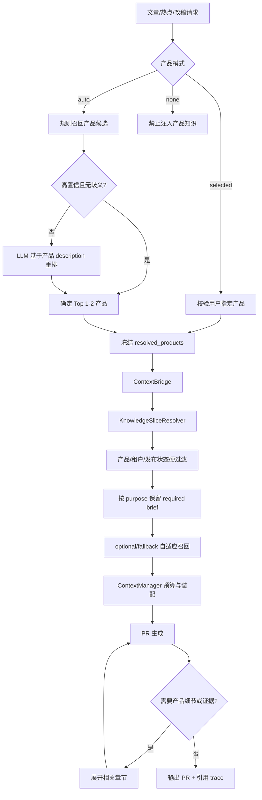

# 产品知识库检索策略改造方案

> 状态：评审修订版  
> 范围：`agent-security-briefs/` 产品知识库及其在评分、PR 草稿、重写、改稿中的检索和注入链路  
> 核心目标：确保每篇 PR 稿引用与文章实际相关的产品知识，并在可追溯、可回退的前提下降低上下文 token 和无关产品噪声  
> 实施原则：增强现有 `ProductCatalogService + KnowledgeSliceResolver + ContextBridge + ContextManager`，不建设平行的第二套知识路由

---

## 1. 结论

“产品硬过滤 → 文档召回 → 摘要注入 → 相关章节按需展开”的方向可行，但必须先解决产品路由在流水线中的传递问题。

本项目当前只有 55 个 Markdown，正式发布的产品为 3 个，每个产品常规 PR 知识通常只有 `overview.md`、`market-brief.md`、`sales-brief.md` 三篇。产品过滤后候选很小，因此当前阶段不需要向量数据库，也不应把 embedding 作为首期前置依赖。

推荐目标形态如下：

```text
文章/热点
  ↓
产品路由：用户指定，或规则召回 + LLM 模糊兜底
  ↓
冻结 resolved_products，贯穿 score/draft/rewrite/chat
  ↓
产品、租户、发布状态硬过滤
  ↓
按 purpose 保留必需 brief，并对可选文档自适应召回
  ↓
注入 brief 正文或摘要 + 来源标识
  ↓
需要具体能力、参数、案例、部署或版本信息时
  ↓
按章节展开原始文档，并保留证据锚点
  ↓
生成 PR + 产品事实引用记录
```

技术选择：

- 产品路由：明确规则优先，LLM 仅处理零命中、歧义和多产品近分场景。
- 常规 brief：产品过滤后直接按用途装配，不做无意义的三篇向量排序。
- 扩展文档：优先关键词/BM25，必要时增加 LLM 重排。
- 大规模或语义召回评测不足时：再启用 embedding；索引接口预留，但首期不依赖。
- 原始文档：纳入索引但标记为 fallback，默认不注入，按相关章节展开。

---

## 2. 当前项目事实

### 2.1 知识规模

本地知识库共有 55 个 Markdown。现有 `KnowledgeLoader` 实际发现 32 个评分相关文件，合计约 4.38 万字符。

当前已发布产品及常规文档规模：

| 产品 | score 文档 | draft 文档 | draft 正文字符量（约） |
|---|---:|---:|---:|
| 智能体身份安全 | 2 | 3 | 4326 |
| 智能体安全 | 2 | 3 | 4918 |
| AI-BOM | 2 | 3 | 4599 |

智能体安全网关和 ANS 当前在 `product_catalog.py` 中为未发布状态；这是检索前的业务约束，不能由索引绕过。

### 2.2 已有可复用组件

| 组件 | 当前职责 | 改造定位 |
|---|---|---|
| `ProductCatalogService` | 稳定产品 ID、别名、发布状态和目录映射 | 保留为产品元数据权威源 |
| `ProductMatcher` | 基于关键词匹配产品 | 修复字段并增加置信度/LLM 兜底 |
| `KnowledgeSliceResolver` | 按产品和 purpose 装配固定文件 | 演进为文档检索与知识包构建器 |
| `ContextBridge` | 连接 score/draft/chat 与上下文管理 | 作为唯一知识上下文入口 |
| `ContextManager` | token 预算、优先级、冲突和 trace | 保留并扩展文档级可观测信息 |
| `KnowledgeRuntimeRefresher` | 任务边界热刷新 | 对接索引版本切换，不在线生成摘要 |

因此不新增与这些组件并行的 `knowledge_retriever.py`。如需拆分代码，应由 `KnowledgeSliceResolver` 调用内部的 `KnowledgeIndex`/`DocumentRetriever`，对外仍通过 `ContextBridge` 使用。

---

## 3. 当前关键问题

### 3.1 产品路由结果没有贯穿 PR 生成链路

PR 稿需要参考命中产品，但当前不同入口使用的产品信息不一致：

- 部分评分路径没有传入候选产品，走全局评分知识。
- 自动模式缺少稳定的 `resolved_products` 输出和持久化。
- 单篇草稿阶段主要读取请求中的 `selected_product_ids`；auto 模式通常为空。
- 批量草稿、质量重写和旧 Reporter 未统一传递产品知识切片。
- 交互改稿仍可能读取全局合并知识。

这意味着即使文档索引检索正确，PR 阶段也可能不知道应该检索哪个产品。

### 3.2 自动产品匹配字段与文章模型不一致

`ProductMatcher` 当前主要读取 `title/summary/content/source`，而项目文章正文和中文摘要主要存放在 `content_md/summary_cn`。这会降低自动匹配召回率。

### 3.3 新旧知识链路并存

项目已有 `KnowledgeSliceResolver` 和 `ContextBridge`，同时还保留 `as_system_prompt()`、`as_scoring_prompt()` 等全局回退。各入口的实际注入行为不完全一致，容易出现单篇有效、批量或改稿失效。

### 3.4 原始文档与 lazy 展开存在矛盾

原始方案计划默认排除 `原始文档/`，同时又要求按需拉取全文。若原始文档没有索引，系统无法判断应该展开哪篇或哪个章节。

### 3.5 摘要不能单独承担 PR 事实依据

PR 稿可能涉及产品能力、参数、部署、版本、客户案例和竞品判断。仅注入 LLM 摘要容易丢失限定条件，也缺少可追溯证据。

---

## 4. 设计原则

1. **先路由产品，再检索文档**：产品选择是流水线事实，不是每个阶段各自重新猜测。
2. **用户选择优先**：selected 模式严格使用用户选择；auto 模式才执行自动路由；none 模式禁止产品知识注入。
3. **冻结并复用**：`resolved_products` 一旦确定，score、draft、rewrite、chat 必须复用同一快照。
4. **产品是硬过滤，类型是分层约束**：产品、租户、发布状态可硬过滤；文档类型按 purpose 分 required/optional/fallback，不能简单只保留一个 type。
5. **必需 brief 不参与竞争淘汰**：`overview` 和 `market-brief` 等 purpose 必需知识应稳定保留。
6. **摘要用于路由，证据用于成稿**：摘要帮助选择文档；PR 中的产品事实应能定位到正文或章节。
7. **优先章节展开**：长文档先返回目录和章节摘要，再取相关章节，不默认截取全文前 2500 字。
8. **索引在发布阶段构建**：知识发布时离线生成/更新索引并原子切换；任务热刷新只加载新版本。
9. **失败可见，不静默串产品**：产品未命中或必需知识缺失时记录状态，不能无声回退到全产品知识。
10. **按评测升级召回算法**：规则/BM25 不足时才增加 LLM 重排或 embedding。

---

## 5. 目标架构



---

## 6. 产品路由数据契约

新增统一的产品路由结果，建议作为任务配置快照和文章/用户评估结果的一部分保存：

```json
{
  "mode": "auto",
  "resolved_products": [
    {
      "product_id": "ai-bom",
      "product_name": "AI-BOM",
      "match_score": 91,
      "match_reason": "文章涉及AI组件资产和模型供应链风险",
      "match_source": "rule+llm"
    }
  ],
  "routing_version": "sha256:...",
  "resolved_at": "2026-08-13T10:00:00+08:00"
}
```

约束：

- selected 模式：`match_source=user_selected`，不得被自动路由覆盖。
- auto 模式：最多保留 2 个产品；最低置信度可配置。
- none 模式：`resolved_products=[]`，知识上下文保持为空。
- score 结果中的 `product_scores` 应保留逐产品分数，并能确定最高相关产品。
- 草稿、重写和改稿读取冻结结果，不重新调用 `ProductMatcher`。
- 知识 trace 必须记录本次实际使用的产品 ID。

### 6.1 自动产品路由

规则召回输入至少包括：

```text
title
summary_cn
summary
content_md
category_v2
tags
```

决策策略：

```text
明确产品名/别名命中：直接高置信候选
多个产品关键词命中：保留 Top 3 候选
零命中或 Top1/Top2 近分：LLM 阅读候选产品 description 后判断
仍低置信：标记 product_unresolved，不使用全局产品事实兜底
```

LLM 判断替代的是模糊产品路由和小候选重排，不替代所有文档召回。

---

## 7. 文档索引模型

索引覆盖 brief、shared、用户 custom 和原始文档；不同层级使用不同注入策略。

```json
{
  "schema_version": 1,
  "index_version": "sha256:...",
  "generated_at": "2026-08-13T10:00:00+08:00",
  "documents": [
    {
      "doc_id": "global:ai-bom:market-brief",
      "product_id": "ai-bom",
      "product_name": "AI-BOM",
      "tenant_scope": "global",
      "doc_type": "market-brief",
      "retrieval_tier": "required",
      "purposes": ["score", "draft", "chat"],
      "title": "AI-BOM 市场研判与传播角度",
      "description": "用于判断AI资产、模型供应链等热点与AI-BOM的传播关联",
      "summary": "自包含摘要，说明核心结论、适用范围和需要展开的细节。",
      "keywords": ["AI资产", "模型供应链", "AI-BOM"],
      "source_path": "3-AI-BOM/market-brief.md",
      "content_hash": "sha256:...",
      "updated_at": "2026-08-13T10:00:00+08:00",
      "published": true,
      "needs_confirmation": false,
      "sections": []
    }
  ]
}
```

### 7.1 必需字段

- `doc_id`：稳定、可追踪，不以数组位置作为标识。
- `product_id`：使用产品目录稳定 ID，不直接使用文件夹显示名。
- `tenant_scope`：区分 global 和 user，用户文档必须继续受 `user_id` 隔离。
- `doc_type`：`overview/market-brief/sales-brief/architecture/raw/custom/shared`。
- `retrieval_tier`：`required/optional/fallback`。
- `purposes`：允许用于 `score/draft/chat` 的范围。
- `description`：用于路由，描述何种问题应该命中该文档。
- `summary`：用于轻量注入，包含结论、限制和展开提示。
- `source_path/content_hash`：用于证据追踪和增量更新。
- `published`：未发布知识不进入正式 PR 生成。
- `needs_confirmation`：指标、客户、竞品或部署等需人工确认时标记。

### 7.2 原始文档策略

`原始文档/` 不再从索引中排除，改为：

```text
doc_type = raw
retrieval_tier = fallback
默认不注入
只在需要事实细节或 brief 不足时召回
长文档建立 sections
```

章节索引建议包含：

```json
{
  "section_id": "3.2",
  "heading": "AI资产发现",
  "description": "说明如何发现模型、数据集、组件和服务资产",
  "summary": "章节核心事实及适用边界",
  "keywords": ["资产发现", "模型", "数据集"],
  "anchor": "3-AI-BOM/原始文档/xxx.md#AI资产发现",
  "start_line": 120,
  "end_line": 186
}
```

---

## 8. 分层检索策略

### 8.1 第一层：硬过滤

硬过滤字段：

- `product_id IN resolved_products`
- `tenant_scope` 和 `user_id`
- `published = true`
- `purpose` 在文档允许范围内
- 禁止路径、未发布草稿和越权用户文档

跨产品 shared 文档不是无条件全部保留，而是按 purpose 和优先级进入 optional 候选。

### 8.2 第二层：purpose 分层

建议默认策略：

| Purpose | Required | Optional | Fallback |
|---|---|---|---|
| score | overview、market-brief | shared/hot-event、custom | architecture、raw sections |
| draft | overview、market-brief | sales-brief、shared、custom | architecture、raw sections |
| chat/revise | overview | market-brief、sales-brief、custom | architecture、raw sections |

required 文档不参与 Top-N 淘汰；缺失时写入 `knowledge_missing`。

### 8.3 第三层：自适应召回

只对 optional/fallback 候选做排序：

| 过滤后可选候选数 | 策略 |
|---:|---|
| 0–8 | 规则和 purpose 顺序直接装配 |
| 9–30 | 标题、keywords、description 的 BM25/关键词召回 |
| 31–100 | BM25 召回 Top 12，LLM 重排到 Top 4–8 |
| >100 | BM25 + embedding 混合召回，再由 LLM 重排 |

当前知识规模首期采用前两档。

关键词召回应特别照顾产品文档中的错误码、配置项、API 名称、英文缩写和型号；这些精确术语通常比纯向量更可靠。

### 8.4 description 语义召回与 LLM 的取舍

结论：当前阶段不需要全面 description 向量召回，也不建议每次让 LLM 阅读全部 description。

- 候选很少：直接装配或规则判断。
- 产品路由歧义：LLM 判断很合适，因为候选产品只有少量。
- 可选文档增多：BM25 负责低成本粗召回，LLM 负责小集合重排。
- 评测证明 BM25 召回不足：增加 embedding，但继续保留关键词通道。

因此采用“规则/BM25 粗召回 + 按需 LLM 重排”，而不是在 LLM 与语义召回之间二选一。

---

## 9. 摘要注入与证据展开

### 9.1 description 与 summary 分工

`description`：回答“什么问题应命中此文档”，建议 40–100 字。

`summary`：回答“注入上下文后模型需要知道什么”，建议 150–400 字，并包含核心结论、适用产品和范围、关键能力、明确限制、需人工确认的信息和进一步展开的章节锚点。摘要不能引入正文没有的产品能力。

### 9.2 PR 上下文三层结构

```text
产品 brief/摘要
  用于产品定位、热点关联和传播角度

命中章节证据摘录
  用于支撑草稿中实际出现的产品事实

原始文档相关章节
  用于参数、案例、版本、部署、竞品等高风险细节
```

### 9.3 展开触发条件

触发相关章节展开，而不是仅以相似度分差判断：

1. 草稿计划将写入具体产品能力或技术机制。
2. 需要参数、错误码、部署、接口、版本或操作步骤。
3. 需要客户案例、性能指标或竞品结论。
4. summary 明确标识信息不足或需查看正文。
5. brief 之间或 brief 与原始文档出现冲突。
6. 事实审核发现草稿中的产品陈述缺少证据。
7. 用户明确要求查看原文或增强产品关联。

护栏：首次最多展开 2 个文档中的相关章节；每个章节有字符/token 上限；不默认返回整篇长文档；若证据仍不足，输出“资料未覆盖/需产品确认”，不能补写能力。

---

## 10. 统一接入方式

### 10.1 唯一主链

```text
Pipeline/Chat
  → ContextBridge.resolve_knowledge/build_plan
  → KnowledgeSliceResolver.resolve
  → KnowledgeIndex + DocumentRetriever（内部能力）
  → ContextManager.build
  → Prompt
```

禁止业务入口直接自行拼接全局知识。旧的 `as_system_prompt()`、`as_scoring_prompt()` 仅作为明确开关控制的兼容回退，并记录 fallback 原因。

### 10.2 必须覆盖的入口

- 单篇评分与草稿生成；
- 批量评分与批量草稿生成；
- `pipeline_v2` 质量重写；
- 交互问答、局部改稿和流式改稿；
- 仍在使用的旧 Reporter；
- 定时海外新闻评分和后续 PR 生成入口。

### 10.3 Query 构造

不同阶段不能机械复用同一个 query：

- score：文章标题 + `summary_cn` + 分类 + 正文前部关键内容。
- draft：文章内容 + 命中产品 + 选定 PR 模板/视角。
- rewrite：原 query + 原草稿 + 质量问题。
- chat/revise：用户指令 + 当前草稿 + 已冻结产品。

---

## 11. 索引构建与更新

### 11.1 构建时机

索引构建发生在首次离线初始化、知识发布流程校验通过之后、管理员显式重建或索引 schema 升级。任务热刷新只加载已经生成成功的新索引，不在请求链路调用 LLM 重新摘要。

### 11.2 增量更新

以 `content_hash` 判断变化：新文档生成元数据和章节索引；内容变化只重建该文档；删除或下线从新版本移除或标记 `published=false`；未变化复用原元数据和可选 embedding。

发布采用临时文件 + `os.replace` 原子切换，索引失败不得影响当前线上版本。

### 11.3 摘要生成约束

LLM 生成摘要必须结构化输出，并经过 JSON schema 校验、字段长度检查、产品 ID 与路径一致性检查、正文事实约束、章节锚点检查，并支持人工预览和重新生成。

---

## 12. 可观测与审计

每次知识检索记录但不记录不必要的全文：

```json
{
  "trace_id": "...",
  "purpose": "draft",
  "product_mode": "auto",
  "resolved_product_ids": ["ai-bom"],
  "routing_version": "sha256:...",
  "index_version": "sha256:...",
  "query_hash": "sha256:...",
  "candidate_count": 7,
  "selected_doc_ids": ["global:ai-bom:overview"],
  "expanded_section_ids": ["global:ai-bom:raw:3.2"],
  "knowledge_missing": [],
  "fallback_reason": null,
  "input_chars": 4800,
  "estimated_tokens": 1500
}
```

PR 草稿至少保存使用的产品快照、索引版本、知识源 `doc_id/source_path/section_id`、需要产品确认的声明和检索 fallback 状态。

---

## 13. 失败与回退策略

| 场景 | 行为 |
|---|---|
| selected 产品非法或未发布 | 阻止任务并返回明确错误 |
| auto 产品零命中 | 标记 `product_unresolved`；允许事件型 PR 时不写具体产品能力 |
| required brief 缺失 | 写入 `knowledge_missing`；不得用其他产品知识替代 |
| 索引文件损坏 | 回退最近成功索引版本并告警 |
| BM25/LLM 重排失败 | 使用 required + 稳定优先级 optional 文档 |
| 章节证据不足 | 输出“资料未覆盖/需产品确认” |
| ContextManager 预算不足 | 保留 required，丢弃 optional，记录 dropped |
| 旧链路回退 | 必须记录 `fallback_reason`，便于灰度对比 |

禁止“检索为空后自动注入全产品知识”的静默回退。

---

## 14. 评测方案

### 14.1 离线数据集

至少覆盖每个已发布产品正例、产品歧义热点、无产品相关新闻、跨产品文章、需要原始章节支持的问题、selected/auto/none 三模式，以及批量、重写和改稿路径。

每条数据标注期望产品、必需/可接受文档、禁止产品、是否需要章节展开，以及 PR 中允许出现的产品事实。

### 14.2 指标

| 指标 | 首期门槛建议 |
|---|---:|
| 产品路由 Top-1 准确率 | ≥ 90% |
| 产品路由 Top-2 召回率 | ≥ 97% |
| required 文档注入成功率 | 100% |
| 文档 Top-N 召回率 | ≥ 95% |
| 跨产品错误注入率 | 0% |
| PR 产品事实有来源率 | ≥ 95% |
| 无依据产品能力新增率 | 0% |
| 上下文 token 相对旧链路下降 | ≥ 30% |
| 新旧 PR 人工质量对比 | 不下降 |

“全文展开比例 <20%”只作为观察指标，不能为了压低比例而牺牲事实准确性。

---

## 15. 改造范围

### 15.1 主要代码

| 文件/模块 | 改造内容 |
|---|---|
| `product_matcher.py` | 修复文章字段、输出置信度、支持 LLM 歧义兜底 |
| `pipeline_config.py` | 冻结统一 `resolved_products` 和路由版本 |
| `scorer_v2.py` | 按候选产品评分并保留 `product_scores`/产品上下文 trace |
| `knowledge_slice.py` | 接入索引、自适应召回、章节展开和证据元数据 |
| `context_bridge.py` | 统一接收 query、冻结产品和索引版本，输出 trace |
| `context_manager.py` | 支持文档级来源、required/optional/fallback 预算 |
| `api/pipeline.py` | 单篇流程传递冻结产品并保存知识 trace |
| `pipeline_v2.py` | 补齐批量草稿和重写的知识切片 |
| `draft_chat.py` | 改稿/问答使用冻结产品上下文，支持章节展开 |
| `reporter.py` | 若仍启用，接入统一上下文入口 |
| `knowledge_admin/publication.py` | 发布成功前构建并校验新索引，原子切换 |
| `knowledge_runtime.py` | 加载新索引版本，不在线生成索引 |

### 15.2 建议新增内部模块

```text
services/backend/agent/knowledge_index.py
  DocIndex / SectionIndex schema
  索引加载、版本和增量构建

services/backend/agent/document_retriever.py
  硬过滤
  BM25/关键词召回
  可选 LLM/embedding 重排接口
  章节展开
```

这两个模块是 `KnowledgeSliceResolver` 的内部依赖，不形成新的业务入口。

---

## 16. 分期建议

1. **P0 产品路由闭环**：修复字段，冻结 `resolved_products`，贯穿所有 PR 阶段。
2. **P1 上下文入口统一**：补齐批量、重写、改稿，消除静默全局回退。
3. **P2 轻量索引**：JSON 索引、description/summary、required/optional/fallback。
4. **P3 章节级展开**：原始文档入索引、相关章节证据、PR 引用 trace。
5. **P4 检索增强**：BM25 评测不足时增加 LLM 重排，再按规模决定 embedding。
6. **P5 灰度上线**：shadow → 小流量 active → 全量，保留版本回滚。

具体任务、测试和验收条件见《知识库检索策略改造逐步实施方案.md》。

---

## 附录 A：description/summary 生成模板

```text
你是产品知识库索引员。仅依据提供的正文生成索引元数据，不得补充正文没有的产品能力、数字、案例、部署承诺或竞品结论。

输出 JSON：
{
  "description": "40-100字，说明什么问题应检索此文档",
  "summary": "150-400字，包含核心结论、适用范围、限制、需确认信息和可展开章节",
  "keywords": ["精确产品术语", "配置名", "错误码或英文缩写"],
  "needs_confirmation": false,
  "confirmation_reasons": []
}

要求：
1. description 面向召回，不是文档开头截取。
2. summary 必须自包含，但不能替代正文证据。
3. 涉及性能指标、客户案例、部署规格或竞品结论时，若正文没有明确确认状态，设置 needs_confirmation=true。
4. 需要详细步骤或参数时，明确指出应展开的章节标题。
```

## 附录 B：关键验收判断

本改造是否成功，不以“建成索引”判断，而以以下问题回答“是”为准：

1. auto 模式能否稳定确定相关产品，并将结果传到 PR 草稿和改稿？
2. selected 模式是否严格只使用用户选择产品的知识？
3. none 模式是否不会出现任何产品能力注入？
4. 批量、单篇、重写和改稿是否使用同一套知识入口？
5. PR 中每条具体产品事实能否追溯到 brief 或原始文档章节？
6. 资料不足时系统是否明确说明，而不是切换到其他产品或自行补写？
